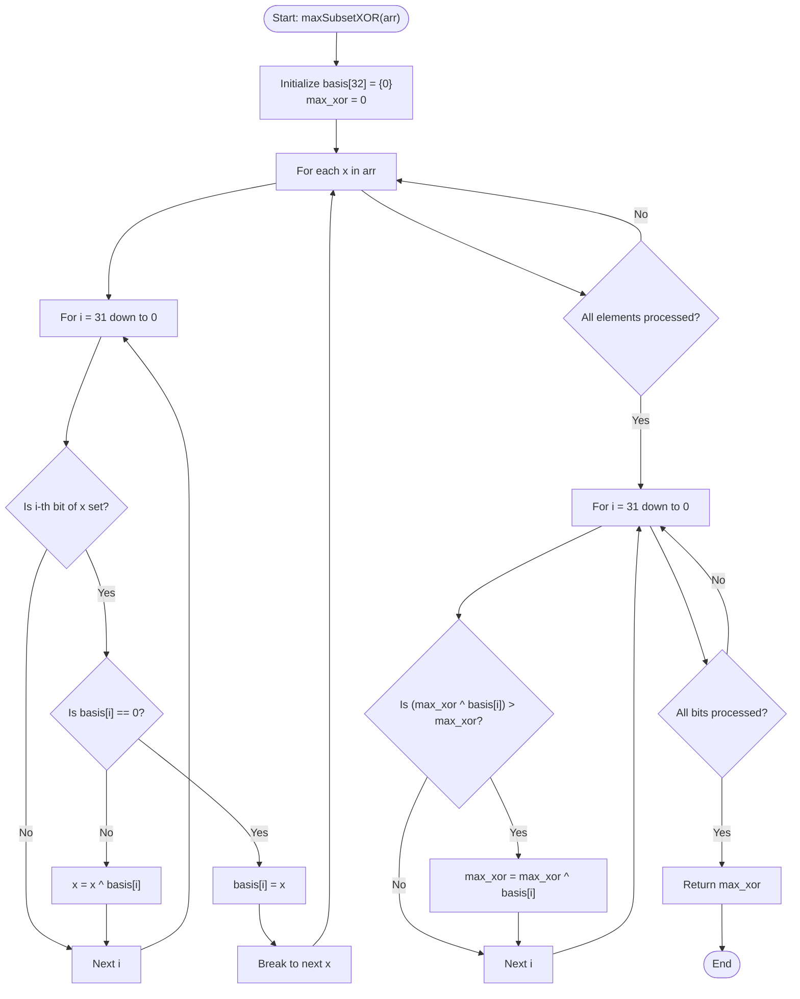

# 💡 Approach — Maximum Subset XOR

| 📄 [Problem](./Problem.md) | 💡 [Approach](./Approach.md) | 🧩 [Solution](./Solution.cpp) | 🚀 [Main](./Main.cpp) |
|:--------------------------:|:-----------------------------:|:------------------------------:|:---------------------:|

---

## 📊 Metadata

---

## 🎯 Core Insight

> [!TIP]
> **Linear Basis of Vector Space over GF(2)**
>
> The problem of finding a subset of elements with the maximum XOR sum is equivalent to finding a combination of basis vectors that yields the maximum value in a vector space over GF(2).
>
> 1. Any subset XOR can be represented as a linear combination of a **Linear Basis** of the array's elements.
> 2. We can construct this basis by processing each element of the array. For each element, we find its most significant bit (MSB).
>    - If a basis vector for that MSB doesn't exist, we insert the element.
>    - If it does, we XOR the element with the existing basis vector to eliminate the MSB and try to insert it at a lower bit position.
> 3. Once the basis is constructed, we greedily build the maximum XOR value from the most significant bit to the least significant bit. If XORing the current maximum with the basis vector at a bit position increases the value, we update the maximum.
>
> This technique runs in $O(n \cdot \log(\max(arr[i])))$ time and uses $O(1)$ auxiliary space.

---

## 🔩 Step-by-Step Breakdown

### Step 1: Initialize the Basis Array
- Create a basis array/vector `basis` of size `32`, initialized to `0`. This array will store the basis vectors, where `basis[i]` holds a number whose most significant bit (MSB) is the $i$-th bit.

### Step 2: Build the Basis
- For each element `x` in the input array `arr`:
  - Loop through the bit positions from MSB (`31`) down to LSB (`0`).
  - If the $i$-th bit of `x` is set:
    - If `basis[i]` is `0` (empty), insert `x` into the basis by setting `basis[i] = x` and terminate the loop for this element.
    - If `basis[i]` is not `0`, XOR `x` with `basis[i]` (`x ^= basis[i]`) and continue checking lower bits.

### Step 3: Find the Maximum Subset XOR
- Initialize `max_xor = 0`.
- Loop through the bit positions from `31` down to `0`.
- For each bit position $i$, check if XORing `max_xor` with `basis[i]` yields a larger value. If `(max_xor ^ basis[i]) > max_xor`, update `max_xor` to `max_xor ^ basis[i]`.

### Step 4: Return the Result
- Return the final value of `max_xor`.

---

## 🔄 Mermaid Flowchart

---

## 🧮 Dry Run

### Dry Run: Example 2
- **Input:** `arr = [9, 8, 5]`
- **Initial Setup:** `basis[32] = {0}`, `max_xor = 0`.

#### Phase 1: Constructing the Basis

| Iteration | Element `x` | Bit Position $i$ | `basis[i]` Status | Action / Update | Basis State |
| :---: | :---: | :---: | :---: | :---: | :---: |
| **1** | `9` (1001) | `3` | `basis[3] == 0` | Set `basis[3] = 9`. Break. | `basis[3] = 9` |
| **2** | `8` (1000) | `3` | `basis[3] != 0` | `8 ^ 9 = 1` (0001). Check lower bits. | `basis[3] = 9` |
| | `1` (0001) | `0` | `basis[0] == 0` | Set `basis[0] = 1`. Break. | `basis[3] = 9`, `basis[0] = 1` |
| **3** | `5` (0101) | `2` | `basis[2] == 0` | Set `basis[2] = 5`. Break. | `basis[3] = 9`, `basis[2] = 5`, `basis[0] = 1` |

#### Phase 2: Computing Maximum XOR

- Start with `max_xor = 0`.

| Bit Position $i$ | `basis[i]` | `max_xor ^ basis[i]` | Greater than `max_xor`? | Update |
| :---: | :---: | :---: | :---: | :---: |
| **3** | `9` (1001) | `0 ^ 9 = 9` | ✔️ Yes | `max_xor = 9` |
| **2** | `5` (0101) | `9 ^ 5 = 12` | ✔️ Yes | `max_xor = 12` |
| **1** | `0` | `12 ^ 0 = 12` | ❌ No | `max_xor = 12` |
| **0** | `1` (0001) | `12 ^ 1 = 13` | ✔️ Yes | `max_xor = 13` |

---

## 📊 Complexity Analysis

| Complexity | Analysis |
| :--- | :--- |
| **Time Complexity** | $O(n \cdot \log(\max(arr[i])))$ because we process $n$ elements, and for each element, we loop through at most $32$ bit positions. Since the elements are bounded by $10^6$, $\log(\max(arr[i])) \approx 20$. This gives an efficient linear-time performance relative to the number of elements. |
| **Auxiliary Space** | $O(1)$ as the size of the `basis` vector is constant ($32$ integers), which does not grow with the input size. |

---

> *"To master bits is to manipulate the very fabric of machine computation."* — Senior C++ Engineer

---

<h3>Happy Coding! 🚀</h3>

