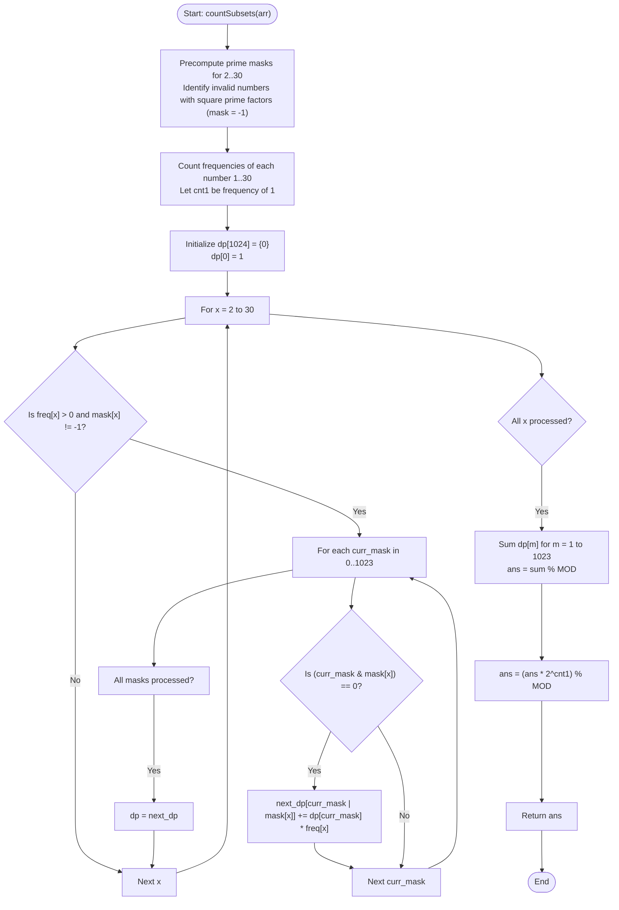

# 💡 Approach — Game of Subsets

| 📄 [Problem](./Problem.md) | 💡 [Approach](./Approach.md) | 🧩 [Solution](./Solution.cpp) | 🚀 [Main](./Main.cpp) |
|:--------------------------:|:-----------------------------:|:------------------------------:|:---------------------:|

---

## 📊 Metadata

---

## 🎯 Core Insight

> [!TIP]
> **Prime Factor Bitmasking & DP**
>
> 1. **Small Value Range:** The array elements are bounded by $1 \le arr[i] \le 30$. This implies we only need to consider the 10 prime numbers in this range: $\{2, 3, 5, 7, 11, 13, 17, 19, 23, 29\}$.
> 2. **Square-Free Numbers:** Any number divisible by a square of a prime (e.g., $4$, $8$, $9$, $12$, $16$, $18$, $20$, $24$, $25$, $27$, $28$) has repeated prime factors. Choosing such a number violates the condition. We can filter them out.
> 3. **Bitmask Representation:** For any valid square-free number, we represent its prime factors as a 10-bit mask. The $j$-th bit is set if the $j$-th prime divides the number.
> 4. **Independent Number '1':** The number `1` is square-free but has no prime factors (mask 0). It can be prepended to any valid subset of numbers $\ge 2$ in $2^{\text{count of 1s}}$ ways without altering the product's prime factors.
> 5. **DP State:** `dp[mask]` stores the number of subsets formed by elements $\ge 2$ whose product of prime factors matches `mask`.
> 6. **Transitions:** When processing each square-free number $x$ with frequency `freq[x]` and mask `mask_x`, we can add it to any existing subset with mask `curr_mask` if and only if they share no prime factors: `(curr_mask & mask_x) == 0`.

---

## 🔩 Step-by-Step Breakdown

### Step 1: Precompute Prime Masks
- Define the 10 primes $\le 30$.
- For each number $i \in [2, 30]$:
  - If $i$ is divisible by $p^2$ for any prime $p$, it is invalid (set `mask[i] = -1`).
  - Otherwise, set the $j$-th bit of `mask[i]` if the $j$-th prime divides $i$.

### Step 2: Count Frequencies
- Create a frequency table `freq` of size 31 for the numbers in `arr`.
- Count the number of `1`s separately in `cnt1`.

### Step 3: Initialize the DP Array
- Create `dp[1024]` initialized to 0, and set the base case `dp[0] = 1` (the empty subset).

### Step 4: Build the DP Table
- For each number $x \in [2, 30]$ with `freq[x] > 0` and `mask[x] != -1`:
  - Create a copy `next_dp = dp`.
  - For each `curr_mask` from $0$ to $1023$:
    - If `(curr_mask & mask[x]) == 0`, we can transition:
      `next_dp[curr_mask | mask[x]] = (next_dp[curr_mask | mask[x]] + dp[curr_mask] * freq[x]) % MOD`.
  - Update `dp = next_dp`.

### Step 5: Sum Valid Subsets
- Sum `dp[m]` for all $1 \le m < 1024$.

### Step 6: Handle '1's
- Multiply the sum by $2^{\text{cnt1}} \pmod{10^9 + 7}$ to account for all combinations of ones.

### Step 7: Return the Result
- Return the final count.

---

## 🔄 Mermaid Flowchart

---

## 🧮 Dry Run

### Dry Run: Example 2
- **Input:** `arr = [2, 2, 3]`
- **Initial Setup:** `cnt1 = 0`, `freq[2] = 2`, `freq[3] = 1`.
- **Masks:** `mask[2] = 1` (binary 0000000001), `mask[3] = 2` (binary 0000000010).

#### Phase 1: Constructing DP for $x = 2$
- `x = 2`, `mask_x = 1`, `freq[2] = 2`.
- `curr_mask = 0`: `(0 & 1) == 0`. `next_dp[1] = dp[1] + dp[0] * 2 = 2`.
- `dp` state: `dp[0] = 1`, `dp[1] = 2`. All others are 0.

#### Phase 2: Constructing DP for $x = 3$
- `x = 3`, `mask_x = 2`, `freq[3] = 1`.
- `curr_mask = 0`: `(0 & 2) == 0`. `next_dp[2] = dp[2] + dp[0] * 1 = 1`.
- `curr_mask = 1`: `(1 & 2) == 0`. `next_dp[3] = dp[3] + dp[1] * 1 = 2`.
- `dp` state: `dp[0] = 1`, `dp[1] = 2`, `dp[2] = 1`, `dp[3] = 2`.

#### Phase 3: Calculate Final Answer
- Sum of `dp[m]` for $m > 0$:
  `dp[1] + dp[2] + dp[3] = 2 + 1 + 2 = 5`.
- Multiply by $2^{\text{cnt1}} = 2^0 = 1$:
  `ans = 5`.

---

## 📊 Complexity Analysis

| Complexity | Analysis |
| :--- | :--- |
| **Time Complexity** | $O(n + 30 \cdot 2^{10})$ where $n$ is the size of the array. Precomputing the prime masks takes $O(30 \cdot 10) \approx O(1)$. Counting frequency takes $O(n)$ time. The DP transitions execute $29 \times 1024$ times, which is a small constant number of operations ($\approx 30,000$). Thus, the time complexity is extremely efficient and linear. |
| **Auxiliary Space** | $O(2^{10}) \approx O(1)$ as the DP table size is a fixed 1024, which does not depend on the input size $n$. |

---

> *"In the landscape of numbers, primes are the singular, indivisible atoms of multiplication."* — Senior competitive programmer

---

<h3>Happy Coding! 🚀</h3>

