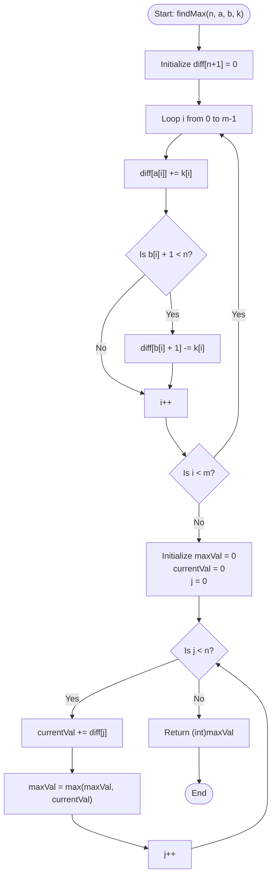

# 💡 Approach — Max After m Range Increments

| 📄 [Problem](./Problem.md) | 💡 [Approach](./Approach.md) | 🧩 [Solution](./Solution.cpp) | 🚀 [Main](./Main.cpp) |
|:--------------------------:|:-----------------------------:|:------------------------------:|:---------------------:|

---

## 📊 Metadata

---

## 🎯 Core Insight

> [!TIP]
> **Difference Array (Sweep-line) Algorithm**
>
> 1. **Avoid Brute Force:** Running each of the $m$ increment operations from index $a_i$ to $b_i$ takes $\mathcal{O}(n \cdot m)$ time, which will result in TLE (Time Limit Exceeded) for $10^6$ constraints.
> 2. **Constant-time Updates:** We can represent range updates in $\mathcal{O}(1)$ using a **difference array** `diff` of size $n+1$:
>    - For each range update $(a_i, b_i, k_i)$, we perform:
>      - `diff[a_i] += k_i`
>      - `diff[b_i + 1] -= k_i` (if $b_i + 1 < n$)
> 3. **Linear Reconstruction:** After processing all $m$ operations, we compute the prefix sum of `diff` to reconstruct the actual elements of the array.
> 4. **Find Max:** Maintain a running maximum value while calculating prefix sums to identify the maximum value in the final array.

---

## 🔩 Step-by-Step Breakdown

### Step 1: Initialize Difference Array
- Create a difference array `diff` of size $n + 1$, initialized to all zeros.

### Step 2: Apply Range Operations
- For each operation $i$ from $0$ to $m-1$:
  - Add $k[i]$ to `diff[a[i]]`.
  - Subtract $k[i]$ from `diff[b[i] + 1]` if $b[i] + 1 < n$.

### Step 3: Compute Prefix Sums
- Initialize `maxVal = 0` and `currentVal = 0`.
- Traverse indices $i$ from $0$ to $n-1$:
  - Add `diff[i]` to `currentVal`.
  - Update `maxVal = max(maxVal, currentVal)`.

### Step 4: Return Max Value
- Return `maxVal` cast to `int` (matching GeeksForGeeks method signature).

---

## 🔄 Mermaid Flowchart

---

## 🧮 Dry Run

### Dry Run: Example 1
- **Input:** $n = 5$, $a = [0, 1, 2]$, $b = [1, 4, 3]$, $k = [100, 100, 100]$
- **Initialization:** `diff = [0, 0, 0, 0, 0, 0]`

#### Phase 1: Applying Difference Operations

| Op Index | Range `[a, b]` | Increment Value `k` | Action on `diff` | Resulting `diff` array |
| :---: | :---: | :---: | :---: | :--- |
| **0** | `[0, 1]` | 100 | `diff[0] += 100`, `diff[2] -= 100` | `[100, 0, -100, 0, 0, 0]` |
| **1** | `[1, 4]` | 100 | `diff[1] += 100`, `diff[5] -= 100` (ignored, $\ge n$) | `[100, 100, -100, 0, 0, 0]` |
| **2** | `[2, 3]` | 100 | `diff[2] += 100`, `diff[4] -= 100` | `[100, 100, 0, 0, -100, 0]` |

#### Phase 2: Prefix Sum and Finding Max

| Index `j` | `diff[j]` | `currentVal` | `maxVal` |
| :---: | :---: | :---: | :---: |
| **0** | 100 | 100 | 100 |
| **1** | 100 | 200 | **200** (Max) |
| **2** | 0 | 200 | 200 |
| **3** | 0 | 200 | 200 |
| **4** | -100 | 100 | 200 |

- **Result:** Maximum value is **200**.

---

## 📊 Complexity Analysis

| Complexity | Analysis |
| :--- | :--- |
| **Time Complexity** | $\mathcal{O}(n + m)$ where $n$ is the array size and $m$ is the number of operations. We iterate through the $m$ operations in $\mathcal{O}(m)$ time and reconstruct the array of size $n$ in $\mathcal{O}(n)$ time. |
| **Auxiliary Space** | $\mathcal{O}(n)$ space to store the difference array of size $n + 1$. |

---

<h3>Happy Coding! 🚀</h3>

