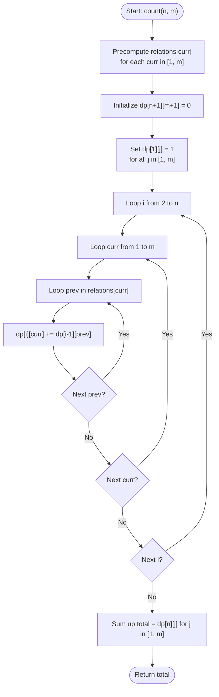

# 💡 Approach — Sequences where Adjacent Divide

| 📄 [Problem](./Problem.md) | 💡 [Approach](./Approach.md) | 🧩 [Solution](./Solution.cpp) | 🚀 [Main](./Main.cpp) |
|:--------------------------:|:-----------------------------:|:------------------------------:|:---------------------:|

---

## 📊 Metadata

---

## 🎯 Core Insight

> [!TIP]
> **Dynamic Programming with Sieve-Like Divisibility Precomputation**
>
> 1. **State Definition:** Let `dp[i][j]` represent the number of valid sequences of length `i` ending with the value `j` (where $1 \le j \le m$).
> 2. **Base Case:** For sequences of length $1$, there is exactly 1 way to form the sequence for each starting number.
>    - `dp[1][j] = 1` for all $1 \le j \le m$.
> 3. **Transitions:** To compute `dp[i][curr]`, we transition from any sequence of length `i - 1` ending in `prev` if and only if `prev` divides `curr` or `curr` divides `prev`:
>    - $dp[i][curr] = \sum dp[i - 1][prev]$ for all $prev$ such that $curr \% prev == 0$ or $prev \% curr == 0$.
> 4. **Complexity Optimization:** Rather than checking all $m$ possibilities for each state (which would take $O(n \cdot m^2)$), we can precompute the list of valid neighbors `relations[curr]` for each number `curr` from $1$ to $m$. The sum of all relation sizes is bounded by $O(m \log m)$, leading to an overall runtime of $O(n \cdot m \log m)$ and space complexity of $O(n \cdot m)$.

---

## 🔩 Step-by-Step Breakdown

### Step 1: Precompute Divisors and Multiples
- Create a list of relations: for each number `curr` from $1$ to $m$:
  - Add all its divisors (numbers $d \le curr$ where $curr \% d == 0$).
  - Add all its multiples (numbers $k \cdot curr \le m$).
  - Remove duplicate relations (since `curr` is both a divisor and a multiple of itself).

### Step 2: Initialize DP Table
- Create a 2D array `dp` of size `(n + 1) x (m + 1)` filled with 0.
- For the base case (length 1), set `dp[1][j] = 1` for all $1 \le j \le m$.

### Step 3: Populate the DP Table
- Outer loop: Iterate through lengths `i` from $2$ to $n$.
  - Middle loop: Iterate through the ending value `curr` from $1$ to $m$.
    - Inner loop: For each valid predecessor `prev` in `relations[curr]`, add `dp[i - 1][prev]` to `dp[i][curr]`.

### Step 4: Aggregate the Result
- Sum all values `dp[n][j]` for $1 \le j \le m$ and return the sum.

---

## 🔄 Mermaid Flowchart

---

## 🧮 Dry Run

### Dry Run: Example 1
- **Input:** $n = 3$, $m = 3$
- **Relations Precomputation:**
  - `relations[1] = {1, 2, 3}` (divisors: 1; multiples: 1, 2, 3)
  - `relations[2] = {1, 2}` (divisors: 1, 2; multiples: 2)
  - `relations[3] = {1, 3}` (divisors: 1, 3; multiples: 3)

#### Phase 1: DP Initialization ($i = 1$)
- `dp[1] = [0, 1, 1, 1]`

#### Phase 2: Length 2 Transitions ($i = 2$)
- `dp[2][1] = dp[1][1] + dp[1][2] + dp[1][3] = 1 + 1 + 1 = 3`
- `dp[2][2] = dp[1][1] + dp[1][2] = 1 + 1 = 2`
- `dp[2][3] = dp[1][1] + dp[1][3] = 1 + 1 = 2`
- `dp[2] = [0, 3, 2, 2]`

#### Phase 3: Length 3 Transitions ($i = 3$)
- `dp[3][1] = dp[2][1] + dp[2][2] + dp[2][3] = 3 + 2 + 2 = 7`
- `dp[3][2] = dp[2][1] + dp[2][2] = 3 + 2 = 5`
- `dp[3][3] = dp[2][1] + dp[2][3] = 3 + 2 = 5`
- `dp[3] = [0, 7, 5, 5]`

- **Result:** Total count is $7 + 5 + 5 = 17$.

---

## 📊 Complexity Analysis

| Complexity | Analysis |
| :--- | :--- |
| **Time Complexity** | $O(n \cdot m \log m)$ because precomputing divisors and multiples takes $O(m \log m)$ using a sieve-like method, and filling the DP table requires processing each state's transitions which sums up to $O(n \cdot m \log m)$ transitions total. |
| **Auxiliary Space** | $O(n \cdot m)$ for the DP table and precomputed relations. |

---

<h3>Happy Coding! 🚀</h3>

