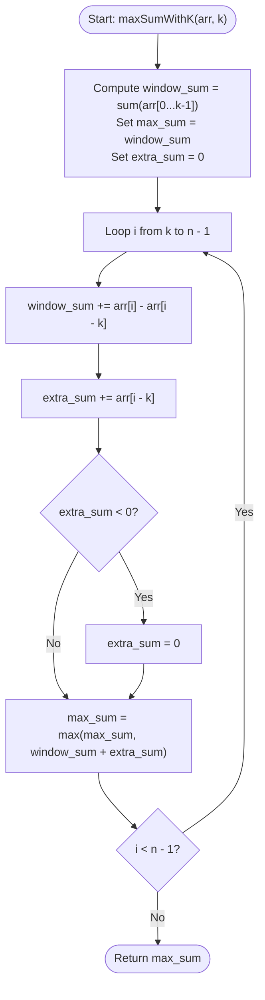

# 💡 Approach — Max Sum Subarray of Size at least K

| 📄 [Problem](./Problem.md) | 💡 [Approach](./Approach.md) | 🧩 [Solution](./Solution.cpp) | 🚀 [Main](./Main.cpp) |
|:--------------------------:|:-----------------------------:|:------------------------------:|:---------------------:|

---

## 📊 Metadata

---

## 🎯 Core Insight

> [!TIP]
> **Sliding Window combined with Kadane's Algorithm**
>
> 1. **Initial Window:** Calculate the sum of the first `k` elements. This represents the sum of the subarray `arr[0...k-1]` (a window of size exactly `k`). Let this be `window_sum`.
> 2. **Track Extra Contributions:** To find a subarray of length *at least* `k`, we can extend the current window of size `k` to the left. 
>    - The elements that fell out of our sliding window are stored in `prev_sum`.
>    - If the cumulative sum of these discarded elements (`extra_sum`) is positive, it is beneficial to include them to maximize our total sum.
>    - If `extra_sum` becomes negative, we reset it to `0` because including a negative sum prefix would only decrease our total. This is equivalent to Kadane's algorithm.
> 3. **Updating Max Sum:** At each step `i` (from `k` to `n-1`):
>    - Slide the window of size `k`: `window_sum += arr[i] - arr[i - k]`.
>    - Accumulate the element that just left the window: `extra_sum += arr[i - k]`.
>    - If `extra_sum < 0`, reset it to `0` (Kadane's reset).
>    - Update the global maximum: `max_sum = max(max_sum, window_sum + extra_sum)`.

---

## 🔩 Step-by-Step Breakdown

### Step 1: Sum the First $K$ Elements
- Calculate the sum of the first `k` elements of the array. Set both `window_sum` and `max_sum` to this value.
- Initialize `extra_sum = 0`.

### Step 2: Slide the Window
- Loop through the array from index `i = k` to `n - 1`:
  - Add the element that enters the window: `window_sum += arr[i]`.
  - Remove the element that leaves the window: `window_sum -= arr[i - k]`.
  - Add the element that left the window to `extra_sum`: `extra_sum += arr[i - k]`.
  - If `extra_sum` is negative, reset it to `0` (do not extend to the left).
  - Update `max_sum = max(max_sum, window_sum + extra_sum)`.

### Step 3: Return Result
- Return `max_sum` which holds the maximum contiguous subarray sum of length $\ge k$.

---

## 🔄 Mermaid Flowchart

---

## 🧮 Dry Run

### Dry Run: Example 1
- **Input:** `arr = [1, -2, 2, -3]`, `k = 3`

#### Phase 1: Initialization
- `window_sum = arr[0] + arr[1] + arr[2] = 1 + (-2) + 2 = 1`
- `max_sum = 1`, `extra_sum = 0`

#### Phase 2: Sliding Window ($i = 3$)
- `window_sum = window_sum + arr[3] - arr[0] = 1 + (-3) - 1 = -3`
- `extra_sum = extra_sum + arr[0] = 0 + 1 = 1`
- `extra_sum` (1) is positive, so no reset.
- `max_sum = max(1, -3 + 1) = max(1, -2) = 1`

- **Result:** `1`

---

## 📊 Complexity Analysis

| Complexity | Analysis |
| :--- | :--- |
| **Time Complexity** | $O(n)$ because we iterate through the array of size $n$ exactly once. |
| **Auxiliary Space** | $O(1)$ since we only use a few tracking variables. |

---

<h3>Happy Coding! 🚀</h3>

