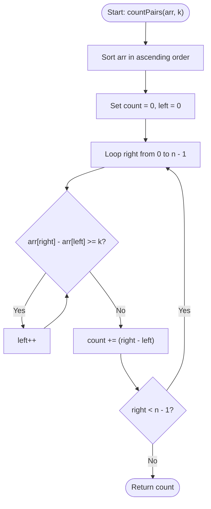

# 💡 Approach — Pairs with Less Than K Diff

| 📄 [Problem](./Problem.md) | 💡 [Approach](./Approach.md) | 🧩 [Solution](./Solution.cpp) | 🚀 [Main](./Main.cpp) |
|:--------------------------:|:-----------------------------:|:------------------------------:|:---------------------:|

---

## 📊 Metadata

---

## 🎯 Core Insight

> [!TIP]
> **Sorting + Sliding Window (Two Pointers)**
>
> 1. **Sorting:** By sorting the array in non-decreasing order, we can guarantee that for any elements at indices `left` and `right` (where `left < right`), `arr[right] >= arr[left]`. The difference `arr[right] - arr[left]` is always non-negative.
> 2. **Sliding Window:** For a fixed `right` pointer, as `right` moves to the right, the value `arr[right]` increases. To keep the difference `arr[right] - arr[left] < k`, the `left` pointer must also move to the right. 
> 3. **Pair Counting:** For each `right` position, after shrinking the window from the left until `arr[right] - arr[left] < k`, all elements between index `left` and `right - 1` form valid pairs with `arr[right]`. The count of such elements is exactly `right - left`.

---

## 🔩 Step-by-Step Breakdown

### Step 1: Sort the Array
- Sort the array `arr[]` in ascending order. This takes $O(n \log n)$ time.

### Step 2: Use Two Pointers
- Initialize `count = 0` and `left = 0`.
- Iterate the `right` pointer from `0` to `n - 1`:
  - Shrink the window: while `arr[right] - arr[left] >= k` and `left < right`, increment `left`.
  - Add the number of valid pairs ending at `right`: `count += (right - left)`.

### Step 3: Return Result
- Return `count` as the total number of pairs.

---

## 🔄 Mermaid Flowchart

---

## 🧮 Dry Run

### Dry Run: Example 1
- **Input:** `arr = [1, 10, 4, 2]`, `k = 3`

#### Phase 1: Sorting
- Sorted array: `arr = [1, 2, 4, 10]`

#### Phase 2: Sliding Window Loop
- **Initialization:** `count = 0`, `left = 0`
- **right = 0 (`arr[0] = 1`):**
  - `arr[0] - arr[0] = 0 < 3` -> No shift.
  - `count += (0 - 0) = 0` (Total count = 0)
- **right = 1 (`arr[1] = 2`):**
  - `arr[1] - arr[0] = 2 - 1 = 1 < 3` -> No shift.
  - `count += (1 - 0) = 1` (Pairs: (1, 2); Total count = 1)
- **right = 2 (`arr[2] = 4`):**
  - `arr[2] - arr[0] = 4 - 1 = 3 >= 3` -> `left` becomes `1`.
  - `arr[2] - arr[1] = 4 - 2 = 2 < 3` -> Stop shifting `left`.
  - `count += (2 - 1) = 1` (Pairs: (2, 4); Total count = 2)
- **right = 3 (`arr[3] = 10`):**
  - `arr[3] - arr[1] = 10 - 2 = 8 >= 3` -> `left` becomes `2`.
  - `arr[3] - arr[2] = 10 - 4 = 6 >= 3` -> `left` becomes `3`.
  - `arr[3] - arr[3] = 0 < 3` -> Stop shifting `left`.
  - `count += (3 - 3) = 0` (Total count = 2)

- **Result:** `2`

---

## 📊 Complexity Analysis

| Complexity | Analysis |
| :--- | :--- |
| **Time Complexity** | $O(n \log n)$ due to the sorting step. The sliding window itself takes $O(n)$ time since both `left` and `right` pointers traverse the array at most once. |
| **Auxiliary Space** | $O(1)$ if sorted in-place. |

---

<h3>Happy Coding! 🚀</h3>

