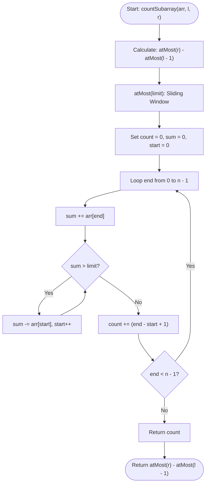

# 💡 Approach — Subarrays with Sum in Range

| 📄 [Problem](./Problem.md) | 💡 [Approach](./Approach.md) | 🧩 [Solution](./Solution.cpp) | 🚀 [Main](./Main.cpp) |
|:--------------------------:|:-----------------------------:|:------------------------------:|:---------------------:|

---

## 📊 Metadata

---

## 🎯 Core Insight

> [!TIP]
> **Sliding Window + Inclusion-Exclusion Principle**
>
> 1. **Inclusion-Exclusion Principle:** Finding the number of subarrays with a sum in the range `[l, r]` is equivalent to:
>    $$\text{Count}(l, r) = \text{Count}(\text{sum} \le r) - \text{Count}(\text{sum} \le l - 1)$$
> 2. **Sliding Window (Two Pointers):** Since all array elements are positive ($arr[i] \ge 1$), the running prefix sums are monotonically increasing. This enables the use of a sliding window to count the number of subarrays with a sum $\le K$ in $O(n)$ time.
> 3. **Subarray Counting:** For any window `[start, end]` where `sum(arr[start..end]) <= K`, all contiguous subarrays ending at `end` and starting at any index from `start` to `end` are valid. The count of such subarrays is exactly `end - start + 1`.

---

## 🔩 Step-by-Step Breakdown

### Step 1: inclusion-exclusion setup
- Define a private helper function `countSubarraysWithSumAtMost(arr, limit)` that returns the count of subarrays whose sum is less than or equal to `limit`.
- If `limit < 0`, return `0`.

### Step 2: sliding window algorithm (`countSubarraysWithSumAtMost`)
- Initialize `count = 0`, `current_sum = 0`, and `start = 0`.
- Iterate the `end` pointer from `0` to `n - 1`:
  - Add the current element to `current_sum`: `current_sum += arr[end]`.
  - While `current_sum > limit` and `start <= end`, shrink the window from the left:
    - Subtract `arr[start]` from `current_sum`.
    - Increment `start`.
  - Add the number of valid subarrays ending at `end` to our accumulator: `count += (end - start + 1)`.

### Step 3: calculate final result
- Compute the count for `r`: `countSubarraysWithSumAtMost(arr, r)`.
- Compute the count for `l - 1`: `countSubarraysWithSumAtMost(arr, l - 1)`.
- Return the difference: `atMost(r) - atMost(l - 1)`.

---

## 🔄 Mermaid Flowchart

---

## 🧮 Dry Run

### Dry Run: Example 1
- **Input:** `arr = [1, 4, 6]`, `l = 3`, `r = 8`

#### Phase 1: `countSubarraysWithSumAtMost(arr, 8)`
- **Initialization:** `count = 0`, `current_sum = 0`, `start = 0`
- **end = 0 (`arr[0] = 1`):**
  - `current_sum = 1 <= 8`. No shrink.
  - `count += (0 - 0 + 1) = 1` (Subarrays: `[1]`)
- **end = 1 (`arr[1] = 4`):**
  - `current_sum = 5 <= 8`. No shrink.
  - `count += (1 - 0 + 1) = 2` (Subarrays: `[4]`, `[1, 4]`)
- **end = 2 (`arr[2] = 6`):**
  - `current_sum = 11 > 8`.
  - Shrink: `current_sum -= arr[0] (1) -> 10`. `start` becomes `1`.
  - Shrink: `current_sum -= arr[1] (4) -> 6`. `start` becomes `2`.
  - `current_sum = 6 <= 8`. Stop.
  - `count += (2 - 2 + 1) = 1` (Subarrays: `[6]`)
- **Result for limit 8:** `4`

#### Phase 2: `countSubarraysWithSumAtMost(arr, 2)`
- **Initialization:** `count = 0`, `current_sum = 0`, `start = 0`
- **end = 0 (`arr[0] = 1`):**
  - `current_sum = 1 <= 2`. No shrink.
  - `count += (0 - 0 + 1) = 1` (Subarrays: `[1]`)
- **end = 1 (`arr[1] = 4`):**
  - `current_sum = 5 > 2`.
  - Shrink: `current_sum -= arr[0] (1) -> 4`. `start` becomes `1`.
  - Shrink: `current_sum -= arr[1] (4) -> 0`. `start` becomes `2`.
  - `current_sum = 0 <= 2`. Stop.
  - `count += (1 - 2 + 1) = 0`
- **end = 2 (`arr[2] = 6`):**
  - `current_sum = 6 > 2`.
  - Shrink: `current_sum -= arr[2] (6) -> 0`. `start` becomes `3`.
  - `current_sum = 0 <= 2`. Stop.
  - `count += (2 - 3 + 1) = 0`
- **Result for limit 2:** `1`

#### Phase 3: Final Answer
- `atMost(8) - atMost(2) = 4 - 1 = 3`.
- **Result:** `3`

---

## 📊 Complexity Analysis

| Complexity | Analysis |
| :--- | :--- |
| **Time Complexity** | $O(n)$ because each element is visited at most twice (once by the `end` pointer and at most once by the `start` pointer) during each of the two calls to `countSubarraysWithSumAtMost`. |
| **Auxiliary Space** | $O(1)$ as we only maintain a few primitive counters and sum variables. |

---

<h3>Happy Coding! 🚀</h3>

