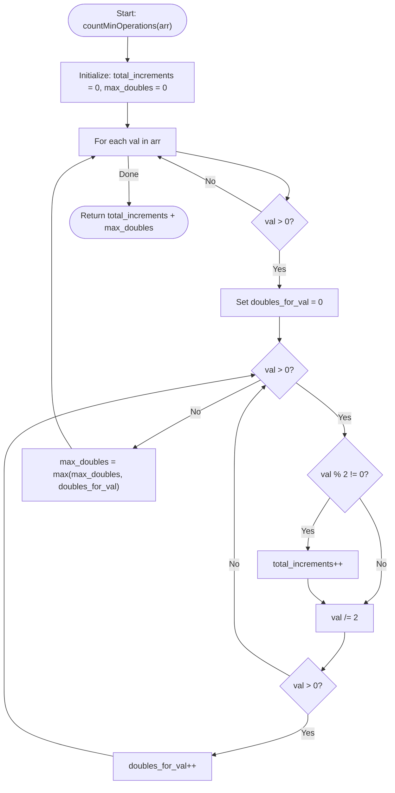

# 💡 Approach — Minimum Steps to Get Desired Array

| 📄 [Problem](./Problem.md) | 💡 [Approach](./Approach.md) | 🧩 [Solution](./Solution.cpp) | 🚀 [Main](./Main.cpp) |
|:--------------------------:|:-----------------------------:|:------------------------------:|:---------------------:|

---

## 📊 Metadata

---

## 🎯 Core Insight

> [!TIP]
> **Reverse Thinking + Binary Representation**
>
> 1. **Reverse Operations:** Instead of building the target array `arr[]` from all 0s, think backward from `arr[]` to all 0s:
>    - Decrement any element by 1 (reverses incrementing by 1).
>    - Divide the entire array by 2 (reverses doubling all elements simultaneously).
> 2. **Optimal Strategy:** 
>    - We must decrement any odd element by 1 before we can divide the array by 2.
>    - The number of decrements needed for any element $arr[i]$ is equal to the number of set bits (1s) in its binary representation.
>    - The number of division operations needed for the entire array is determined by the maximum value in the array. It is equal to the position of the Most Significant Bit (MSB) of the maximum element.
> 3. **Mathematical Formulation:**
>    $$\text{Total Operations} = \sum_{i=0}^{N-1} \text{popcount}(arr[i]) + \max_{i} (\text{MSB}(arr[i]))$$
>    where $\text{MSB}(x)$ is the index of the highest set bit in $x$ (0-indexed, or $-1$ if $x = 0$).

---

## 🔩 Step-by-Step Breakdown

### Step 1: Initialize counters
- Initialize `total_increments = 0` to count the total addition operations.
- Initialize `max_doubles = 0` to count the maximum division (double) operations required.

### Step 2: Iterate through each element
- For each element `val` in `arr`:
  - Count set bits (increments) and track the position of the MSB (doubles) for `val`.
  - Initialize `doubles_for_val = 0`.
  - While `val > 0`:
    - If `val % 2 != 0` (or `val & 1`), increment `total_increments`.
    - Divide `val` by 2 (`val >>= 1`).
    - If `val > 0`, increment `doubles_for_val` (signifying a division/double is needed).
  - Update `max_doubles = max(max_doubles, doubles_for_val)`.

### Step 3: Return the sum of increments and max doubles
- Return `total_increments + max_doubles`.

---

## 🔄 Mermaid Flowchart

---

## 🧮 Dry Run

### Dry Run: Example 2
- **Input:** `arr = [2, 3]`

#### Element 1: `val = 2`
- `doubles_for_val = 0`
- `val = 2` (even):
  - `val` is even $\rightarrow$ no increment.
  - `val /= 2` $\rightarrow$ `val = 1`.
  - `val > 0` $\rightarrow$ `doubles_for_val` becomes `1`.
- `val = 1` (odd):
  - `val` is odd $\rightarrow$ `total_increments` becomes `1`.
  - `val /= 2` $\rightarrow$ `val = 0`.
  - `val` is not $>0$ $\rightarrow$ loop ends.
- `max_doubles = max(0, 1) = 1`.

#### Element 2: `val = 3`
- `doubles_for_val = 0`
- `val = 3` (odd):
  - `val` is odd $\rightarrow$ `total_increments` becomes `1 + 1 = 2`.
  - `val /= 2` $\rightarrow$ `val = 1`.
  - `val > 0` $\rightarrow$ `doubles_for_val` becomes `1`.
- `val = 1` (odd):
  - `val` is odd $\rightarrow$ `total_increments` becomes `2 + 1 = 3`.
  - `val /= 2` $\rightarrow$ `val = 0`.
  - `val` is not $>0$ $\rightarrow$ loop ends.
- `max_doubles = max(1, 1) = 1`.

#### Final calculation
- `total_increments + max_doubles = 3 + 1 = 4`.
- **Result:** `4`

---

## 📊 Complexity Analysis

| Complexity | Analysis |
| :--- | :--- |
| **Time Complexity** | $O(n \cdot \log(\max(arr[i])))$ because we process each element by repeatedly dividing by 2. For elements up to $10^9$, this takes at most 30 divisions per element. |
| **Auxiliary Space** | $O(1)$ as we only maintain a few integer counters. |

---

<h3>Happy Coding! 🚀</h3>

