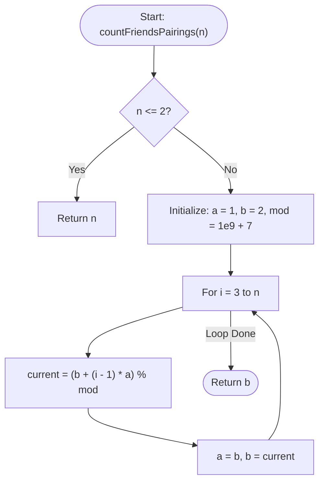

# 💡 Approach — Friends Pairing Problem

| 📄 [Problem](./Problem.md) | 💡 [Approach](./Approach.md) | 🧩 [Solution](./Solution.cpp) | 🚀 [Main](./Main.cpp) |
|:--------------------------:|:-----------------------------:|:------------------------------:|:---------------------:|

---

## 📊 Metadata

---

## 🎯 Core Insight

> [!TIP]
> **Subproblem Decomposition & Recurrence Relation**
>
> For $n$ friends, let $f(n)$ represent the total number of ways they can remain single or be paired up.
> Consider the $n$-th person. There are two distinct, mutually exclusive choices:
> 
> 1. **Remain Single:** The $n$-th person does not pair with anyone.
>    - The number of ways to arrange the remaining $n-1$ friends is $f(n-1)$.
> 
> 2. **Pair Up:** The $n$-th person pairs up with one of the other $n-1$ friends.
>    - There are $n-1$ possible partners.
>    - Once the pair is formed, the number of ways to arrange the remaining $n-2$ friends is $f(n-2)$.
>    - Thus, the total ways for this case is $(n-1) \times f(n-2)$.
>
> **Recurrence Relation:**
> $$f(n) = f(n-1) + (n-1) \times f(n-2)$$
>
> **Base Cases:**
> - $f(1) = 1$ (Only 1 way: `{1}`)
> - $f(2) = 2$ (2 ways: `{1}, {2}` or `{1,2}`)

---

## 🔩 Step-by-Step Breakdown

### Step 1: Handle Base Cases
- If $n \le 2$, return $n$ directly.

### Step 2: Iterative State Transition (Space-Optimized DP)
- We only need the previous two states to compute the current state.
- Maintain two variables:
  - `a` represents $f(i-2)$, initialized to $1$ (for $n=1$).
  - `b` represents $f(i-1)$, initialized to $2$ (for $n=2$).
- Loop from $i = 3$ to $n$:
  - Calculate `current = (b + (i - 1) * a) % MOD`.
  - Update `a = b`.
  - Update `b = current`.
- Return `b` as the result.

---

## 🔄 Mermaid Flowchart

---

## 🧮 Dry Run

### Dry Run: $n = 4$
- **Base Case Check:** $n = 4 > 2$, proceed to initialization.
- **Initialization:** `a = 1`, `b = 2`.

#### Iteration $i = 3$:
- `current = (b + (i - 1) * a) % mod`
- `current = (2 + 2 * 1) = 4`
- Update: `a = 2`, `b = 4`

#### Iteration $i = 4$:
- `current = (b + (i - 1) * a) % mod`
- `current = (4 + 3 * 2) = 10`
- Update: `a = 4`, `b = 10`

- **Return:** `b = 10`
- **Result:** `10`

---

## 📊 Complexity Analysis

| Complexity | Analysis |
| :--- | :--- |
| **Time Complexity** | $O(n)$ because we iterate from $3$ to $n$ exactly once, performing constant time operations in each step. |
| **Auxiliary Space** | $O(1)$ as we only store state in two variables `a` and `b`. |

---

<h3>Happy Coding! 🚀</h3>

