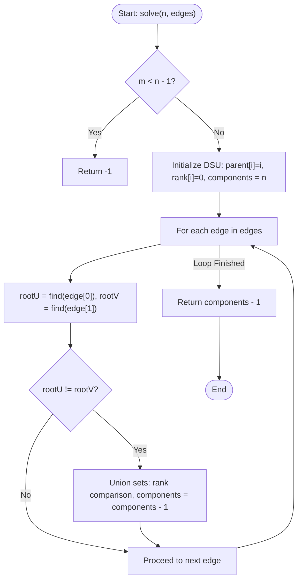

# 💡 Approach — Connecting the Graph

| 📄 [Problem](./Problem.md) | 💡 [Approach](./Approach.md) | 🧩 [Solution](./Solution.cpp) | 🚀 [Main](./Main.cpp) |
|:--------------------------:|:-----------------------------:|:------------------------------:|:---------------------:|

---

## 📊 Metadata

---

## 🎯 Core Insight

> [!TIP]
> **Mathematical Criteria for Graph Connectivity**
> 
> 1. **Minimum Edges Requirement:**
>    To connect $n$ vertices, we need at least $n - 1$ edges. If the total number of edges $m$ is less than $n - 1$, it is mathematically impossible to connect the graph regardless of how we move the edges. In this case, we immediately return `-1`.
> 
> 2. **Component Connectivity & Redundant Edges:**
>    If $m \ge n - 1$:
>    - Let the number of connected components in the graph be $C$.
>    - To connect $C$ components, we need exactly $C - 1$ bridging edges.
>    - Because $m \ge n - 1$, we are guaranteed to have at least $C - 1$ redundant edges (edges that form cycles and are not required to keep their respective components connected).
>    - We can remove these $C - 1$ redundant edges and use them to bridge the components.
>    
>    **Minimum Operations Required:**
>    $$\text{Operations} = C - 1$$

---

## 🔩 Step-by-Step Breakdown

### Step 1: Check Minimum Edges Constraint
- If $m < n - 1$, return `-1` immediately.

### Step 2: Initialize Disjoint Set Union (DSU)
- Create parent and rank arrays of size $n$.
- Initialize `parent[i] = i` for all $0 \le i < n$.
- Track the number of components, starting with `numComponents = n`.

### Step 3: Union-Find Processing
- Loop through each edge `(u, v)`:
  - Find the representative parents of `u` and `v` using path compression.
  - If the representatives are different:
    - Perform a union operation by rank (or size) to merge the two components.
    - Decrement `numComponents` by 1.

### Step 4: Return Result
- The minimum operations to connect the graph is `numComponents - 1`.

---

## 🔄 Mermaid Flowchart

---

## 🧮 Dry Run

### Dry Run: $n = 4$, `edges = [[0, 1], [0, 2], [1, 2]]`
- **Check Edge Count:** $m = 3$, $n-1 = 3$. Since $3 \ge 3$, connection is possible.
- **DSU Initialization:**
  - `parent = [0, 1, 2, 3]`
  - `rank = [0, 0, 0, 0]`
  - `numComponents = 4`

#### 1. Process Edge `[0, 1]`
- `rootU = find(0) = 0`, `rootV = find(1) = 1`.
- `rootU != rootV` (0 != 1).
- Union: Set `parent[1] = 0`.
- Update: `numComponents = 3`.

#### 2. Process Edge `[0, 2]`
- `rootU = find(0) = 0`, `rootV = find(2) = 2`.
- `rootU != rootV` (0 != 2).
- Union: Set `parent[2] = 0`.
- Update: `numComponents = 2`.

#### 3. Process Edge `[1, 2]`
- `rootU = find(1) = 0` (via path compression), `rootV = find(2) = 0`.
- `rootU == rootV` (0 == 0).
- Union: No operation (this is a redundant edge).
- Update: `numComponents = 2`.

- **Return:** `numComponents - 1 = 2 - 1 = 1`.
- **Result:** `1`

---

## 📊 Complexity Analysis

| Complexity | Analysis |
| :--- | :--- |
| **Time Complexity** | $O(n + m \cdot \alpha(n))$ where $\alpha$ is the Inverse Ackermann function. This is virtually $O(n + m)$ since $\alpha(n) \le 4$ for all practical values of $n$. |
| **Auxiliary Space** | $O(n)$ to store the `parent` and `rank` vectors for the Disjoint Set Union data structure. |

---

<h3>Happy Coding! 🚀</h3>

