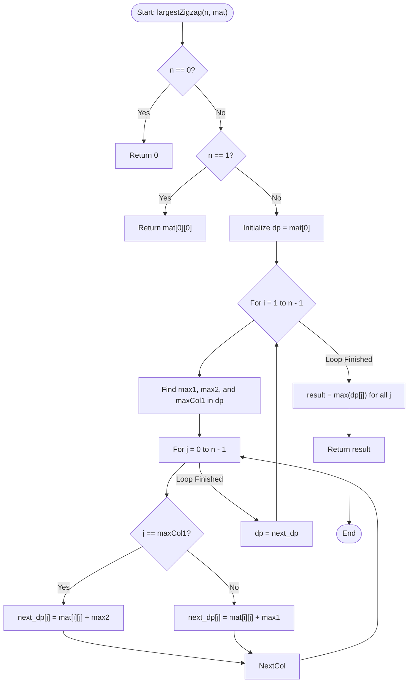

# 💡 Approach — Largest Zigzag Sequence

| 📄 [Problem](./Problem.md) | 💡 [Approach](./Approach.md) | 🧩 [Solution](./Solution.cpp) | 🚀 [Main](./Main.cpp) |
|:--------------------------:|:-----------------------------:|:------------------------------:|:---------------------:|

---

## 📊 Metadata

---

## 🎯 Core Insight

> [!TIP]
> **State Tracking and $O(1)$ Column Selection**
> 
> 1. **DP State definition:**
>    Let $dp[j]$ store the maximum sum of a zigzag sequence ending at column $j$ of the current row.
> 
> 2. **Avoiding $O(n)$ transitions:**
>    To compute $dp[j]$ for the current row, we need the maximum value from the previous row's DP state, excluding column $j$ (to avoid consecutive elements in the same column). A naive search takes $O(n)$ per cell, giving $O(n^3)$ overall time.
>    
>    Instead, we can find the **maximum (`max1`)** and **second maximum (`max2`)** values of the previous row's DP state along with the column of the maximum value (`maxCol1`).
>    - For any column $j \neq maxCol1$, the best previous value we can transition from is `max1`.
>    - For column $j == maxCol1$, we cannot use `max1` (since it's in the same column), so we must transition from the next best value, `max2`.
>    
>    This reduces the transition time to $O(1)$ per cell, yielding an optimal $O(n^2)$ overall time complexity.

---

## 🔩 Step-by-Step Breakdown

### Step 1: Handle Edge Cases
- If $n = 0$, return `0`.
- If $n = 1$, return `mat[0][0]`.

### Step 2: Initialize DP State
- Initialize a 1D DP array `dp` of size $n$ with the elements of the first row: `dp[j] = mat[0][j]` for $0 \le j < n$.

### Step 3: Iterate Through Subsequent Rows
For each row $i$ from $1$ to $n-1$:
1. **Find Top Two Maximums:**
   - Scan the `dp` array representing the previous row.
   - Record `max1` (largest value), `maxCol1` (its column), and `max2` (second largest value).
2. **Transition:**
   - Create a temporary array `next_dp` of size $n$.
   - For each column $j$ from $0$ to $n-1$:
     - If $j == maxCol1$, set `next_dp[j] = mat[i][j] + max2`.
     - Otherwise, set `next_dp[j] = mat[i][j] + max1`.
3. **Update State:**
   - Set `dp = next_dp`.

### Step 4: Extract Answer
- The maximum sum is the largest value in the final `dp` array: $\max_{0 \le j < n} (dp[j])$.

---

## 🔄 Mermaid Flowchart

---

## 🧮 Dry Run

### Dry Run: $n = 3$, `mat = [[3, 1, 2], [4, 8, 5], [6, 9, 7]]`

- **Initialization:**
  - `dp = [3, 1, 2]`

#### 1. Process Row $i = 1$ (`mat[1] = [4, 8, 5]`)
- **Find top two in `dp`:**
  - `dp = [3, 1, 2]` $\rightarrow$ `max1 = 3` (at `maxCol1 = 0`), `max2 = 2`.
- **Transitions:**
  - $j = 0$ ($j == maxCol1$): `next_dp[0] = mat[1][0] + max2 = 4 + 2 = 6`
  - $j = 1$ ($j \neq maxCol1$): `next_dp[1] = mat[1][1] + max1 = 8 + 3 = 11`
  - $j = 2$ ($j \neq maxCol1$): `next_dp[2] = mat[1][2] + max1 = 5 + 3 = 8`
- **Update DP:**
  - `dp = [6, 11, 8]`

#### 2. Process Row $i = 2$ (`mat[2] = [6, 9, 7]`)
- **Find top two in `dp`:**
  - `dp = [6, 11, 8]` $\rightarrow$ `max1 = 11` (at `maxCol1 = 1`), `max2 = 8`.
- **Transitions:**
  - $j = 0$ ($j \neq maxCol1$): `next_dp[0] = mat[2][0] + max1 = 6 + 11 = 17`
  - $j = 1$ ($j == maxCol1$): `next_dp[1] = mat[2][1] + max2 = 9 + 8 = 17`
  - $j = 2$ ($j \neq maxCol1$): `next_dp[2] = mat[2][2] + max1 = 7 + 11 = 18`
- **Update DP:**
  - `dp = [17, 17, 18]`

- **Final Answer:**
  - $\max(17, 17, 18) = 18$

---

## 📊 Complexity Analysis

| Complexity | Analysis |
| :--- | :--- |
| **Time Complexity** | $O(n^2)$ — We iterate through all $n$ rows. For each row, we find the top two maximum values in $O(n)$ time and perform $n$ transitions in $O(1)$ time each. |
| **Auxiliary Space** | $O(n)$ — We only keep the DP values of the previous row (`dp`) and the current row (`next_dp`), avoiding a full $O(n^2)$ matrix representation. |

---

> *"Dynamic programming is not about memorization; it's about breaking a complex journey into simple, optimal choices at every step."*

---

<h3>Happy Coding! 🚀</h3>

