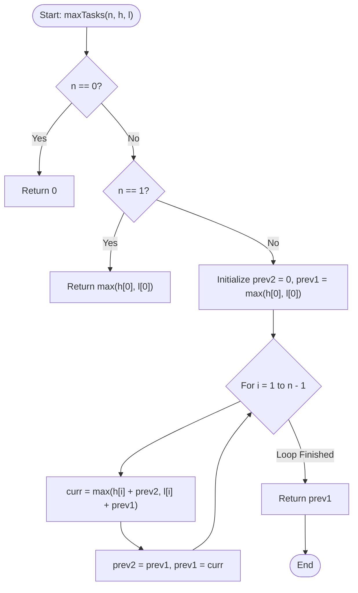

# 💡 Approach — High Effort vs Low Effort

| 📄 [Problem](./Problem.md) | 💡 [Approach](./Approach.md) | 🧩 [Solution](./Solution.cpp) | 🚀 [Main](./Main.cpp) |
|:--------------------------:|:-----------------------------:|:------------------------------:|:---------------------:|

---

## 📊 Metadata

---

## 🎯 Core Insight

> [!TIP]
> **State Reduction and Cooldown Transition**
> 
> 1. **DP State definition:**
>    Let $dp[i]$ represent the maximum tasks we can complete up to day $i$.
> 
> 2. **Formulating the transitions:**
>    On any day $i$, we can make one of two optimal choices (performing no task is implicitly covered since $l[i] \ge 0$, meaning performing a low-effort task is always at least as good as doing nothing if we choose to perform a task on day $i$):
>    - **Option 1 (Perform high-effort task on day $i$):** This requires that we perform **no task** on day $i-1$. By doing no task on day $i-1$, our max reward up to day $i-1$ is simply $dp[i-2]$. Thus, the total reward is $h[i] + dp[i-2]$.
>    - **Option 2 (Perform low-effort task on day $i$):** This can follow any state of the previous day, so the total reward is $l[i] + dp[i-1]$.
>    
>    This gives us the recurrence relations:
>    $$dp[i] = \max(h[i] + dp[i-2],\ l[i] + dp[i-1])$$
>    
> 3. **Space Optimization:**
>    To compute $dp[i]$, we only need the solutions for day $i-1$ ($dp[i-1]$) and day $i-2$ ($dp[i-2]$). By keeping track of only these two variables (`prev1` and `prev2`), we reduce the auxiliary space from $O(n)$ to $O(1)$.

---

## 🔩 Step-by-Step Breakdown

### Step 1: Handle Edge Cases
- If $n = 0$, return `0`.
- If $n = 1$, the maximum we can get is by performing either the high-effort or low-effort task on the first day, i.e., `max(h[0], l[0])`.

### Step 2: Initialize DP State
- Define `prev2 = 0` (representing $dp[-1]$ or the state before day 0).
- Define `prev1 = max(h[0], l[0])` (representing $dp[0]$).

### Step 3: Iterate Through Subsequent Days
For each day $i$ from $1$ to $n-1$:
1. Calculate the optimal value for the current day:
   - `curr = max(h[i] + prev2, l[i] + prev1)`
2. Update the DP variables for the next day:
   - `prev2 = prev1`
   - `prev1 = curr`

### Step 4: Extract Answer
- The maximum tasks completed is the value stored in `prev1` after the loop finishes.

---

## 🔄 Mermaid Flowchart

---

## 🧮 Dry Run

### Dry Run: $h = [3, 6, 8, 7, 6]$, $l = [1, 5, 4, 5, 3]$

- **Initialization:**
  - `prev2 = 0`
  - `prev1 = max(3, 1) = 3`

#### 1. Day $i = 1$ ($h[1] = 6, l[1] = 5$)
- `curr = max(6 + prev2, 5 + prev1) = max(6 + 0, 5 + 3) = max(6, 8) = 8`
- Update: `prev2 = 3`, `prev1 = 8`

#### 2. Day $i = 2$ ($h[2] = 8, l[2] = 4$)
- `curr = max(8 + prev2, 4 + prev1) = max(8 + 3, 4 + 8) = max(11, 12) = 12`
- Update: `prev2 = 8`, `prev1 = 12`

#### 3. Day $i = 3$ ($h[3] = 7, l[3] = 5$)
- `curr = max(7 + prev2, 5 + prev1) = max(7 + 8, 5 + 12) = max(15, 17) = 17`
- Update: `prev2 = 12`, `prev1 = 17`

#### 4. Day $i = 4$ ($h[4] = 6, l[4] = 3$)
- `curr = max(6 + prev2, 3 + prev1) = max(6 + 12, 3 + 17) = max(18, 20) = 20`
- Update: `prev2 = 17`, `prev1 = 20`

- **Final Answer:** `prev1 = 20`

---

## 📊 Complexity Analysis

| Complexity | Analysis |
| :--- | :--- |
| **Time Complexity** | $O(n)$ — We perform a single loop from day $1$ to $n-1$, doing $O(1)$ operations at each day. |
| **Auxiliary Space** | $O(1)$ — We only keep the DP values of the previous two days (`prev1`, `prev2`) in scalar variables, requiring no extra array space. |

---

> *"The best preparation for tomorrow is doing your best today."*

---

<h3>Happy Coding! 🚀</h3>

