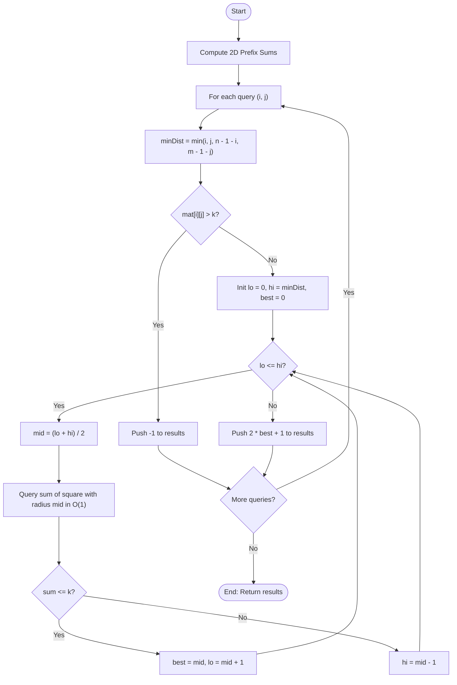

# 💡 Approach — Largest Odd Squares with Limited 1s

| 📄 [Problem](./Problem.md) | 💡 [Approach](./Approach.md) | 🧩 [Solution](./Solution.cpp) | 🚀 [Main](./Main.cpp) |
|:--------------------------:|:-----------------------------:|:------------------------------:|:---------------------:|

---

## 📊 Metadata

---

## 🎯 Core Insight

> [!TIP]
> **2D Prefix Sums & Monotonicity of Square Sizes**
> 
> 1. **2D Prefix Sum (Summed-Area Table):**
>    To check the number of ones in a square region in $O(1)$ time, we precompute a 2D prefix sum array where `prefix[i][j]` stores the sum of all elements in the sub-rectangle from `(0, 0)` to `(i-1, j-1)`.
>    For any subgrid with top-left `(r1, c1)` and bottom-right `(r2, c2)`, the sum of elements is:
>    $$\text{Sum} = prefix[r2 + 1][c2 + 1] - prefix[r1][c2 + 1] - prefix[r2 + 1][c1] + prefix[r1][c1]$$
> 
> 2. **Monotonicity:**
>    Since the elements in a binary matrix are non-negative ($0$ or $1$), expanding a square from the center `(i, j)` monotonically increases (or leaves unchanged) the number of ones inside it. 
>    Therefore, if a square of radius $d$ contains $\le k$ ones, then any square of radius $d' < d$ will also contain $\le k$ ones. Conversely, if a square of radius $d$ contains $> k$ ones, then any square of radius $d' > d$ will also contain $> k$ ones.
>    This monotonic property allows us to perform a **binary search** on the radius $d \in [0, minDist]$ to find the maximum valid square.

---

## 🔩 Step-by-Step Breakdown

### Step 1: Precompute 2D Prefix Sums
- Construct a `(n + 1) x (m + 1)` prefix sum matrix.
- Fill `prefix[i + 1][j + 1] = prefix[i][j + 1] + prefix[i + 1][j] - prefix[i][j] + mat[i][j]`.

### Step 2: Handle Each Query `(i, j)`
For each query, find the maximum possible expansion radius `minDist` without going out of the grid boundaries:
$$\text{minDist} = \min(\{i, j, n - 1 - i, m - 1 - j\})$$

### Step 3: Check Center Cell (Radius $d = 0$)
- If the center cell itself has more than $k$ ones (i.e. `mat[i][j] > k`), then no valid square can be formed. 
- In this case, output `-1` for this query.

### Step 4: Binary Search for Radius $d$
- Initialize the search range: `lo = 0`, `hi = minDist`, `best = 0`.
- While `lo <= hi`:
  1. Calculate `mid = (lo + hi) / 2`.
  2. Compute boundaries: `r1 = i - mid`, `c1 = j - mid`, `r2 = i + mid`, `c2 = j + mid`.
  3. Query the sum in `[r1..r2]` and `[c1..c2]` using the 2D prefix sum table.
  4. If `sum <= k`, set `best = mid` and search the upper half (`lo = mid + 1`).
  5. Otherwise, search the lower half (`hi = mid - 1`).

### Step 5: Store Result
- The side length for radius `best` is `2 * best + 1`. Append this to the results.

---

## 🔄 Mermaid Flowchart

---

## 🧮 Dry Run

### Dry Run: Matrix $= [[1, 0, 1, 0, 0], [1, 0, 1, 1, 1], [1, 1, 1, 1, 1], [1, 0, 0, 1, 0]]$, $k = 9$, query $= [1, 2]$

- **Matrix dimensions:** $n = 4, m = 5$.
- **Min distance from boundaries:** `minDist = min(1, 2, 4 - 1 - 1, 5 - 1 - 2) = min(1, 2, 2, 2) = 1`.
- **Center cell:** `mat[1][2] = 1 <= 9` (Valid).
- **Binary Search initialization:** `lo = 0`, `hi = 1`, `best = 0`.

#### Iteration 1:
- `mid = (0 + 1) / 2 = 0`.
- Sum of square of radius 0 (cell `mat[1][2]`): `1 <= 9`.
- Update: `best = 0`, `lo = 1`.

#### Iteration 2:
- `mid = (1 + 1) / 2 = 1`.
- Sum of square of radius 1 (spanning rows 0 to 2, columns 1 to 3):
  $$\text{Sum} = 1 + 2 + 3 = 6 \le 9$$
- Update: `best = 1`, `lo = 2`.

- **Termination:** `lo > hi` ($2 > 1$).
- **Answer:** `2 * best + 1 = 3`. Correct!

---

## 📊 Complexity Analysis

| Complexity | Analysis |
| :--- | :--- |
| **Time Complexity** | $O(n \times m + q \times \log(\min(n, m)))$ — Precomputing the prefix sum takes $O(n \times m)$ time. For each of the $q$ queries, we binary search over a range of size at most $\min(n, m)/2$, performing $O(1)$ submatrix sum checks at each step. |
| **Auxiliary Space** | $O(n \times m)$ — To store the 2D prefix sum matrix of size $(n + 1) \times (m + 1)$. |

---

> *"Divide and conquer, search and optimize."*

---

<h3>Happy Coding! 🚀</h3>

