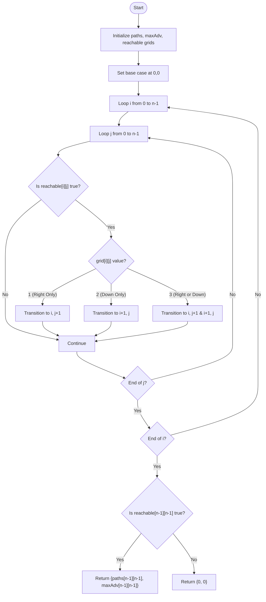

# 💡 Approach — Adventure in a Maze

| 📄 [Problem](./Problem.md) | 💡 [Approach](./Approach.md) | 🧩 [Solution](./Solution.cpp) | 🚀 [Main](./Main.cpp) |
|:--------------------------:|:-----------------------------:|:------------------------------:|:---------------------:|

## 📊 Metadata

---

> [!TIP]
> **Core Insight**: Since moves are strictly Right or Down, there are no cycles in our movement graph (it is a DAG). We can solve it using bottom-up 2D Dynamic Programming. To prevent reachability detection bugs caused by modulo arithmetic (where a non-zero path count becomes exactly $0$ modulo $10^9+7$), we must track reachability with a dedicated boolean grid `reachable[i][j]` instead of just checking `paths[i][j] > 0`.

---

## 🔩 Step-by-Step Breakdown

### Step 1: State Definition
Maintain three grids of size $n \times n$:
- `paths[i][j]`: Stores the number of distinct valid paths from `(0, 0)` to `(i, j)` modulo $10^9 + 7$.
- `maxAdv[i][j]`: Stores the maximum adventure value accumulated along any path from `(0, 0)` to `(i, j)`.
- `reachable[i][j]`: A boolean table tracking if cell `(i, j)` is reachable from the starting cell `(0, 0)`.

### Step 2: Base Case Initialization
Initialize the starting cell:
- `paths[0][0] = 1`
- `maxAdv[0][0] = grid[0][0]`
- `reachable[0][0] = true`
All other cells are initialized to `paths[i][j] = 0`, `maxAdv[i][j] = 0`, and `reachable[i][j] = false`.

### Step 3: DP Transitions
Iterate through the grid using nested loops: $i$ from $0$ to $n-1$, and $j$ from $0$ to $n-1$.
For each cell `(i, j)` where `reachable[i][j]` is `true`:
- Let `val = grid[i][j]`.
- If `val == 1` or `val == 3` (allows moving Right):
  - Transition to `(i, j + 1)` if `j + 1 < n`:
    - `reachable[i][j + 1] = true`
    - `paths[i][j + 1] = (paths[i][j + 1] + paths[i][j]) % MOD`
    - `maxAdv[i][j + 1] = max(maxAdv[i][j + 1], maxAdv[i][j] + grid[i][j + 1])`
- If `val == 2` or `val == 3` (allows moving Down):
  - Transition to `(i + 1, j)` if `i + 1 < n`:
    - `reachable[i + 1][j] = true`
    - `paths[i + 1][j] = (paths[i + 1][j] + paths[i][j]) % MOD`
    - `maxAdv[i + 1][j] = max(maxAdv[i + 1][j], maxAdv[i][j] + grid[i + 1][j])`

### Step 4: Answer Extraction
- If `reachable[n-1][n-1]` is `false`, the exit is not reachable. Return `{0, 0}`.
- Otherwise, return `{paths[n-1][n-1], maxAdv[n-1][n-1]}`.

---

## 🔄 Mermaid Flowchart

---

## 🧮 Dry Run

### Dry Run: `grid[][] = [[3, 2], [1, 3]]`

- **Initialization**:
  - `paths[0][0] = 1`, `maxAdv[0][0] = 3`, `reachable[0][0] = true`.
  - All other cells are initialized to `paths = 0`, `maxAdv = 0`, `reachable = false`.

#### Step 1: Cell `(0, 0)`
- `reachable[0][0] == true`. Value `val = grid[0][0] = 3` (allows Right & Down).
  - **Move Right to `(0, 1)`**:
    - `reachable[0][1] = true`
    - `paths[0][1] = (paths[0][1] + paths[0][0]) % MOD = (0 + 1) = 1`
    - `maxAdv[0][1] = max(maxAdv[0][1], maxAdv[0][0] + grid[0][1]) = max(0, 3 + 2) = 5`
  - **Move Down to `(1, 0)`**:
    - `reachable[1][0] = true`
    - `paths[1][0] = (paths[1][0] + paths[0][0]) % MOD = (0 + 1) = 1`
    - `maxAdv[1][0] = max(maxAdv[1][0], maxAdv[0][0] + grid[1][0]) = max(0, 3 + 1) = 4`

#### Step 2: Cell `(0, 1)`
- `reachable[0][1] == true`. Value `val = grid[0][1] = 2` (allows Down only).
  - **Move Down to `(1, 1)`**:
    - `reachable[1][1] = true`
    - `paths[1][1] = (paths[1][1] + paths[0][1]) % MOD = (0 + 1) = 1`
    - `maxAdv[1][1] = max(maxAdv[1][1], maxAdv[0][1] + grid[1][1]) = max(0, 5 + 3) = 8`

#### Step 3: Cell `(1, 0)`
- `reachable[1][0] == true`. Value `val = grid[1][0] = 1` (allows Right only).
  - **Move Right to `(1, 1)`**:
    - `paths[1][1] = (paths[1][1] + paths[1][0]) % MOD = (1 + 1) = 2`
    - `maxAdv[1][1] = max(maxAdv[1][1], maxAdv[1][0] + grid[1][1]) = max(8, 4 + 3) = 8`

#### Step 4: Cell `(1, 1)`
- Loop terminates. Reachable check for `(1, 1)` is `true`.
- **Result**: Return `{paths[1][1], maxAdv[1][1]}` which is `{2, 8}`. Correct!

---

## 📊 Complexity Analysis

| Complexity | Resource | Details |
| :--- | :--- | :--- |
| **Time Complexity** | $\mathcal{O}(n^2)$ | We iterate through the $n \times n$ grid once, performing $\mathcal{O}(1)$ operations per cell. |
| **Space Complexity** | $\mathcal{O}(n^2)$ | We allocate three tables of size $n \times n$ (`paths`, `maxAdv`, and `reachable`). |

---

> *"Dynamic programming is not about memory, it's about finding the structure of the problem and breaking it down into simple, overlapping subproblems."*

---

<h3>Happy Coding! 🚀</h3>

