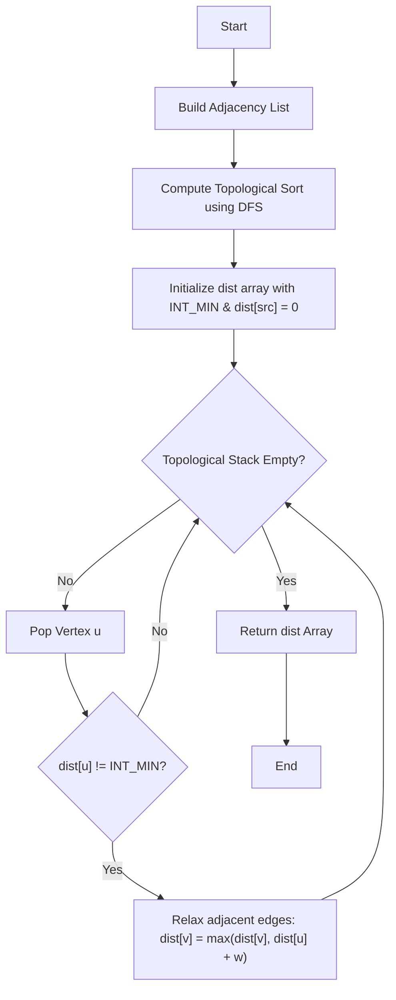

# 💡 Approach — Longest Path in a DAG

| 📄 [Problem](./Problem.md) | 💡 [Approach](./Approach.md) | 🧩 [Solution](./Solution.cpp) | 🚀 [Main](./Main.cpp) |
|:--------------------------:|:-----------------------------:|:------------------------------:|:---------------------:|

## 📊 Metadata

---

## 💡 Core Insight

> [!TIP]
> **Core Insight:**  
> In a Directed Acyclic Graph (DAG), we can find the shortest/longest paths from a source vertex in linear time $O(V + E)$ by processing vertices in **Topological Order**.  
> Because a DAG has no cycles, a topological sort gives us a linear ordering where for every directed edge $u \to v$, vertex $u$ comes before $v$. Therefore, when we process $u$, we are guaranteed to have already computed the absolute longest path to $u$. We can then greedily relax all outgoing edges from $u$ to update the longest paths to its neighbors.

---

## 🔩 Step-by-Step Breakdown

1. **Build Adjacency List**:
   - Construct a directed graph representation where each node $u$ points to its neighbor $v$ along with the edge weight $w$ (i.e. `adj[u].push_back({v, w})`).

2. **Compute Topological Sort**:
   - Use Depth First Search (DFS) to find a topological ordering of the graph.
   - For each unvisited node, recursively visit all its neighbors, and push the node onto a stack when all its descendants have been fully processed.
   - The stack will store the topological sort order (with the first node to be processed on top).

3. **Initialize Distance Array**:
   - Create a `dist` array of size $V$ initialized to `INT_MIN` representing that all vertices are initially unreachable.
   - Set the source vertex distance `dist[src] = 0`.

4. **Relax Edges in Topological Order**:
   - Pop vertices from the topological stack one by one.
   - For each popped vertex $u$:
     - If `dist[u] != INT_MIN` (meaning $u$ is reachable from `src`):
       - For each neighbor $v$ of $u$ with weight $w$:
         - If `dist[u] + w > dist[v]`, update `dist[v] = dist[u] + w`.

5. **Return Distances**:
   - The updated `dist` array will contain the longest path from `src` to all vertices. Unreachable vertices will remain `INT_MIN`.

---

## 🔄 Mermaid Flowchart

---

## 📊 Complexity Analysis

| Complexity | Resource | Details / Explanation |
| :--------: | :------: | --------------------- |
| **Time**   | $O(V + E)$ | $O(V + E)$ for topological sorting using DFS, and $O(V + E)$ to process each vertex and relax its outgoing edges exactly once. |
| **Space**  | $O(V + E)$ | Adjacency list requires $O(V + E)$ space, and the topological stack and visited array require $O(V)$ space. |

---

> *"The efficiency of pathfinding in acyclic structures lies in the beauty of linear ordering. Process the past before you determine the future."*

---

<h3>Happy Coding! 🚀</h3>

