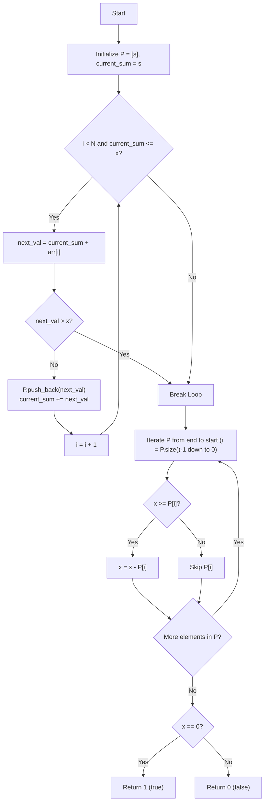

# 💡 Approach — Subset Sum on Generated Sequence

| 📄 [Problem](./Problem.md) | 💡 [Approach](./Approach.md) | 🧩 [Solution](./Solution.cpp) | 🚀 [Main](./Main.cpp) |
|:--------------------------:|:-----------------------------:|:------------------------------:|:---------------------:|

## 📊 Metadata

---

## 💡 Core Insight

> [!TIP]
> **Core Insight:**  
> The numbers written on the paper form a **superincreasing sequence**, where each element $P_k$ is strictly greater than the sum of all preceding elements ($P_k > P_0 + P_1 + \dots + P_{k-1}$).  
> Because each term grows at least exponentially ($P_k \ge s \cdot 2^k$), the sequence exceeds $x$ in at most $\approx 63$ steps.  
> For any superincreasing sequence, the **Greedy Choice** is optimal: iterate backwards from the largest element $\le x$, and if $x \ge P_k$, subtract $P_k$ from $x$. If $x$ becomes $0$, then $x$ can be formed by a subset!

---

## 🔩 Step-by-Step Breakdown

1. **Generate Sequence Terms up to $x$**:
   - Start with initial paper term $P_0 = s$ and running paper sum `current_sum = s`.
   - For each child's assigned value `arr[i]`:
     - Calculate `next_val = current_sum + arr[i]`.
     - If `next_val > x` or `current_sum > x`, stop generating (to avoid unnecessary iterations and 64-bit integer overflow).
     - Otherwise, add `next_val` to sequence $P$ and update `current_sum += next_val`.

2. **Greedy Subset Selection**:
   - Process the generated terms in sequence $P$ from right to left (largest to smallest).
   - For each term $P[i]$:
     - If $x \ge P[i]$, pick $P[i]$ and update $x = x - P[i]$.

3. **Check Result**:
   - If $x == 0$, return `true` (or `1`).
   - Otherwise, return `false` (or `0`).

---

## 🔄 Mermaid Flowchart

---

## 📊 Complexity Analysis

| Complexity | Resource | Details / Explanation |
| :--------: | :------: | --------------------- |
| **Time**   | $O(\min(N, \log X))$ | The sequence grows exponentially, generating at most $\approx 63$ terms before exceeding $X$. Iterating over $P$ takes $O(\log X)$ steps. |
| **Space**  | $O(\min(N, \log X))$ | Auxiliary vector $P$ stores at most $\approx 63$ terms ($O(\log X)$ space). |

---

> *"When each step outgrows the sum of its past, greedy choices from the future guarantee the optimal path."*

---

<h3>Happy Coding! 🚀</h3>

