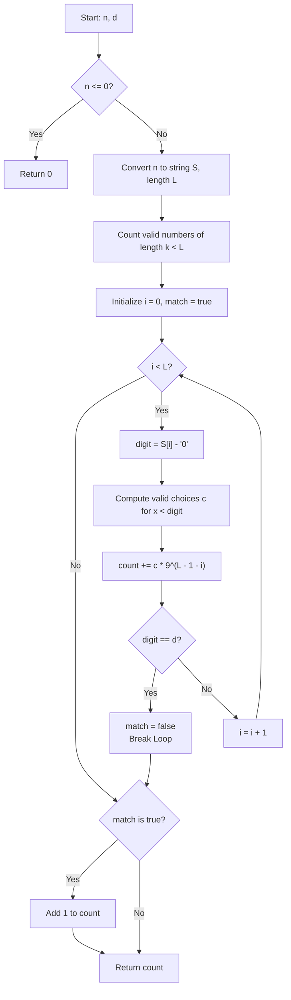

# 💡 Approach — Numbers Without d as Digit

| 📄 [Problem](./Problem.md) | 💡 [Approach](./Approach.md) | 🧩 [Solution](./Solution.cpp) | 🚀 [Main](./Main.cpp) |
|:--------------------------:|:-----------------------------:|:------------------------------:|:---------------------:|

## 📊 Metadata

---

## 💡 Core Insight

> [!TIP]
> **Core Insight:**  
> To count numbers from $1$ to $n$ that do not contain digit $d$, we use positional digit counting:
> 1. Count all valid numbers with length $k < L$ (where $L$ is the number of digits of $n$).
>    - If $d = 0$, valid digits are $\{1..9\}$, so there are $9^k$ valid numbers of length $k$.
>    - If $d \neq 0$, MSD has $8$ choices (excluding $0$ and $d$), and subsequent $k-1$ digits have $9$ choices (excluding $d$), giving $8 \times 9^{k-1}$ valid numbers.
> 2. Count valid numbers of length $L$ that are $\le n$ by matching prefixes of $n$ digit by digit from left to right (MSD to LSD).
>    - At position $i$, if we pick a digit $x < S[i]$ such that $x$ is valid (not equal to $d$, and not leading zero at MSD), then the remaining $L - 1 - i$ positions can be filled independently with any of the $9$ valid digits, yielding $c \times 9^{\text{rem}}$ choices.
>    - If $S[i] = d$, no prefix-matching number $\le n$ can extend further, so we break early.
>    - If all digits of $n$ are valid and $\neq d$, add $1$ for $n$ itself.

---

## 🔩 Step-by-Step Breakdown

1. **Edge Case**: If $n \le 0$, return `0`.
2. **Setup**: Convert $n$ to string $S$, let $L = S.\text{length}()$. Precompute powers of $9$ up to $9^{10}$.
3. **Shorter Lengths ($k < L$)**:
   - If $d == 0$, add $\sum_{k=1}^{L-1} 9^k$.
   - If $d \neq 0$, add $\sum_{k=1}^{L-1} 8 \cdot 9^{k-1}$.
4. **Equal Length ($L$), Numbers $\le n$**:
   - Iterate $i$ from $0$ to $L-1$:
     - Let `digit = S[i] - '0'`.
     - Count valid digits $x < \text{digit}$:
       - If $i == 0$: $x \in [1, \text{digit}-1], x \neq d$.
       - If $i > 0$: $x \in [0, \text{digit}-1], x \neq d$.
     - Add $c \times 9^{L-1-i}$ to count.
     - If $\text{digit} == d$, break loop!
5. **Exact Match**: If loop completed without breaking (all digits $\neq d$), increment count by $1$.

---

## 🔄 Mermaid Flowchart

---

## 🔍 Detailed Dry Run

### Example 1: `n = 25, d = 3`

- **Initialization**: $S = \text{"25"}$, $L = 2$, `count = 0`
- **Shorter Lengths ($k < 2$)**: 
  - $k = 1 \implies \text{count} += 8 \times 9^0 = 8$ (`count` = 8)
- **Same Length ($L = 2$)**:
  - `i = 0`, `digit = 2`: Range $[1, 1]$, valid choice $x = 1 \implies c = 1$.  
    $\text{count} += 1 \times 9^1 = 9 \implies \text{count} = 17$. (`digit 2 != 3`)
  - `i = 1`, `digit = 5`: Range $[0, 4]$, valid choices $x \in \{0, 1, 2, 4\} \implies c = 4$.  
    $\text{count} += 4 \times 9^0 = 4 \implies \text{count} = 21$. (`digit 5 != 3`)
- **Exact Match**: `match = true` $\implies \text{count} += 1 = 22$.

### Example 2: `n = 35, d = 3` (Early Break)

- **Initialization**: $S = \text{"35"}$, $L = 2$, `count = 0`
- **Shorter Lengths ($k < 2$)**: $k = 1 \implies \text{count} += 8 \times 9^0 = 8$ (`count` = 8)
- **Same Length ($L = 2$)**:
  - `i = 0`, `digit = 3`: Range $[1, 2]$, valid choices $x \in \{1, 2\} \implies c = 2$.  
    $\text{count} += 2 \times 9^1 = 18 \implies \text{count} = 26$.
  - `digit == d` ($3 == 3$) $\implies$ `match = false; break;`
- **Output**: `26`

---

## 📊 Complexity Analysis

| Complexity | Resource | Details / Explanation |
| :--------: | :------: | --------------------- |
| **Time**   | $O(\log_{10} n)$ | String length $L \le 10$. The digit loop runs at most 10 iterations. |
| **Space**  | $O(1)$ | Uses fixed array for powers of 9 and auxiliary scalar variables. |

---

> *"Breaking down numbers digit by digit turns complex counting into powers of valid choices."*

---

<h3>Happy Coding! 🚀</h3>

