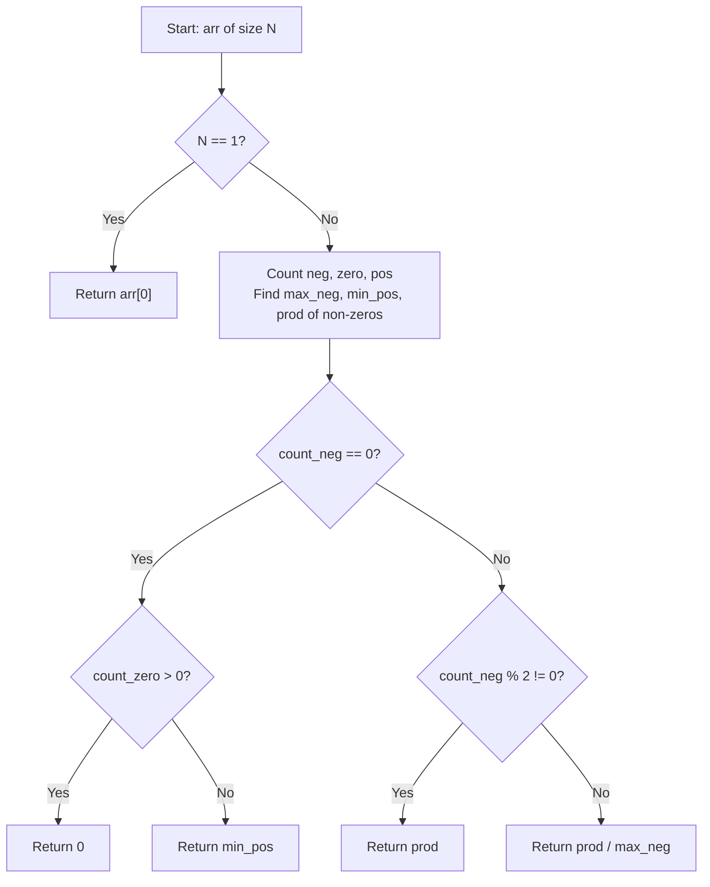

# 💡 Approach — Min Product Subset

| 📄 [Problem](./Problem.md) | 💡 [Approach](./Approach.md) | 🧩 [Solution](./Solution.cpp) | 🚀 [Main](./Main.cpp) |
|:--------------------------:|:-----------------------------:|:------------------------------:|:---------------------:|

## 📊 Metadata

---

## 💡 Core Insight

> [!TIP]
> **Core Insight:**  
> To minimize the product of a non-empty subset of array elements, we analyze the counts and values of negative, zero, and positive numbers:
> 1. **Single Element**: If array has only $1$ element, return it directly.
> 2. **Odd Count of Negatives**: Multiply all non-zero numbers. An odd number of negative factors yields a negative product of maximum magnitude (i.e. absolute minimum).
> 3. **Even Count of Negatives ($> 0$)**: An even count of negatives yields a positive product. To obtain a negative product, exclude the negative number with the smallest magnitude (largest value, `max_neg`). Multiplying the rest gives a negative product.
> 4. **No Negatives**:
>    - If there are **zeros**, the minimum possible subset product is `0` (pick subset `[0]`).
>    - If there are **no zeros**, all elements are positive. The minimum product is the single smallest positive element (`min_pos`).

---

## 🔩 Step-by-Step Breakdown

1. **Edge Case**: If $N == 1$, return `arr[0]`.
2. **State Tracking**:
   - Count negative elements (`count_neg`), zeros (`count_zero`), and positives (`count_pos`).
   - Track `max_neg` (greatest negative number, e.g. $-1 > -5$) and `min_pos` (smallest positive number).
   - Compute `prod` = product of all non-zero elements using `long long`.
3. **Decision Tree**:
   - **Case 1: `count_neg == 0`**
     - If `count_zero > 0` $\implies$ return `0`.
     - Else $\implies$ return `min_pos`.
   - **Case 2: `count_neg % 2 != 0` (Odd negatives)**
     - Return `prod` (product of all non-zero elements).
   - **Case 3: `count_neg % 2 == 0 && count_neg > 0` (Even negatives)**
     - Return `prod / max_neg` (drops the negative number closest to 0 to keep the product negative).

---

## 🔄 Mermaid Flowchart

---

## 🔍 Detailed Dry Run

### Example 1: `arr[] = [1, 2, 3]`
- $N = 3$, `count_neg = 0`, `count_zero = 0`, `min_pos = 1`.
- `count_neg == 0` and `count_zero == 0` $\implies$ return `min_pos = 1`.
- **Output:** `1`

### Example 2: `arr[] = [4, -2, 5]`
- $N = 3$, `count_neg = 1` (odd), `count_zero = 0`, `prod = 4 * (-2) * 5 = -40`.
- `count_neg` is odd $\implies$ return `prod = -40`.
- **Output:** `-40`

### Example 3: `arr[] = [-1, -2]`
- $N = 2$, `count_neg = 2` (even), `max_neg = -1`, `prod = (-1) * (-2) = 2`.
- `count_neg` is even $\implies$ return `prod / max_neg = 2 / (-1) = -2`.
- **Output:** `-2`

---

## 📊 Complexity Analysis

| Complexity | Resource | Details / Explanation |
| :--------: | :------: | --------------------- |
| **Time**   | $O(N)$   | Single linear scan over the array of size $N$. |
| **Space**  | $O(1)$   | Uses scalar variables for counts, max/min, and product. |

---

> *"Balancing sign counts transforms subset products into a single-pass greedy strategy."*

---

<h3>Happy Coding! 🚀</h3>

