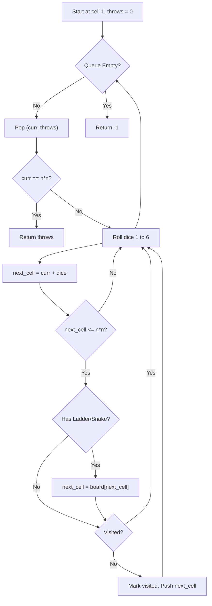

# 💡 Approach — [Snake and Ladder Problem]

| 📄 [Problem](./Problem.md) | 💡 [Approach](./Approach.md) | 🧩 [Solution](./Solution.cpp) | 🚀 [Main](./Main.cpp) |
|:--------------------------:|:-----------------------------:|:------------------------------:|:---------------------:|

## 📊 Metadata

  

> [!TIP]
> **Core Insight:** The problem can be modeled as finding the shortest path in an unweighted directed graph, where nodes represent cells on the board, and edges represent possible dice throws. Breadth-First Search (BFS) is optimal for finding the shortest path in an unweighted graph.

## 🔩 Step-by-Step Breakdown
1. **Initialize the Board:** First, create a mapping from any start cell of a snake or ladder to its destination cell.
2. **Setup BFS:** Use a queue to store the current cell and the number of dice throws taken to reach it. Start with cell `1` and `0` throws. Keep track of visited cells to prevent cycles.
3. **Traverse Using BFS:** While the queue is not empty, pop the current cell.
   - If the current cell is the target `n*n`, return the throws.
   - Otherwise, iterate through all possible dice rolls `(1 to 6)`.
4. **Determine Next Moves:** For each dice roll, calculate the next potential cell. If it falls within the board limit `n*n`, check if it's the start of a snake/ladder using the board mapping.
5. **Update Queue:** If the resolved next cell hasn't been visited, mark it as visited and enqueue it with `throws + 1`.

## 🔄 Mermaid Flowchart

## 🏃‍♂️ Dry Run
Let's trace **Example 2**: `n = 3`, `lad = [2, 8]`, `sn = [7, 3]`
* Target cell is $3 \times 3 = 9$.
* The `board` mapping is created: `{2: 8, 7: 3}`.
* **Initialization**: `queue = [(1, 0)]`, `visited = {1}`.

**Step 1:**
* Pop `(1, 0)`. `curr = 1, throws = 0`.
* Roll dice 1 to 6 from cell 1:
  * **Roll 1:** `next_cell` = $1 + 1 = 2$. Cell 2 has a ladder to 8, so `next_cell` becomes **8**. Enqueue `(8, 1)`, mark 8 as visited.
  * **Roll 2:** `next_cell` = $1 + 2 = 3$. Enqueue `(3, 1)`, mark 3 as visited.
  * *(Rolls 3, 4, 5 enqueue cells 4, 5, 6 with 1 throw)*
  * **Roll 6:** `next_cell` = $1 + 6 = 7$. Cell 7 has a snake to 3, so `next_cell` becomes **3**. Since 3 is already visited, we ignore it.
* `queue` is now: `[(8, 1), (3, 1), (4, 1), (5, 1), (6, 1)]`

**Step 2:**
* Pop `(8, 1)`. `curr = 8, throws = 1`.
* Roll dice 1 to 6 from cell 8:
  * **Roll 1:** `next_cell` = $8 + 1 = 9$. Target reached!
* **Return throws + 1 = 2.**

## 📊 Complexity Analysis
| Complexity | Analysis |
| :---: | :--- |
| **Time** | $\mathcal{O}(n^2)$: Each cell is pushed into the queue and visited at most once. |
| **Space** | $\mathcal{O}(n^2)$: The visited array, the board map, and the queue can each take up to $\mathcal{O}(n^2)$ space. |

> *"First, solve the problem. Then, write the code."*

<h3>Happy Coding! 🚀</h3>

