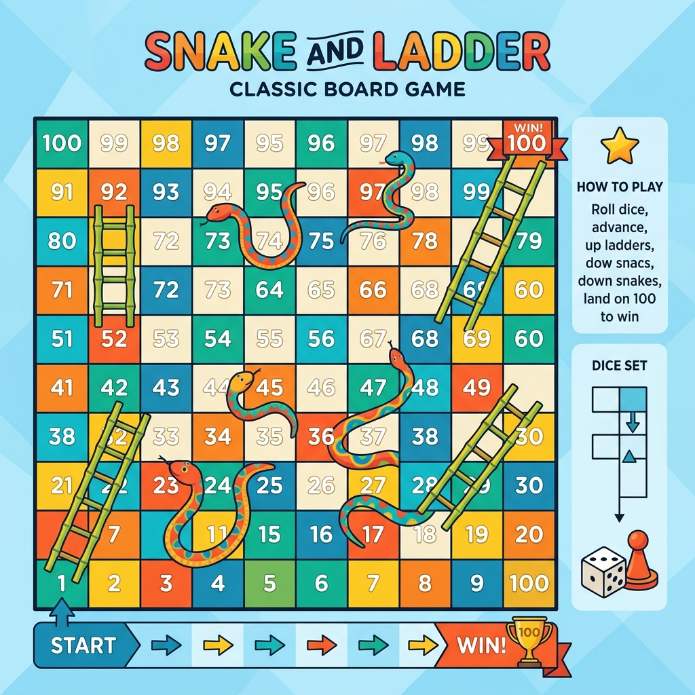

# 202. [Snake and Ladder Problem](https://www.geeksforgeeks.org/problems/snake-and-ladder-problem4816/1)

<div align="center">

| 📄 [Problem](./Problem.md) | 💡 [Approach](./Approach.md) | 🧩 [Solution](./Solution.cpp) | 🚀 [Main](./Main.cpp) |
|:--------------------------:|:-----------------------------:|:------------------------------:|:---------------------:|
</div>

## 📊 Metadata


## 🧩 Problem Description
<div align="center">
  
</div>

Given an integer `n` such that there is an `n × n` Snakes and Ladders board with cells numbered from `1` to `n*n`, find the minimum number of dice throws required to reach cell `n*n` starting from cell `1`. Given two arrays of even lengths:
- `lad[]`, where each pair `(lad[2*i], lad[2*i + 1])` represents the start and end of a ladder.
- `sn[]`, where each pair `(sn[2*i], sn[2*i + 1])` represents the start and end of a snake.

If you land on the start cell of a snake or ladder, you must immediately move to its corresponding end cell.
You have complete control over the outcome of each dice throw i.e., in a single move, you can move forward by any number of cells from 1 to 6.
If it is impossible to reach cell `n*n`, return `-1`.

## 📌 Examples

**Example 1:**
```text
Input: n = 6, lad[] = [3, 22, 5, 8, 11, 35, 20, 32], sn[] = [17, 4, 19, 7, 34, 1, 21, 9] 
Output: 3 
Explanation: For the 6 × 6 board, the minimum number of dice throws needed to reach cell 36 from cell 1 is 3. One optimal path is: 
Throw 4 to move from 1 to 5, then take the ladder to 8 
Throw 3 to move from 8 to 11, then take the ladder to 35 
Throw 1 to move from 35 to 36 
So the destination is reached in 3 dice throws.
```

**Example 2:**
```text
Input: n = 3, lad[] = [2, 8], sn[] = [7, 3] 
Output: 2 
Explanation: For the 3 × 3 board, the minimum number of dice throws needed to reach cell 9 from cell 1 is 2. One optimal path is: 
Throw 1 to move from 1 to 2, then take the ladder to 8. 
Throw 1 to move from 8 to 9.
So the destination is reached in 2 dice throws.
```

## 📐 Constraints
- $1 \le n \le 10^3$
- $1 \le \text{lad.size()}, \text{sn.size()}, \text{lad}[i], \text{sn}[i] \le n^2$

## ⏱️ Expected Complexities
| Parameter | Complexity |
| :---: | :---: |
| **Time** | $\mathcal{O}(n^2)$ |
| **Space** | $\mathcal{O}(n^2)$ |
---

<div align="center">
<h3>Happy Coding! 🚀</h3>
<a href="../201_Day/Problem.md">
  
</a>
<a href="https://x.com/PankajB42550" target="_blank">
  
</a>
<a href="../203_Day/Problem.md">
  
</a>
</div>
