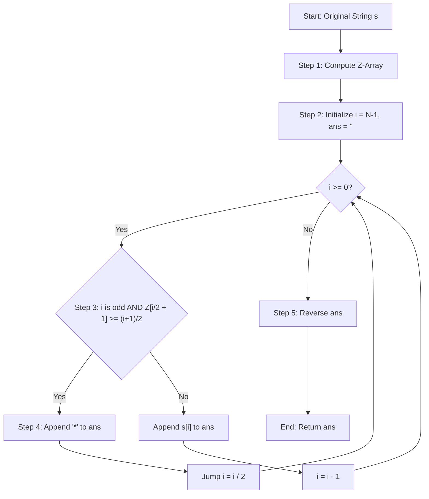

# 💡 Approach — Secret Cipher

  | 📄 [Problem](./Problem.md) | 💡 [Approach](./Approach.md) | 🧩 [Solution](./Solution.cpp) | 🚀 [Main](./Main.cpp) |
  |:--------------------------:|:-----------------------------:|:------------------------------:|:---------------------:|

## 📊 Metadata

> [!TIP]
> **Core Insight:** A `*` operation exactly halves the current original string sequence. To find the lexicographically smallest and shortest string, we should traverse backwards and greedily take the longest possible `*` replacements. Valid identical halves can be efficiently detected in O(1) time using a precomputed **Z-algorithm** array.

## 🔩 Step-by-Step Breakdown
1. **Compute Z-array**: Calculate the Z-array for string `s` in `O(N)` time. This array helps in determining the longest matching prefix at any index.
2. **Backward Traversal**: Start traversing `s` from right to left (`i = N - 1`).
3. **Greedy Compression**: If `i` is odd, check if the first half `s[0 .. i/2]` exactly equals the second half `s[i/2 + 1 .. i]`. This is true if `Z[i/2 + 1] >= (i+1)/2`.
4. **Append & Jump**: If valid, append `*` to the answer and jump to `i / 2` (end of the first half). If invalid, append the current character `s[i]` and decrement `i`.
5. **Reverse Output**: Because we traversed backward, we must reverse the result string to obtain the lexicographically smallest encrypted string.

## 🔄 Mermaid Flowchart

## 🏃‍♂️ Dry Run
Let's trace **Example 1**: `s = "ababcababcd"`
* **Length $n$**: 11  
* **Computed Z-array**: `[0, 0, 2, 0, 0, 5, 0, 2, 0, 0, 0]`
* **Initialization**: `ans = ""`.

**Backward Traversal:**
* **Step 1:** `i = 10` ('d'). Even index. Append 'd' ➔ `ans = "d"`, `i = 9`.
* **Step 2:** `i = 9` ('c'). Odd index. $i/2 + 1 = 5$. `Z[5] = 5 \ge (9+1)/2 = 5`. Valid! 
  * Append '*' ➔ `ans = "d*"`. 
  * Jump `i = 9 / 2 = 4`.
* **Step 3:** `i = 4` ('c'). Even index. Append 'c' ➔ `ans = "d*c"`, `i = 3`.
* **Step 4:** `i = 3` ('b'). Odd index. $i/2 + 1 = 2$. `Z[2] = 2 \ge (3+1)/2 = 2`. Valid!
  * Append '*' ➔ `ans = "d*c*"`. 
  * Jump `i = 3 / 2 = 1`.
* **Step 5:** `i = 1` ('b'). Odd index. $i/2 + 1 = 1$. `Z[1] = 0 < 1`. Invalid.
  * Append 'b' ➔ `ans = "d*c*b"`, `i = 0`.
* **Step 6:** `i = 0` ('a'). Even index. Append 'a' ➔ `ans = "d*c*ba"`, `i = -1`.

**Final Step:** Reverse `ans` ➔ `"ab*c*d"`.

## 📊 Complexity Analysis
| Complexity | Analysis |
| :---: | :--- |
| **Time** | $\mathcal{O}(n)$: The Z-array is built in linear time. We then perform a single pass backward taking linear time. |
| **Space** | $\mathcal{O}(n)$: Linear auxiliary space is needed to store the Z-array and the answer string. |

> *"Simplicity is prerequisite for reliability."*

---

<h3>Happy Coding! 🚀</h3>

