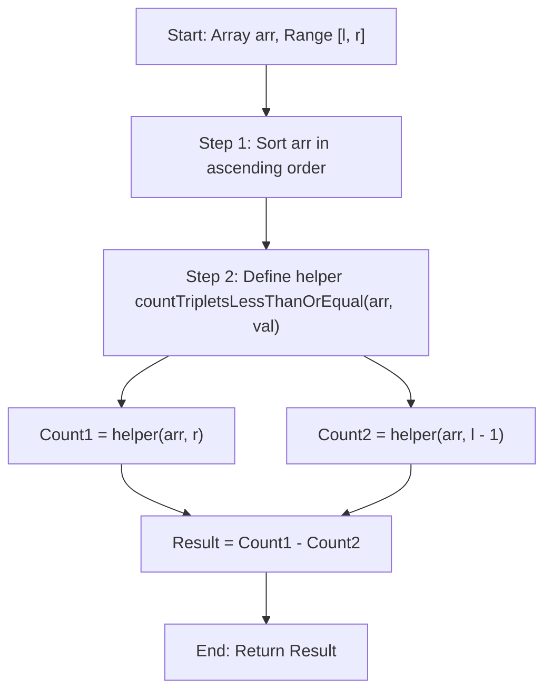

# 💡 Approach — Triplets with Sum in Range

  | 📄 [Problem](./Problem.md) | 💡 [Approach](./Approach.md) | 🧩 [Solution](./Solution.cpp) | 🚀 [Main](./Main.cpp) |
  |:--------------------------:|:-----------------------------:|:------------------------------:|:---------------------:|

## 📊 Metadata

> [!TIP]
> **Core Insight:** Counting triplets in a range $[l, r]$ can be transformed using the prefix difference principle:
> $$\text{Count}(l \le \text{sum} \le r) = \text{Count}(\text{sum} \le r) - \text{Count}(\text{sum} \le l - 1)$$
> By sorting the array first, the count of triplets with sum $\le \text{val}$ can be efficiently found in $\mathcal{O}(n^2)$ using a **Two-Pointer** approach.

## 🔩 Step-by-Step Breakdown

1. **Sort the Array**: Sorting the array `arr` in ascending order allows us to use the two-pointer technique effectively.
2. **Helper Function `countTripletsLessThanOrEqual(arr, val)`**:
   - Iterate with the first element index `i` from `0` to `n - 3`.
   - Initialize two pointers: `left = i + 1` and `right = n - 1`.
   - While `left < right`:
     - Calculate `current_sum = arr[i] + arr[left] + arr[right]`.
     - If `current_sum <= val`:
       - Since the array is sorted, all elements from `left + 1` to `right` when paired with `arr[i]` and `arr[left]` will produce a sum $\le \text{val}$.
       - Add `(right - left)` to our count.
       - Increment `left` to explore bigger sums.
     - Else (`current_sum > val`):
       - Decrement `right` to reduce the sum.
3. **Range Query**:
   - Compute `countTripletsLessThanOrEqual(arr, r)`
   - Compute `countTripletsLessThanOrEqual(arr, l - 1)`
   - The result is the difference between these two values.

## 🔄 Mermaid Flowchart

## 🏃‍♂️ Dry Run
Let's trace **Example 1**: `arr = [8, 3, 5, 2]`, `l = 7`, `r = 11`
* **Sorted array**: `[2, 3, 5, 8]`, $n = 4$

**Computing `countTripletsLessThanOrEqual(arr, 11)`:**
* `i = 0` (`arr[0] = 2`):
  * `left = 1` (`arr[1] = 3`), `right = 3` (`arr[3] = 8`):
    * $\text{Sum} = 2 + 3 + 8 = 13 > 11 \implies \text{right} = 2$.
    * $\text{Sum} = 2 + 3 + 5 = 10 \le 11 \implies \text{count} += (2 - 1) = 1$, $\text{left} = 2$ (loop ends).
* `i = 1` (`arr[1] = 3`):
  * `left = 2` (`arr[2] = 5`), `right = 3` (`arr[3] = 8`):
    * $\text{Sum} = 3 + 5 + 8 = 16 > 11 \implies \text{right} = 2$ (loop ends).
* Total $\le 11 = 1$.

**Computing `countTripletsLessThanOrEqual(arr, 6)`:**
* `i = 0` (`arr[0] = 2`):
  * `left = 1` (`3`), `right = 3` (`8`):
    * $\text{Sum} = 13 > 6 \implies \text{right} = 2$.
    * $\text{Sum} = 10 > 6 \implies \text{right} = 1$ (loop ends).
* Total $\le 6 = 0$.

**Final Result:** $1 - 0 = 1$.

## 📊 Complexity Analysis
| Complexity | Analysis |
| :---: | :--- |
| **Time** | $\mathcal{O}(n^2)$: Sorting takes $\mathcal{O}(n \log n)$. The two-pointer helper function runs in $\mathcal{O}(n^2)$ and is called twice. Overall time complexity is $\mathcal{O}(n^2)$. |
| **Space** | $\mathcal{O}(1)$: In-place sorting and constant extra auxiliary space. |

> *"Simplicity is prerequisite for reliability."*

---

<h3>Happy Coding! 🚀</h3>

