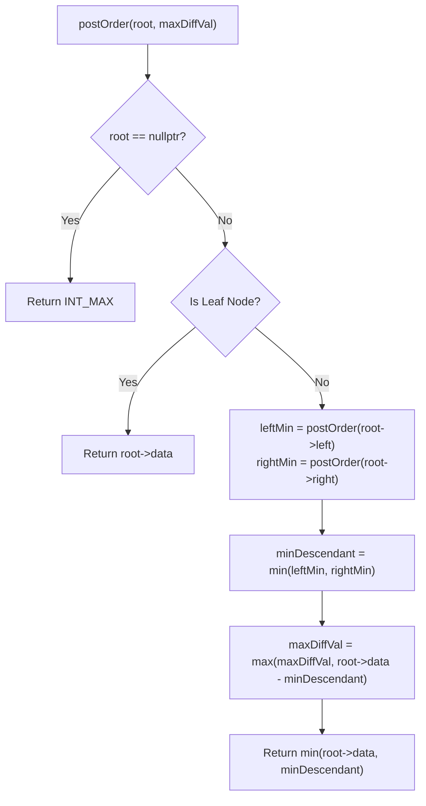

# 💡 Approach — Node and Ancestor Max Diff

<div align="center">

  | 📄 [Problem](./Problem.md) | 💡 [Approach](./Approach.md) | 🧩 [Solution](./Solution.cpp) | 🚀 [Main](./Main.cpp) |
  |:--------------------------:|:-----------------------------:|:------------------------------:|:---------------------:|
</div>

## 📊 Metadata


> [!TIP]
> **Core Insight:** To maximize $A.data - B.data$ where $A$ is an ancestor of $B$:
> - For a fixed ancestor $A$, we want to find the **minimum descendant value** in its entire subtree:
>   $$\text{Max Difference at Node } A = A.data - \min_{B \in \text{Subtree}(A), B \neq A}(B.data)$$
> - By using a **Bottom-Up (Post-Order)** traversal, each node can query the minimum value from its left and right subtrees in $\mathcal{O}(1)$ time, update the global maximum difference, and return the minimum node value in its subtree to its parent.

## 🔩 Step-by-Step Breakdown

1. **Base Cases**:
   - If the current node is `nullptr`, return $\infty$ (`INT_MAX`).
   - If the current node is a **leaf node** (no left or right child), it has no descendants to form a pair. Hence, return `root->data` directly without updating the maximum difference.

2. **Post-Order Subtree Traversal (Bottom-Up)**:
   - Recursively evaluate the left subtree: `leftMin = postOrder(root->left)`.
   - Recursively evaluate the right subtree: `rightMin = postOrder(root->right)`.

3. **Compute Minimum Descendant**:
   - `minDescendant = min(leftMin, rightMin)` represents the smallest descendant value found across both subtrees under the current node.

4. **Update Global Maximum Difference**:
   - Update `maxDiffVal = max(maxDiffVal, root->data - minDescendant)`.

5. **Propagate Minimum Upward**:
   - Return `min(root->data, minDescendant)` so that ancestor nodes can consider this subtree's minimum.

---

## 🔄 Mermaid Flowchart



---

## 🏃‍♂️ Dry Run

Let's trace **Example 2**: `root = [1, 2, 3, N, N, N, 7]`

```text
        1
      /   \
     2     3
            \
             7
```

| Node | `leftMin` | `rightMin` | `minDescendant` | `root->data - minDescendant` | `maxDiffVal` | Returned Value |
| :---: | :---: | :---: | :---: | :---: | :---: | :---: |
| **Node 2** (Leaf) | — | — | — | — | `INT_MIN` | `2` |
| **Node 7** (Leaf) | — | — | — | — | `INT_MIN` | `7` |
| **Node 3** | $\infty$ | `7` | `7` | $3 - 7 = -4$ | $\max(\text{INT\_MIN}, -4) = -4$ | $\min(3, 7) = 3$ |
| **Node 1** | `2` | `3` | $\min(2, 3) = 2$ | $1 - 2 = -1$ | $\max(-4, -1) = -1$ | $\min(1, 2) = 1$ |

**Final Answer:** `maxDiffVal = -1`.

---

## 📊 Complexity Analysis

| Complexity | Analysis |
| :---: | :--- |
| **Time** | $\mathcal{O}(n)$: Each node in the binary tree is visited exactly once during the post-order DFS traversal. |
| **Space** | $\mathcal{O}(h) \approx \mathcal{O}(n)$: Auxiliary call stack space proportional to the height $h$ of the binary tree ($\mathcal{O}(\log n)$ for balanced trees, $\mathcal{O}(n)$ in the worst case for skewed trees). |

> *"Divide and conquer: Solve locally, propagate globally."*

---

<div align="center">
<h3>Happy Coding! 🚀</h3>
<a href="../204_Day/Approach.md">
  
</a>
<a href="https://x.com/PankajB42550" target="_blank">
  
</a>
<a href="../206_Day/Approach.md">
  
</a>
</div>
