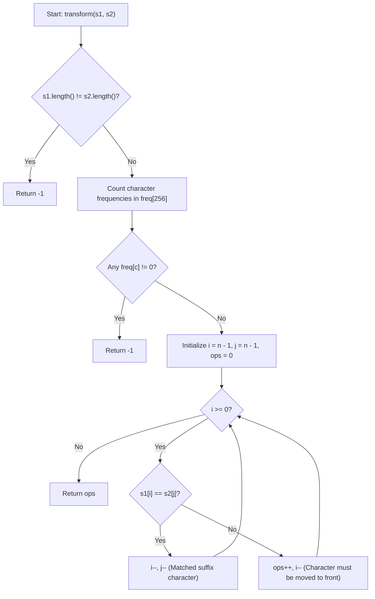

# 💡 Approach — Transform String

  | 📄 [Problem](./Problem.md) | 💡 [Approach](./Approach.md) | 🧩 [Solution](./Solution.cpp) | 🚀 [Main](./Main.cpp) |
  |:--------------------------:|:-----------------------------:|:------------------------------:|:---------------------:|

## 📊 Metadata

> [!TIP]
> **Core Insight:**
> - A string `s1` can be transformed into `s2` if and only if both strings have the **same length** and are **anagrams** (identical character frequencies).
> - The only allowed operation is moving a character to the front. Notice that any character *not* moved preserves its original relative order.
> - The characters that remain untouched form the longest suffix of `s2` that exists as a subsequence of `s1`.
> - By iterating backwards from the end of both strings using **two pointers**, whenever `s1[i] == s2[j]`, the character can stay in place. Whenever `s1[i] != s2[j]`, `s1[i]` must be picked and moved to the front at some point, contributing $1$ to our operation count.

## 🔩 Step-by-Step Breakdown

1. **Length & Feasibility Check**:
   - If `s1.length() != s2.length()`, transformation is impossible; return `-1`.

2. **Anagram Validation using Frequency Array**:
   - Maintain a fixed-size frequency array `freq[256]` initialized to `0`.
   - Increment count for each character in `s1` and decrement for each character in `s2`.
   - If any character has a non-zero count remaining, `s1` and `s2` have different character sets; return `-1`.

3. **Greedy Backward Matching (Two Pointers)**:
   - Initialize pointer `i = n - 1` (pointing to the end of `s1`), `j = n - 1` (pointing to the end of `s2`), and `operations = 0`.
   - While `i >= 0`:
     - If `s1[i] == s2[j]`:
       - The current character at `s1[i]` matches `s2[j]` and does not need to be relocated.
       - Move both pointers leftward: `i--`, `j--`.
     - Else (`s1[i] != s2[j]`):
       - The character `s1[i]` must eventually be extracted and placed at the beginning of `s1`.
       - Increment `operations++` and shift `i--` to search for `s2[j]` further to the left in `s1`.

4. **Return Result**:
   - Return `operations` as the minimum number of steps required.

---

## 🔄 Mermaid Flowchart

---

## 🏃‍♂️ Dry Run

Let's trace **Example 1**: `s1 = "abd"`, `s2 = "bad"` ($n = 3$)

1. **Frequency check**: `'a': 0, 'b': 0, 'd': 0` $\rightarrow$ Valid anagrams.
2. **Matching backwards**:

| Step | `i` | `s1[i]` | `j` | `s2[j]` | Comparison | Action | `ops` |
| :---: | :---: | :---: | :---: | :---: | :---: | :---: | :---: |
| 1 | `2` | `'d'` | `2` | `'d'` | Match (`'d' == 'd'`) | `i--, j--` | `0` |
| 2 | `1` | `'b'` | `1` | `'a'` | Mismatch (`'b' != 'a'`) | `ops++, i--` | `1` |
| 3 | `0` | `'a'` | `1` | `'a'` | Match (`'a' == 'a'`) | `i--, j--` | `1` |
| End | `-1` | — | `0` | — | Loop terminates (`i < 0`) | Return `ops` | `1` |

**Final Result:** `1` operation (move `'b'` to the front $\rightarrow$ `"bad"`).

---

## 📊 Complexity Analysis

| Complexity | Analysis |
| :---: | :--- |
| **Time** | $\mathcal{O}(n)$: We perform one pass of length $n$ to verify character frequencies, and one backward pass with two pointers bounded by $n$. |
| **Space** | $\mathcal{O}(1)$: Auxiliary space is $\mathcal{O}(256) \approx \mathcal{O}(1)$ for the fixed-size ASCII character frequency table. |

> *"True optimization is not doing things faster, but realizing what doesn't need to be moved at all."*

---

<h3>Happy Coding! 🚀</h3>

