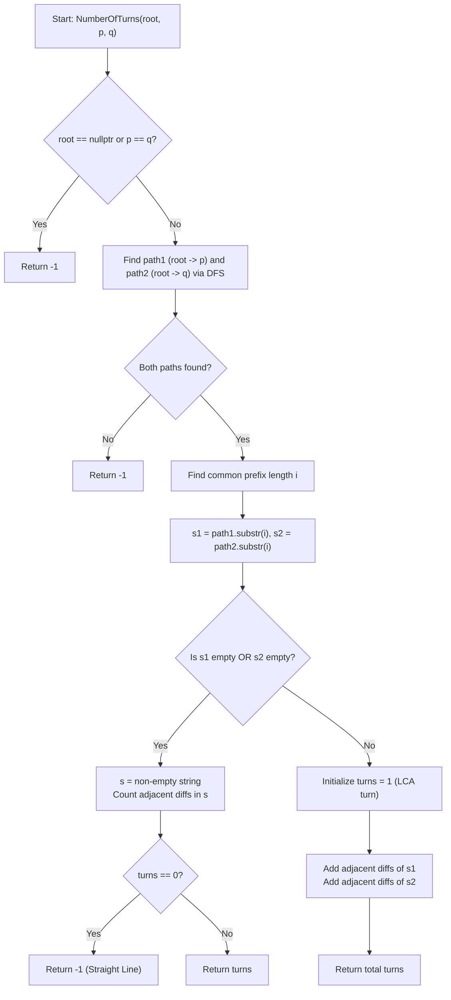

# 💡 Approach — Number of Turns in Binary Tree

  | 📄 [Problem](./Problem.md) | 💡 [Approach](./Approach.md) | 🧩 [Solution](./Solution.cpp) | 🚀 [Main](./Main.cpp) |
  |:--------------------------:|:-----------------------------:|:------------------------------:|:---------------------:|

## 📊 Metadata

> [!TIP]
> **Core Insight:**
> - Any simple path between two nodes $p$ and $q$ in a binary tree traverses up to their **Lowest Common Ancestor (LCA)** and then down to the target node.
> - Represent the path from the root to node $p$ as a sequence of branch decisions (e.g. `'L'` for left child, `'R'` for right child) $D_p$, and the path from the root to node $q$ as $D_q$.
> - The **common prefix** of $D_p$ and $D_q$ corresponds to the path from the root to the LCA.
> - Stripping this common prefix leaves the sub-paths from the LCA:
>   - $S_1$: sequence of moves from LCA down to $p$.
>   - $S_2$: sequence of moves from LCA down to $q$.
> - **Counting Turns**:
>   1. **If LCA is one of the nodes** (i.e. $S_1$ is empty or $S_2$ is empty):
>      - The path is strictly vertical.
>      - Count adjacent direction changes in the non-empty sequence ($S_i[j] \neq S_i[j+1]$).
>      - If turns $= 0$ (a straight path), return `-1`; otherwise return the count of turns.
>   2. **If LCA is distinct from both $p$ and $q$** ($S_1 \neq \emptyset$ and $S_2 \neq \emptyset$):
>      - The path ascends from $p$ to LCA and descends from LCA to $q$.
>      - Turns in $p \to \text{LCA}$ = adjacent differences in $S_1$.
>      - Turning point at $\text{LCA}$ = $+1$ (since $S_1[0] \neq S_2[0]$).
>      - Turns in $\text{LCA} \to q$ = adjacent differences in $S_2$.
>      - Total Turns = $(\text{diffs in } S_1) + 1 + (\text{diffs in } S_2)$.

---

## 🔩 Step-by-Step Breakdown

1. **Find Root-to-Node Paths (DFS)**:
   - Use recursive DFS to search for $p$ and $q$.
   - While descending, append `'L'` when exploring the left subtree and `'R'` when exploring the right subtree. Backtrack (`pop_back()`) if the target node is not found in that subtree.
   - Store directions in strings `path1` and `path2`. If either target node is not found or $p == q$, return `-1`.

2. **Locate Lowest Common Ancestor (LCA)**:
   - Compare `path1` and `path2` character-by-character from index $0$.
   - Let $i$ be the length of their longest common prefix.
   - Suffix $S_1 = \text{path1}[i \dots]$ represents directions from LCA to $p$.
   - Suffix $S_2 = \text{path2}[i \dots]$ represents directions from LCA to $q$.

3. **Calculate Turns**:
   - **Case A: One node is an ancestor of the other ($S_1 = \emptyset$ or $S_2 = \emptyset$)**:
     - Let $S = (S_1 = \emptyset) ? S_2 : S_1$.
     - Count every index $j$ where $S[j] \neq S[j+1]$.
     - If `turns == 0`, return `-1` (straight path); otherwise return `turns`.
   - **Case B: Both $S_1$ and $S_2$ are non-empty**:
     - Initialize `turns = 1` for the turn at the LCA.
     - Add adjacent differences in $S_1$: $\sum [S_1[j] \neq S_1[j+1]]$.
     - Add adjacent differences in $S_2$: $\sum [S_2[j] \neq S_2[j+1]]$.
     - Return `turns`.

---

## 🔄 Mermaid Flowchart

---

## 🏃‍♂️ Dry Run

### Test Case 1: $p = 5, q = 10$
- **Tree**: Root $1$, Left subtree containing $2, 4, 5, 8$, Right subtree containing $3, 6, 7, 9, 10$.
- **Path to $p = 5$**: $1 \xrightarrow{L} 2 \xrightarrow{R} 5 \implies \text{path1} = \text{"LR"}$
- **Path to $q = 10$**: $1 \xrightarrow{R} 3 \xrightarrow{L} 6 \xrightarrow{R} 10 \implies \text{path2} = \text{"RLR"}$
- **Common Prefix**: Length $i = 0$ (LCA is Root $1$).
- Suffixes: $S_1 = \text{"LR"}$, $S_2 = \text{"RLR"}$.

| Component | Sequence | Adjacent Transitions | Turns |
| :--- | :--- | :--- | :---: |
| Path $5 \to \text{LCA}(1)$ | $S_1 = \text{"LR"}$ | $L \to R$ (at node 2) | $1$ |
| Turn at $\text{LCA}(1)$ | $S_1[0]=\text{'L'}, S_2[0]=\text{'R'}$ | $L \to R$ (at node 1) | $1$ |
| Path $\text{LCA}(1) \to 10$ | $S_2 = \text{"RLR"}$ | $R \to L$ (at node 3), $L \to R$ (at node 6) | $2$ |
| **Total** | | | **4** |

---

### Test Case 2: $p = 1, q = 4$
- **Path to $p = 1$**: $\text{path1} = \text{""}$
- **Path to $q = 4$**: $1 \xrightarrow{L} 2 \xrightarrow{L} 4 \implies \text{path2} = \text{"LL"}$
- **Common Prefix**: Length $i = 0$.
- Suffixes: $S_1 = \text{""}$ (empty), $S_2 = \text{"LL"}$.
- Adjacent transitions in $S_2$: none ('L' == 'L').
- `turns = 0` $\implies$ **Return `-1`** (Straight line).

---

## 📊 Complexity Analysis

| Complexity | Analysis |
| :---: | :--- |
| **Time** | $\mathcal{O}(n)$: DFS traverses at most all $n$ nodes in the tree to locate the target nodes. Suffix parsing and turn counting take $\mathcal{O}(h)$ time. |
| **Space** | $\mathcal{O}(h)$: Auxiliary space used by recursion stack and path strings is proportional to the tree height $h$ ($\mathcal{O}(\log n)$ for balanced trees, $\mathcal{O}(n)$ in skewed trees). |

> *"Every turn in a binary tree marks a change of perspective — from left to right or right to left across ancestors."*

---

<h3>Happy Coding! 🚀</h3>

