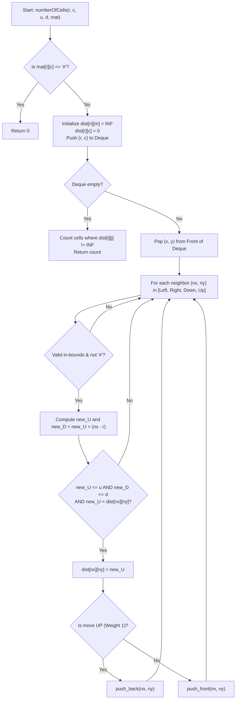

# 💡 Approach — Geek in a Maze

<div align="center">

  | 📄 [Problem](./Problem.md) | 💡 [Approach](./Approach.md) | 🧩 [Solution](./Solution.cpp) | 🚀 [Main](./Main.cpp) |
  |:--------------------------:|:-----------------------------:|:------------------------------:|:---------------------:|
</div>

## 📊 Metadata


---

> [!TIP]
> **Core Mathematical Insight:**
> - Let Geek start at cell $(r, c)$ and reach cell $(x, y)$ using $U$ **upward** moves and $D$ **downward** moves.
> - Each upward move decreases the row index by $1$, and each downward move increases the row index by $1$.
> - Therefore, the net vertical displacement is:
>   $$\Delta \text{row} = x - r = D - U \implies D = U + (x - r)$$
> - Notice that for any specific target cell $(x, y)$, the value of $(x - r)$ is a constant!
> - As a result, **minimizing the number of upward moves $U$ automatically minimizes the number of downward moves $D$**.
> - There is no Pareto trade-off between $U$ and $D$. A path that reaches $(x, y)$ with minimum $U$ is simultaneously the path that reaches $(x, y)$ with minimum $D$.

---

## 🧭 Graph Modeling & 0-1 BFS

Because horizontal moves (Left and Right) are unlimited and cost $0$ vertical moves, we can model this as finding the single-source shortest path from $(r, c)$ where the "distance" is the number of **upward moves ($U$)**:

| Direction | Movement | Up Moves Added ($\Delta U$) | Deque Operation |
| :--- | :---: | :---: | :--- |
| **Up** | $(x - 1, y)$ | $+1$ | `push_back` (Weight $1$) |
| **Down** | $(x + 1, y)$ | $+0$ | `push_front` (Weight $0$) |
| **Left** | $(x, y - 1)$ | $+0$ | `push_front` (Weight $0$) |
| **Right** | $(x, y + 1)$ | $+0$ | `push_front` (Weight $0$) |

Since all edge weights are binary ($\{0, 1\}$), we can use **0-1 BFS** with a double-ended queue (`std::deque`):
- Weight $0$ transitions are pushed to the **front** of the deque.
- Weight $1$ transitions are pushed to the **back** of the deque.
- This guarantees nodes are processed in non-decreasing order of cost in linear $\mathcal{O}(n \times m)$ time, avoiding the $\mathcal{O}(\log(n \times m))$ overhead of a priority queue.

---

## 🔩 Step-by-Step Breakdown

1. **Obstacle & Boundary Check**:
   - If `mat[r][c] == '#'`, the starting cell itself is impassable $\implies$ return `0`.

2. **Distance Table Initialization**:
   - Maintain a 2D array `dist[n][m]` initialized to $\infty$ (`INT_MAX`), representing the minimum upward moves needed to reach each cell.
   - Set `dist[r][c] = 0`.
   - Push the starting coordinate $(r, c)$ to the `deque`.

3. **0-1 BFS Execution**:
   - Pop $(x, y)$ from the front of the deque.
   - Let $U = \text{dist}[x][y]$ and compute $D = U + (x - r)$.
   - For each of the 4 neighbors $(nx, ny)$:
     - Ensure $(nx, ny)$ is inside maze bounds and `mat[nx][ny] != '#'`.
     - Compute new upward moves:
       - If moving **Up** ($nx = x - 1$): $new\_U = U + 1$, weight $= 1$.
       - If moving **Down**, **Left**, or **Right**: $new\_U = U$, weight $= 0$.
     - Compute corresponding downward moves: $new\_D = new\_U + (nx - r)$.
     - If $new\_U \le u$ and $new\_D \le d$ and $new\_U < \text{dist}[nx][ny]$:
       - Update $\text{dist}[nx][ny] = new\_U$.
       - If weight is $0$, `push_front({nx, ny})`.
       - If weight is $1$, `push_back({nx, ny})`.

4. **Count Reachable Cells**:
   - Count all cells $(i, j)$ where $\text{dist}[i][j] \neq \infty$.
   - Return the count.

---

## 🔄 Mermaid Flowchart



---

## 🏃‍♂️ Dry Run

### Example 1: $r = 1, c = 0, u = 1, d = 1$
```text
Maze:
(0,0)=.  (0,1)=.  (0,2)=.
(1,0)=.  (1,1)=#  (1,2)=.
(2,0)=#  (2,1)=.  (2,2)=.
```

| Step | Current Cell $(x, y)$ | Move | Target $(nx, ny)$ | Cost ($U, D$) | $U \le 1 \land D \le 1$ | Deque Action |
| :---: | :---: | :---: | :---: | :---: | :---: | :---: |
| 1 | $(1, 0)$ | Start | - | $U=0, D=0$ | Valid | Push $(1, 0)$ |
| 2 | $(1, 0)$ | UP | $(0, 0)$ | $U=1, D=0$ | Valid | `push_back(0, 0)` |
| 3 | $(0, 0)$ | RIGHT | $(0, 1)$ | $U=1, D=0$ | Valid | `push_front(0, 1)` |
| 4 | $(0, 1)$ | RIGHT | $(0, 2)$ | $U=1, D=0$ | Valid | `push_front(0, 2)` |
| 5 | $(0, 2)$ | DOWN | $(1, 2)$ | $U=1, D=1$ | Valid | `push_front(1, 2)` |
| 6 | $(1, 2)$ | DOWN | $(2, 2)$ | $U=1, D=2$ | ❌ $D > 1$ (Pruned) | Skipped |

- **Reachable Cells**: $(1,0), (0,0), (0,1), (0,2), (1,2)$
- **Total Count**: **5** ✅

---

## 📊 Complexity Analysis

| Complexity | Measure | Analysis |
| :---: | :---: | :--- |
| **Time** | $\mathcal{O}(n \times m)$ | Each cell is pushed into the deque at most a constant number of times and popped once. All 4 neighbor checks take $\mathcal{O}(1)$ time. |
| **Space** | $\mathcal{O}(n \times m)$ | The `dist` matrix and the `std::deque` store at most $\mathcal{O}(n \times m)$ cell states. |

---

<div align="center">
<h3>Happy Coding! 🚀</h3>
<a href="../207_Day/Approach.md">
  
</a>
<a href="https://x.com/PankajB42550" target="_blank">
  
</a>
<a href="../209_Day/Approach.md">
  
</a>
</div>
