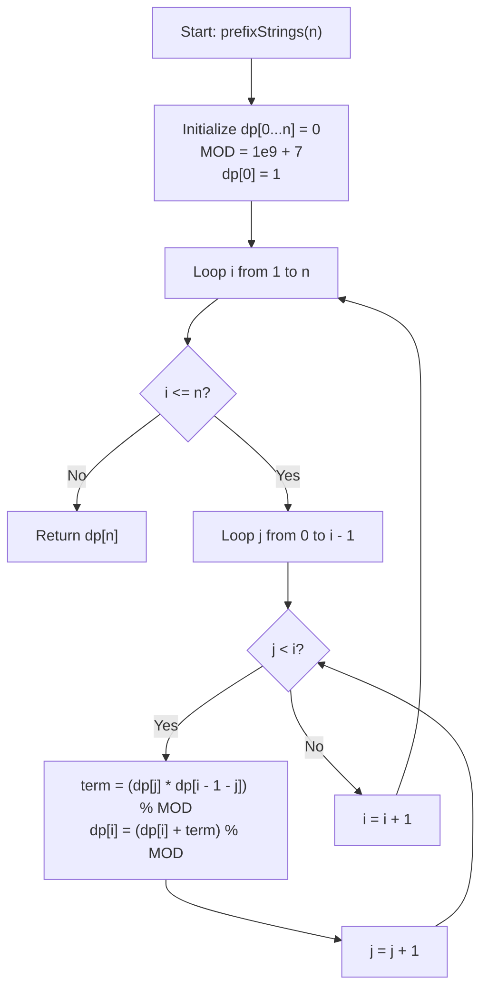

# 💡 Approach — Count Prefix-Balanced Binary Strings

  | 📄 [Problem](./Problem.md) | 💡 [Approach](./Approach.md) | 🧩 [Solution](./Solution.cpp) | 🚀 [Main](./Main.cpp) |
  |:--------------------------:|:-----------------------------:|:------------------------------:|:---------------------:|

## 📊 Metadata

---

> [!TIP]
> **Core Mathematical Insight — Catalan Numbers:**
> - A binary string of length $2n$ with $n$ `1`s and $n$ `0`s where every prefix has $\text{count}(1) \ge \text{count}(0)$ is mathematically isomorphic to:
>   1. **Valid Parentheses Strings**: Map `'1' \to '('` and `'0' \to ')'`. Every prefix having at least as many `'1'`s as `'0'`s is the exact definition of a valid, well-formed sequence of $n$ pairs of parentheses.
>   2. **Dyck Paths**: Grid paths from $(0, 0)$ to $(n, n)$ with steps $(+1, 0)$ and $(0, +1)$ that never cross above the line $y = x$.
>   3. **$n$-th Catalan Number ($C_n$)**:
>      $$C_n = \frac{1}{n+1} \binom{2n}{n} = \frac{(2n)!}{(n+1)!\,n!}$$

---

## 🧭 Mathematical Formulation & DP Recurrence

### 1. Structural Decomposition
Every valid prefix-balanced binary string of length $2n$ ($n \ge 1$) must start with a `'1'`. 

There is a unique first index where the prefix balance returns to zero (i.e., where the first `'1'` is matched with its corresponding `'0'`).
- Let the matching `'0'` appear after $2k$ characters (where $0 \le k \le n-1$).
- Then the string can be decomposed into:
  $$\text{String} = \mathbf{1} + \text{Substring}_A + \mathbf{0} + \text{Substring}_B$$
- $\text{Substring}_A$ is a valid prefix-balanced string containing $k$ pairs of `1`s and `0`s (length $2k$).
- $\text{Substring}_B$ is a valid prefix-balanced string containing $n - 1 - k$ pairs of `1`s and `0`s (length $2(n - 1 - k)$).

### 2. Recurrence Relation
Because $\text{Substring}_A$ and $\text{Substring}_B$ are independent:
$$C_n = \sum_{k=0}^{n-1} C_k \times C_{n-1-k} \pmod{10^9 + 7}$$

**Base Cases:**
- $C_0 = 1$ (Empty string is valid)
- $C_1 = 1$ ("10")

---

## 🔩 Step-by-Step Breakdown

1. **Initialize DP Table**:
   - Create a 1D array `dp` of size `n + 1` initialized to $0$.
   - Set base case `dp[0] = 1`.

2. **Iterative DP Computation**:
   - Outer loop $i$ from $1$ to $n$:
     - Inner loop $j$ from $0$ to $i - 1$:
       $$\text{dp}[i] = (\text{dp}[i] + \text{dp}[j] \times \text{dp}[i - 1 - j]) \pmod{10^9 + 7}$$

3. **Return Result**:
   - Return `dp[n]`.

---

## 🔄 Mermaid Flowchart

---

## 🏃‍♂️ Dry Run

Let's compute $C_n$ for $n = 0, 1, 2, 3, 4$:

| $i$ | $j$ Values | Calculation ($\sum \text{dp}[j] \times \text{dp}[i - 1 - j]$) | $\text{dp}[i]$ | Valid Binary Strings |
| :---: | :---: | :--- | :---: | :--- |
| **0** | - | Base case | **1** | `""` |
| **1** | $j=0$ | $\text{dp}[0] \times \text{dp}[0] = 1 \times 1 = 1$ | **1** | `"10"` |
| **2** | $j=0, 1$ | $\text{dp}[0]\text{dp}[1] + \text{dp}[1]\text{dp}[0] = 1 + 1 = 2$ | **2** | `"1100"`, `"1010"` |
| **3** | $j=0, 1, 2$ | $\text{dp}[0]\text{dp}[2] + \text{dp}[1]\text{dp}[1] + \text{dp}[2]\text{dp}[0] = 2 + 1 + 2 = 5$ | **5** | `"111000"`, `"110100"`, `"110010"`, `"101100"`, `"101010"` |
| **4** | $j=0, 1, 2, 3$ | $\text{dp}[0]\text{dp}[3] + \text{dp}[1]\text{dp}[2] + \text{dp}[2]\text{dp}[1] + \text{dp}[3]\text{dp}[0] = 5 + 2 + 2 + 5 = 14$ | **14** | All 14 Catalan strings |

---

## 💡 Alternative Approach: $\mathcal{O}(n)$ Time with Modular Inverse

Using the single-variable Catalan recurrence:
$$C_i = C_{i-1} \times \frac{2(2i - 1)}{i + 1} \pmod{10^9 + 7}$$

Since division modulo a prime $P = 10^9 + 7$ is multiplication by the modular multiplicative inverse:
$$(i + 1)^{-1} \equiv (i + 1)^{P - 2} \pmod P \quad (\text{by Fermat's Little Theorem})$$

This achieves $\mathcal{O}(n \log (\text{MOD}))$ or $\mathcal{O}(n)$ time and $\mathcal{O}(1)$ space!

---

## 📊 Complexity Analysis

| Approach | Time Complexity | Auxiliary Space | Remarks |
| :--- | :---: | :---: | :--- |
| **1D DP (Convolution)** | $\mathcal{O}(n^2)$ | $\mathcal{O}(n)$ | **Expected & Standard Solution** |
| **Modular Inverse DP** | $\mathcal{O}(n \log \text{MOD})$ | $\mathcal{O}(1)$ | **Optimal Linear Space/Time** |

---

<h3>Happy Coding! 🚀</h3>

