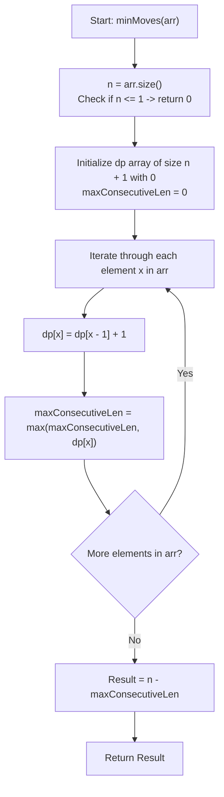

# 💡 Approach — Minimum Moves to Sort Permutation

  | 📄 [Problem](./Problem.md) | 💡 [Approach](./Approach.md) | 🧩 [Solution](./Solution.cpp) | 🚀 [Main](./Main.cpp) |
  |:--------------------------:|:-----------------------------:|:------------------------------:|:---------------------:|

## 📊 Metadata

---

> [!TIP]
> **Core Algorithmic Insight — Longest Consecutive Increasing Subsequence:**
> - In each operation, an element can be moved to either the **very beginning** or the **very end** of the array.
> - The elements that are **never moved** will maintain their relative positions.
> - To end up with a fully sorted array $[1, 2, 3, \dots, n]$, any elements that remain unmoved must form a subsequence of consecutive integers in increasing order:
>   $$x, \; x+1, \; x+2, \; \dots, \; x+L-1$$
> - Any smaller element ($< x$) can be placed at the beginning in descending order ($x-1, x-2, \dots, 1$), and any larger element ($> x+L-1$) can be placed at the end in ascending order ($x+L, x+L+1, \dots, n$).
> - Thus, sorting the permutation requires moving exactly $n - L$ elements.
> - To **minimize** operations $(n - L)$, we must **maximize** $L$, the length of the longest consecutive increasing subsequence.

---

## 🧭 Intuition & Mathematical Proof

1. **Permutation Structure:**
   The array `arr` is a permutation of $\{1, 2, \dots, n\}$.
   
2. **Dynamic Programming State:**
   - Let $\text{dp}[x]$ represent the length of the longest consecutive increasing subsequence ending with the value $x$.
   - When we encounter the number $x$ in `arr`:
     - If $x - 1$ was already processed earlier in the array, then $x$ can extend that sequence:
       $$\text{dp}[x] = \text{dp}[x - 1] + 1$$
     - If $x - 1$ has not appeared yet, $\text{dp}[x - 1] = 0$, so $\text{dp}[x] = 0 + 1 = 1$.
   
3. **Optimality:**
   A single linear scan $\mathcal{O}(n)$ tracks all consecutive sequence lengths. The maximum value in `dp` array gives $L = \max_{1 \le x \le n}(\text{dp}[x])$.
   
4. **Final Answer:**
   $$\text{Minimum Moves} = n - L$$

---

## 🔩 Step-by-Step Breakdown

1. **Step 1: Initialize variables and DP/frequency array**:
   - Let $n = \text{arr.size()}$. If $n \le 1$, return $0$.
   - Allocate a 1D vector `dp` of size $n + 1$ initialized to $0$.
   - Initialize `maxConsecutiveLen = 0`.

2. **Step 2: Compute longest consecutive increasing subsequence**:
   - Traverse each element $x$ in `arr`:
     - Set $\text{dp}[x] = \text{dp}[x - 1] + 1$.
     - Update $\text{maxConsecutiveLen} = \max(\text{maxConsecutiveLen}, \text{dp}[x])$.

3. **Step 3: Return minimum operations required**:
   - The minimum moves needed is $n - \text{maxConsecutiveLen}$.

---

## 🔄 Mermaid Flowchart

---

## 🏃‍♂️ Dry Run

Let's trace **Example 2:** `arr = [4, 3, 1, 2]`, $n = 4$:

| Step | Current $x$ | $x - 1$ | $\text{dp}[x - 1]$ | New $\text{dp}[x]$ | $\text{maxConsecutiveLen}$ | Subsequence Formed |
| :---: | :---: | :---: | :---: | :---: | :---: | :--- |
| **Init** | - | - | - | `dp = [0, 0, 0, 0, 0]` | 0 | None |
| **1** | **4** | 3 | 0 | $\text{dp}[4] = 0 + 1 = 1$ | 1 | `[4]` |
| **2** | **3** | 2 | 0 | $\text{dp}[3] = 0 + 1 = 1$ | 1 | `[3]` |
| **3** | **1** | 0 | 0 | $\text{dp}[1] = 0 + 1 = 1$ | 1 | `[1]` |
| **4** | **2** | 1 | 1 | $\text{dp}[2] = 1 + 1 = 2$ | **2** | `[1, 2]` |

- **Max consecutive subsequence length ($L$):** $2$ (`[1, 2]`)
- **Minimum moves required:** $n - L = 4 - 2 = \mathbf{2}$ moves (move $3$ to end, then move $4$ to end).

---

## 📊 Complexity Analysis

| Complexity Metric | Estimation | Rationale |
| :--- | :---: | :--- |
| **Time Complexity** | $\mathcal{O}(n)$ | Single pass over the array of size $n$ with $\mathcal{O}(1)$ DP table transitions. |
| **Auxiliary Space** | $\mathcal{O}(n)$ | Fixed size `dp` vector of size $n + 1$. |

---

> *"Small steps in order lead to grand transformations."*

---

<h3>Happy Coding! 🚀</h3>

