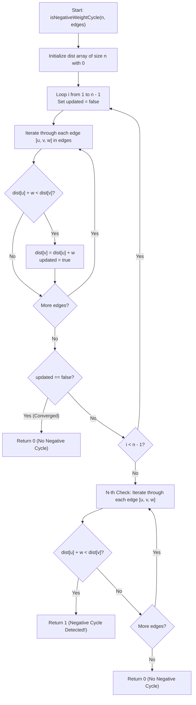

# 💡 Approach — Negative Weight Cycle

  | 📄 [Problem](./Problem.md) | 💡 [Approach](./Approach.md) | 🧩 [Solution](./Solution.cpp) | 🚀 [Main](./Main.cpp) |
  |:--------------------------:|:-----------------------------:|:------------------------------:|:---------------------:|

## 📊 Metadata

---

> [!TIP]
> **Core Algorithmic Insight — Bellman-Ford Algorithm with Virtual Source:**
> - In a directed graph with $V$ vertices, any simple path (a path without cycles) contains at most $V - 1$ edges.
> - Therefore, relaxing all edges $V - 1$ times guarantees finding the shortest simple path distances from a source.
> - If an edge $u \to v$ with weight $w$ can **still** be relaxed on the $V$-th pass ($\text{dist}[u] + w < \text{dist}[v]$), it implies a path with $V$ edges is shorter than any path with $V - 1$ edges, which is only possible if there is a **negative weight cycle**.
> - **Handling Disconnected Components:** By initializing $\text{dist}[v] = 0$ for all $v \in [0, V-1]$ (equivalent to connecting a virtual super-source $S^*$ to every vertex with edge weight 0), every component and cycle in the graph becomes reachable and detectable in a single unified run!

---

## 🧭 Intuition & Mathematical Proof

1. **Why $V - 1$ Iterations?**
   - In a graph without negative cycles, the shortest path between any two reachable vertices visits each vertex at most once, and therefore contains at most $V - 1$ edges.
   - After iteration $k$, the Bellman-Ford algorithm finds the shortest path of length at most $k$ edges.
   - Thus, after $V - 1$ iterations, all shortest paths must be completely converged.

2. **The $V$-th Iteration (Negative Cycle Detection):**
   - If after $V - 1$ iterations there still exists some edge $(u, v)$ such that:
     $$\text{dist}[u] + w < \text{dist}[v]$$
   - It means we can continue decreasing the path weight infinitely by traversing a cycle repeatedly.
   - Hence, a negative weight cycle exists.

3. **Virtual Super-Source ($0$-Initialization):**
   - If we initialized only $\text{dist}[0] = 0$ and all other $\text{dist}[v] = \infty$, we would fail to detect negative weight cycles located in disconnected components unreachable from vertex $0$.
   - Initializing $\text{dist}[v] = 0$ for all $v \in [0, V-1]$ is mathematically identical to adding a dummy source $S^*$ connected to every vertex with weight $0$.
   - Since $0$-weight edges from $S^*$ to all vertices cannot create new negative cycles, any negative cycle detected belongs strictly to the original graph.

---

## 🔩 Step-by-Step Breakdown

1. **Step 1: Initialize Distance Array**:
   - Allocate a vector `dist` of size $n$ initialized to $0$.

2. **Step 2: Relax All Edges $(n - 1)$ Times**:
   - For round $i = 1$ to $n - 1$:
     - Track whether any distance changes with a flag `updated = false`.
     - For each edge `[u, v, w]` in `edges`:
       - If $\text{dist}[u] + w < \text{dist}[v]$, update $\text{dist}[v] = \text{dist}[u] + w$ and set `updated = true`.
     - **Early Exit Optimization:** If no relaxation happened during an entire pass (`!updated`), shortest paths have already converged $\implies$ return $0$ immediately.

3. **Step 3: Check for Negative Cycle on $n$-th Pass**:
   - Iterate through all edges one more time:
     - If $\text{dist}[u] + w < \text{dist}[v]$, return $1$ (negative cycle exists).
   - If no edge can be further relaxed, return $0$ (no negative cycle).

---

## 🔄 Mermaid Flowchart

---

## 🏃‍♂️ Dry Run

Let's trace **Example 2:**
- $V = 4$, $E = 4$
- Edges: `[[1, 0, 4], [3, 1, -2], [1, 2, -6], [2, 3, 5]]`

### Initial State:
`dist = [0, 0, 0, 0]`

### Pass 1 ($i = 1$):
- Edge `(1, 0, 4)`: `dist[1] + 4 = 0 + 4 = 4` $\not<$ `dist[0] (0)`
- Edge `(3, 1, -2)`: `dist[3] + (-2) = 0 - 2 = -2 < dist[1] (0)` $\implies$ `dist[1] = -2`
- Edge `(1, 2, -6)`: `dist[1] + (-6) = -2 - 6 = -8 < dist[2] (0)` $\implies$ `dist[2] = -8`
- Edge `(2, 3, 5)`: `dist[2] + 5 = -8 + 5 = -3 < dist[3] (0)` $\implies$ `dist[3] = -3`
- Result after Pass 1: `dist = [0, -2, -8, -3]`, `updated = true`

### Pass 2 ($i = 2$):
- Edge `(1, 0, 4)`: `dist[1] + 4 = -2 + 4 = 2` $\not<$ `dist[0] (0)`
- Edge `(3, 1, -2)`: `dist[3] + (-2) = -3 - 2 = -5 < dist[1] (-2)` $\implies$ `dist[1] = -5`
- Edge `(1, 2, -6)`: `dist[1] + (-6) = -5 - 6 = -11 < dist[2] (-8)` $\implies$ `dist[2] = -11`
- Edge `(2, 3, 5)`: `dist[2] + 5 = -11 + 5 = -6 < dist[3] (-3)` $\implies$ `dist[3] = -6`
- Result after Pass 2: `dist = [0, -5, -11, -6]`, `updated = true`

### Pass 3 ($i = 3 = V - 1$):
- Continues to decrease: `dist[1] = -8`, `dist[2] = -14`, `dist[3] = -9`

### Pass 4 ($n$-th verification pass):
- Edge `(3, 1, -2)`: `dist[3] + (-2) = -9 - 2 = -11 < dist[1] (-8)` $\implies$ Relaxation still succeeds!
- **Output:** `1` (Negative weight cycle detected in cycle $1 \to 2 \to 3 \to 1$ with cycle weight $-6 + 5 - 2 = -3$).

---

## 📊 Complexity Analysis

| Complexity Metric | Estimation | Rationale |
| :--- | :---: | :--- |
| **Time Complexity** | $\mathcal{O}(V \times E)$ | We perform at most $V$ passes over all $E$ edges. Each edge relaxation takes $\mathcal{O}(1)$ time. With the early-exit optimization, graphs without negative cycles often finish in much fewer iterations. |
| **Auxiliary Space** | $\mathcal{O}(V)$ | A single 1D distance array of size $V$ is maintained. |

---

> *"Paths may wander in endless descent, but algorithm vigilance catches the cycle."*

---

<h3>Happy Coding! 🚀</h3>

