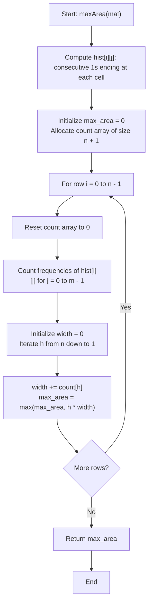

# 💡 Approach — Largest Rectangle with Column Swaps

  | 📄 [Problem](./Problem.md) | 💡 [Approach](./Approach.md) | 🧩 [Solution](./Solution.cpp) | 🚀 [Main](./Main.cpp) |
  |:--------------------------:|:-----------------------------:|:------------------------------:|:---------------------:|

## 📊 Metadata

---

> [!TIP]
> **Core Algorithmic Insight — Column Swapping & Histogram Reduction:**
> - In standard "Maximal Rectangle", column order is rigid, requiring monotonic stacks to handle contiguous histogram bars.
> - When **column swaps are permitted**, the constraint of adjacency disappears! Any set of $w$ columns can be grouped together into adjacent positions by swapping.
> - Thus, if row $i$ has $w$ columns with consecutive $1$s of height at least $h$, those $w$ columns can always form a contiguous rectangle of dimension $h \times w$ entirely filled with $1$s.
> - **Counting Sort Optimization:** Column heights are non-negative integers bounded by $n$ (the number of rows). Instead of sorting $m$ elements per row in $\mathcal{O}(m \log m)$, a frequency array allows counting sort in $\mathcal{O}(n + m)$ time per row, achieving the exact expected time complexity of $\mathcal{O}(n \times (n + m))$.

---

## 🧭 Intuition & Mathematical Proof

1. **Permutation Equivalence:**
   - Any permutation of columns can be achieved by a sequence of adjacent or arbitrary column swaps.
   - For a fixed bottom row $i$ and height $h$, a column $j$ can be part of a rectangle of height $h$ if and only if:
     $$\text{mat}[r][j] = 1 \quad \forall r \in [i - h + 1, i]$$
   - Let $\text{hist}[i][j]$ denote the length of consecutive $1$s ending at $(i, j)$:
     $$\text{hist}[i][j] = \begin{cases} 
     \text{hist}[i-1][j] + 1 & \text{if } \text{mat}[i][j] = 1 \\ 
     0 & \text{if } \text{mat}[i][j] = 0 
     \end{cases}$$
   - Column $j$ supports height $h$ at row $i$ if and only if $\text{hist}[i][j] \ge h$.

2. **Maximizing Area per Row:**
   - If we reorder the columns of row $i$ such that their heights are sorted in descending order:
     $$h_1 \ge h_2 \ge h_3 \ge \dots \ge h_m$$
   - The first $k$ columns all have height $\ge h_k$.
   - Grouping these $k$ columns together yields a rectangle of height $h_k$ and width $k$, with area:
     $$\text{Area}(k) = h_k \times k$$
   - The optimal rectangle ending at row $i$ is:
     $$\max_{1 \le k \le m} (h_k \times k)$$

3. **Linear Counting Sort $\mathcal{O}(n + m)$ vs Comparison Sort $\mathcal{O}(m \log m)$:**
   - The height of any bar cannot exceed the number of rows $n$ ($0 \le \text{hist}[i][j] \le n$).
   - We construct a frequency table $\text{count}[0 \dots n]$ where $\text{count}[h]$ is the number of columns in row $i$ with height exactly $h$.
   - Scanning from $h = n$ down to $1$, we maintain a running prefix sum of widths:
     $$\text{width}(h) = \sum_{H = h}^{n} \text{count}[H]$$
   - Any height $h$ gives an area of $h \times \text{width}(h)$.
   - This checks all possible heights in $\mathcal{O}(n)$ time after an $\mathcal{O}(m)$ frequency count pass!

---

## 🔩 Step-by-Step Breakdown

1. **Step 1: Compute Consecutive 1s (Histogram Heights)**:
   - Create a 2D table `hist` of size $n \times m$.
   - For row $0$: `hist[0][j] = mat[0][j]`.
   - For row $i \in [1, n-1]$: `hist[i][j] = mat[i][j] ? hist[i - 1][j] + 1 : 0`.

2. **Step 2: Evaluate Each Row as Base**:
   - Maintain `max_area = 0`.
   - For each row $i$ from $0$ to $n - 1$:
     - Reset a frequency array `count` of size $n + 1$ to $0$.
     - Increment `count[hist[i][j]]` for each column $j \in [0, m - 1]$.
     - Initialize `width = 0`.
     - Loop $h$ from $n$ down to $1$:
       - `width += count[h]`
       - `max_area = max(max_area, h * width)`

3. **Step 3: Return Global Maximum**:
   - After processing all $n$ rows, `max_area` holds the maximum rectangle area.

---

## 🔄 Mermaid Flowchart

---

## 🏃‍♂️ Dry Run

### Example 1:
$$\text{mat} = \begin{pmatrix} 0 & 1 & 0 & 1 & 0 \\ 0 & 1 & 0 & 1 & 1 \\ 1 & 1 & 0 & 1 & 0 \end{pmatrix}, \quad n = 3, m = 5$$

#### 1. Histogram Matrix (`hist`):
| Row | Col 0 | Col 1 | Col 2 | Col 3 | Col 4 |
| :---: | :---: | :---: | :---: | :---: | :---: |
| **Row 0** | 0 | 1 | 0 | 1 | 0 |
| **Row 1** | 0 | 2 | 0 | 2 | 1 |
| **Row 2** | 1 | 3 | 0 | 3 | 0 |

#### 2. Row Processing:
- **Row 0:** Heights = `[0, 1, 0, 1, 0]`
  - `count[1] = 2`, `count[0] = 3`
  - $h = 1 \implies \text{width} = 2 \implies \text{area} = 1 \times 2 = 2$.
  - `max_area` = 2.

- **Row 1:** Heights = `[0, 2, 0, 2, 1]`
  - `count[2] = 2`, `count[1] = 1`, `count[0] = 2`
  - $h = 2 \implies \text{width} = 2 \implies \text{area} = 2 \times 2 = 4$.
  - $h = 1 \implies \text{width} = 2 + 1 = 3 \implies \text{area} = 1 \times 3 = 3$.
  - `max_area` = 4.

- **Row 2:** Heights = `[1, 3, 0, 3, 0]`
  - `count[3] = 2`, `count[2] = 0`, `count[1] = 1`, `count[0] = 2`
  - $h = 3 \implies \text{width} = 2 \implies \text{area} = 3 \times 2 = 6$.
  - $h = 2 \implies \text{width} = 2 \implies \text{area} = 2 \times 2 = 4$.
  - $h = 1 \implies \text{width} = 2 + 1 = 3 \implies \text{area} = 1 \times 3 = 3$.
  - `max_area` = $\mathbf{6}$.

**Final Answer:** `6` (columns 1 and 3 grouped together form a $3 \times 2$ rectangle).

---

## 📊 Complexity Analysis

| Complexity Metric | Estimation | Rationale |
| :--- | :---: | :--- |
| **Time Complexity** | $\mathcal{O}(n \times (n + m))$ | Precomputing heights takes $\mathcal{O}(n \times m)$. For each of the $n$ rows, counting frequencies takes $\mathcal{O}(m)$ and scanning heights takes $\mathcal{O}(n)$. Overall time is $\mathcal{O}(n \times (n + m))$. |
| **Auxiliary Space** | $\mathcal{O}(n \times m)$ | Storing the 2D `hist` table requires $\mathcal{O}(n \times m)$ space. The counting sort array takes $\mathcal{O}(n)$ auxiliary space. *(Note: Space can further be reduced to $\mathcal{O}(m)$ by maintaining only the previous row's heights).* |

---

> *"Rearranging columns reveals structure hidden beneath disorder."*

---

<h3>Happy Coding! 🚀</h3>

