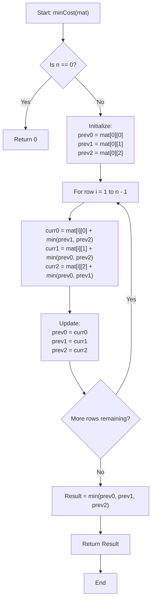

# 💡 Approach — Minimum Cost Selection

  | 📄 [Problem](./Problem.md) | 💡 [Approach](./Approach.md) | 🧩 [Solution](./Solution.cpp) | 🚀 [Main](./Main.cpp) |
  |:--------------------------:|:-----------------------------:|:------------------------------:|:---------------------:|

## 📊 Metadata

---

> [!TIP]
> **Core Algorithmic Insight — State Machine DP with $\mathcal{O}(1)$ Space:**
> - At each row $i$, we must select one of the three available choices ($0$, $1$, or $2$).
> - The choice at row $i$ is constrained *only* by the choice made at the immediately preceding row $i - 1$ (adjacent rows cannot share the same choice).
> - Because decisions in row $i$ depend strictly on row $i - 1$, this problem exhibits the **optimal substructure** and **overlapping subproblems** properties characteristic of **Dynamic Programming**.
> - By maintaining just 3 state variables for the choices made in the previous row, we reduce auxiliary space from $\mathcal{O}(n)$ to $\mathcal{O}(1)$ without mutating the input matrix.

---

## 🧭 Intuition & Mathematical Formulation

### 1. State Definition
Let $dp[i][c]$ denote the minimum cumulative cost to make valid selections for all rows from row $0$ up to row $i$, such that choice $c \in \{0, 1, 2\}$ is selected at row $i$.

### 2. Base Case ($i = 0$)
For the very first row, there are no prior constraints. The minimum cost to pick choice $c$ is simply its cost:
$$dp[0][c] = \text{mat}[0][c] \quad \text{for } c \in \{0, 1, 2\}$$

### 3. State Transitions ($i \ge 1$)
For each row $i$, if we pick choice $c$, the previous choice at row $i - 1$ must be any valid choice other than $c$. To minimize the total cost, we take the minimum of those alternate choices:
$$dp[i][0] = \text{mat}[i][0] + \min(dp[i-1][1], dp[i-1][2])$$
$$dp[i][1] = \text{mat}[i][1] + \min(dp[i-1][0], dp[i-1][2])$$
$$dp[i][2] = \text{mat}[i][2] + \min(dp[i-1][0], dp[i-1][1])$$

### 4. Final Result
The optimal answer after considering all $n$ rows is the minimum cost among the three possible choices at the last row $n - 1$:
$$\text{Result} = \min(dp[n-1][0], dp[n-1][1], dp[n-1][2])$$

### 5. Space Optimization ($\mathcal{O}(1)$ Auxiliary Space)
Notice that computing $dp[i]$ only requires values from row $i - 1$. We do not need to store the entire $n \times 3$ table. We can store:
- `prev0`, `prev1`, `prev2`: minimum costs for choices $0, 1, 2$ at row $i - 1$.
- `curr0`, `curr1`, `curr2`: minimum costs for choices $0, 1, 2$ at row $i$.

After computing `curr`, we set `prev = curr` and proceed to row $i + 1$. This maintains pure $\mathcal{O}(1)$ auxiliary space.

---

## 🔩 Step-by-Step Breakdown

1. **Edge Case Handling**:
   - If $n = 0$, return $0$.
   - If $n = 1$, return $\min(\text{mat}[0][0], \text{mat}[0][1], \text{mat}[0][2])$.

2. **Initialize Base State**:
   - Set `prev0 = mat[0][0]`, `prev1 = mat[0][1]`, and `prev2 = mat[0][2]`.

3. **Iterate from Row $1$ to $n - 1$**:
   - For each row $i$:
     - `curr0 = mat[i][0] + min(prev1, prev2)`
     - `curr1 = mat[i][1] + min(prev0, prev2)`
     - `curr2 = mat[i][2] + min(prev0, prev1)`
     - Update: `prev0 = curr0`, `prev1 = curr1`, `prev2 = curr2`.

4. **Return Answer**:
   - Return $\min(\text{prev0}, \text{prev1}, \text{prev2})$.

---

## 🔄 Mermaid Flowchart

---

## 🏃‍♂️ Dry Run

### Example 1:
$$\text{mat} = \begin{pmatrix} 1 & 50 & 50 \\ 50 & 50 & 50 \\ 1 & 50 & 50 \end{pmatrix}, \quad n = 3$$

| Row | Action | `prev0` (Choice 0) | `prev1` (Choice 1) | `prev2` (Choice 2) |
|:---:|:---|:---:|:---:|:---:|
| **Row 0** | Initialization | $1$ | $50$ | $50$ |
| **Row 1** | `curr0 = 50 + min(50, 50) = 100` `curr1 = 50 + min(1, 50) = 51` `curr2 = 50 + min(1, 50) = 51` | $100$ | $51$ | $51$ |
| **Row 2** | `curr0 = 1 + min(51, 51) = 52` `curr1 = 50 + min(100, 51) = 101` `curr2 = 50 + min(100, 51) = 101` | $52$ | $101$ | $101$ |

$$\text{Final Result} = \min(52, 101, 101) = \mathbf{52}$$

---

### Example 2:
$$\text{mat} = \begin{pmatrix} 1 & 4 & 1 \\ 3 & 2 & 2 \\ 3 & 2 & 3 \end{pmatrix}, \quad n = 3$$

| Row | Action | `prev0` (Choice 0) | `prev1` (Choice 1) | `prev2` (Choice 2) |
|:---:|:---|:---:|:---:|:---:|
| **Row 0** | Initialization | $1$ | $4$ | $1$ |
| **Row 1** | `curr0 = 3 + min(4, 1) = 4` `curr1 = 2 + min(1, 1) = 3` `curr2 = 2 + min(1, 4) = 3` | $4$ | $3$ | $3$ |
| **Row 2** | `curr0 = 3 + min(3, 3) = 6` `curr1 = 2 + min(4, 3) = 5` `curr2 = 3 + min(4, 3) = 6` | $6$ | $5$ | $6$ |

$$\text{Final Result} = \min(6, 5, 6) = \mathbf{5}$$

---

## 📊 Complexity Analysis

| Complexity Metric | Estimation | Rationale |
| :--- | :---: | :--- |
| **Time Complexity** | $\mathcal{O}(n)$ | We iterate through the $n$ rows once. In each iteration, constant $\mathcal{O}(1)$ work is done (3 sums and minimums). |
| **Auxiliary Space** | $\mathcal{O}(1)$ | Only 6 scalar integer variables (`prev0..2` and `curr0..2`) are maintained throughout execution. |

---

<h3>Happy Coding! 🚀</h3>

