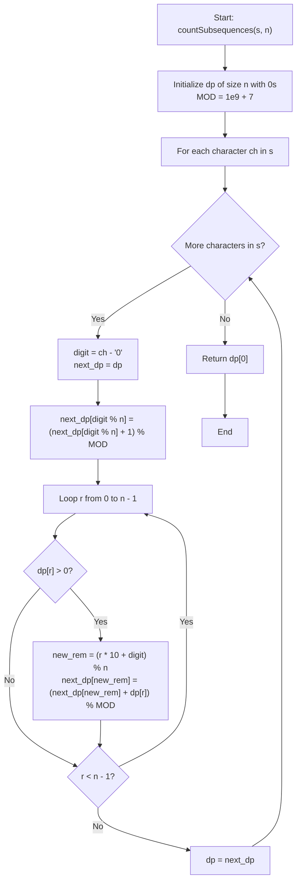

# 💡 Approach — Count Subsequences Divisible by n

  | 📄 [Problem](./Problem.md) | 💡 [Approach](./Approach.md) | 🧩 [Solution](./Solution.cpp) | 🚀 [Main](./Main.cpp) |
  |:--------------------------:|:-----------------------------:|:------------------------------:|:---------------------:|

## 📊 Metadata

---

> [!TIP]
> **Core Algorithmic Insight — Dynamic Programming over Modular States:**
> - A string of length $|s|$ has $2^{|s|} - 1$ non-empty subsequences. Directly generating them or storing their large values leads to exponential $\mathcal{O}(2^{|s|})$ time and integer overflow.
> - When appending a new digit $d$ to a number with numeric value $V$, the new value becomes:
>   $$V' = V \times 10 + d$$
> - By modular arithmetic:
>   $$V' \pmod n = ((V \pmod n) \times 10 + d) \pmod n$$
> - Thus, the remainder of the new number depends **solely on the remainder of the existing prefix number modulo $n$**, not its actual magnitude!
> - There are only $n$ possible remainders $\{0, 1, \dots, n - 1\}$. By maintaining an array `dp[r]` representing the count of non-empty subsequences that leave remainder $r$ modulo $n$, we solve the problem in $\mathcal{O}(|s| \times n)$ time and $\mathcal{O}(n)$ auxiliary space.

---

## 🧭 Intuition & Mathematical Formulation

### 1. State Definition
Let $dp[r]$ denote the number of non-empty subsequences formed from the prefix of string $s$ processed so far whose decimal value satisfies:
$$\text{val}(\text{subsequence}) \equiv r \pmod n, \quad \text{for } 0 \le r < n$$

### 2. Base Case
Before processing any characters from $s$, no non-empty subsequences exist:
$$dp[r] = 0 \quad \forall \; r \in \{0, 1, \dots, n - 1\}$$

### 3. State Transitions for Digit $d$
When we encounter a digit $d = s[i] - \text{'0'}$, each subsequence has three possibilities:
1. **Exclude $d$**:
   All non-empty subsequences previously formed remain unchanged:
   $$\text{next\_dp}[r] \mathrel{+}= dp[r]$$
2. **Start a new subsequence with $d$**:
   The single digit $d$ on its own forms a valid 1-digit subsequence with remainder $d \pmod n$:
   $$\text{next\_dp}[d \pmod n] \mathrel{+}= 1$$
3. **Extend existing subsequences with $d$**:
   For every prior subsequence having remainder $r$, appending $d$ produces a new subsequence with remainder:
   $$r_{\text{new}} = (r \times 10 + d) \pmod n$$
   Hence, we add the count $dp[r]$ to $\text{next\_dp}[r_{\text{new}}]$:
   $$\text{next\_dp}[(r \times 10 + d) \pmod n] \mathrel{+}= dp[r]$$

All additions are performed modulo $10^9 + 7$.

### 4. Final Answer
After processing all $|s|$ characters, any subsequence whose numeric value is divisible by $n$ leaves a remainder of $0$. Therefore, the answer is:
$$\text{Result} = dp[0]$$

### 5. Space Optimization
Computing the DP state for the current character only requires the DP array from the immediately preceding character. By utilizing two 1D vectors of size $n$ (`dp` and `next_dp`), auxiliary space is reduced to $\mathcal{O}(n)$.

---

## 🔩 Step-by-Step Breakdown

1. **Initialize State**:
   - Create a vector `dp` of size $n$ initialized to $0$.
   - Define modulo constant $\text{MOD} = 10^9 + 7$.

2. **Iterate Through Digits**:
   - For each character `ch` in string $s$:
     - Let `digit = ch - '0'`.
     - Initialize `next_dp = dp` (carrying forward unchanged subsequences).
     - Increment `next_dp[digit % n]` by $1$ (starting a standalone subsequence with `digit`).
     - For each remainder $r \in [0, n - 1]$:
       - If $dp[r] > 0$:
         - Compute `new_rem = (r * 10 + digit) % n`.
         - Add $dp[r]$ to `next_dp[new_rem]` modulo $\text{MOD}$.
     - Update `dp = move(next_dp)`.

3. **Return Divisible Subsequences Count**:
   - Return $dp[0]$.

---

## 🔄 Mermaid Flowchart

---

## 🏃‍♂️ Dry Run

### Example 1: $s = \text{"1234"}, \; n = 4$

Initial state: `dp = [0, 0, 0, 0]`

| Step | Char | Digit | Subsequences Formed | `dp[0]` (rem 0) | `dp[1]` (rem 1) | `dp[2]` (rem 2) | `dp[3]` (rem 3) |
|:---:|:---:|:---:|:---|:---:|:---:|:---:|:---:|
| **Init** | - | - | None | $0$ | $0$ | $0$ | $0$ |
| **1** | `'1'` | $1$ | `"1"` | $0$ | $1$ | $0$ | $0$ |
| **2** | `'2'` | $2$ | Extend: `"12"` (rem 0) New: `"2"` (rem 2) | $1$ | $1$ | $1$ | $0$ |
| **3** | `'3'` | $3$ | Extend: `"123"` (rem 3), `"13"` (rem 1), `"23"` (rem 3) New: `"3"` (rem 3) | $1$ | $2$ | $1$ | $3$ |
| **4** | `'4'` | $4$ | Extend: `"124"` (rem 0), `"14"` (rem 2), `"134"` (rem 2), `"24"` (rem 0), `"1234"` (rem 2), `"234"` (rem 2), `"34"` (rem 2) New: `"4"` (rem 0) | **4** | $2$ | $5$ | $4$ |

Final result: `dp[0] = 4` (Subsequences: `"4"`, `"12"`, `"24"`, `"124"`).

---

### Example 2: $s = \text{"330"}, \; n = 6$

Initial state: `dp = [0, 0, 0, 0, 0, 0]`

| Step | Char | Digit | Transitions & Subsequences | `dp[0]` | `dp[1]` | `dp[2]` | `dp[3]` | `dp[4]` | `dp[5]` |
|:---:|:---:|:---:|:---|:---:|:---:|:---:|:---:|:---:|:---:|
| **Init** | - | - | None | $0$ | $0$ | $0$ | $0$ | $0$ | $0$ |
| **1** | `'3'` | $3$ | New: `"3"` (rem 3) | $0$ | $0$ | $0$ | $1$ | $0$ | $0$ |
| **2** | `'3'` | $3$ | Extend: `"33"` ($33 \equiv 3 \pmod 6$) New: `"3"` (rem 3) | $0$ | $0$ | $0$ | $3$ | $0$ | $0$ |
| **3** | `'0'` | $0$ | Extend: $(3 \times 10 + 0) \equiv 0 \pmod 6 \implies$ 3 to rem 0 New: `"0"` ($0 \equiv 0 \pmod 6$) | **4** | $0$ | $0$ | $3$ | $0$ | $0$ |

Final result: `dp[0] = 4` (Subsequences: `"30"`, `"30"`, `"330"`, `"0"`).

---

## 📊 Complexity Analysis

| Complexity Metric | Estimation | Rationale |
| :--- | :---: | :--- |
| **Time Complexity** | $\mathcal{O}(\|s\| \times n)$ | We iterate through each of the $\|s\|$ characters in string $s$. For each character, we iterate through all $n$ remainders ($0 \le r < n$) performing constant $\mathcal{O}(1)$ modular operations. Overall time is bounded by $\mathcal{O}(\|s\| \times n) \le 10^6$ ops, running in $< 5$ ms. |
| **Auxiliary Space** | $\mathcal{O}(n)$ | We maintain only two vectors of size $n$ (`dp` and `next_dp`) at any point in execution. At maximum $n = 10^6$, memory usage is $\approx 4\text{ MB}$, well within standard limits. |

---

<h3>Happy Coding! 🚀</h3>

