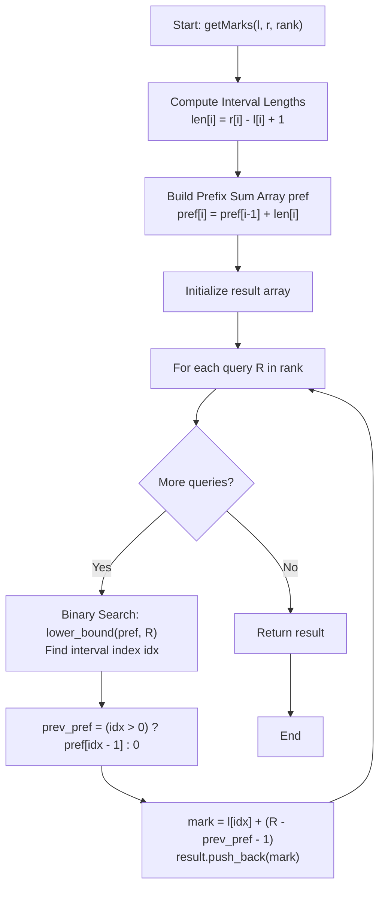

# 💡 Approach — Marks from Ranks

  | 📄 [Problem](./Problem.md) | 💡 [Approach](./Approach.md) | 🧩 [Solution](./Solution.cpp) | 🚀 [Main](./Main.cpp) |
  |:--------------------------:|:-----------------------------:|:------------------------------:|:---------------------:|

## 📊 Metadata

---

> [!TIP]
> **Core Algorithmic Insight — Prefix Sums of Interval Sizes + Binary Search:**
> - Because all intervals $[l[i], r[i]]$ are consecutive integers, pairwise disjoint, and already sorted in strictly increasing order, the marks within each interval occupy a contiguous block of ranks.
> - The $i$-th interval $[l[i], r[i]]$ contains exactly $len[i] = r[i] - l[i] + 1$ distinct marks.
> - By precomputing a prefix sum array `pref` where $pref[i]$ is the total count of marks in all intervals from $0$ to $i$, the ranks covered by interval $i$ are precisely:
>   $$[\,pref[i - 1] + 1, \; pref[i]\,]$$
> - For any query rank $R$, the interval containing rank $R$ is the first interval $idx$ where $pref[idx] \ge R$. Since $pref$ is strictly monotonically increasing, we can find $idx$ in $\mathcal{O}(\log n)$ using binary search (`std::lower_bound`).
> - Once the interval index $idx$ is known, the rank offset inside that interval is $R - pref[idx - 1]$. Since marks within interval $idx$ start at $l[idx]$, the exact mark is simply:
>   $$\text{mark} = l[idx] + (R - pref[idx - 1] - 1)$$

---

## 🧭 Intuition & Mathematical Formulation

### 1. Cumulative Rank Range
Consider $n$ intervals $[l[0], r[0]], [l[1], r[1]], \dots, [l[n-1], r[n-1]]$.
Each interval $i$ contains $len[i] = r[i] - l[i] + 1$ integers.
We define the cumulative count of marks:
$$pref[i] = \begin{cases} len[0] & \text{if } i = 0 \\ pref[i - 1] + len[i] & \text{if } i > 0 \end{cases}$$

Thus:
- Interval $0$ covers ranks: $[1, pref[0]]$
- Interval $1$ covers ranks: $[pref[0] + 1, pref[1]]$
- Interval $i$ covers ranks: $[pref[i - 1] + 1, pref[i]]$

### 2. Locating the Interval via Binary Search
Given a target rank $R$, we need to find the unique interval index $idx$ such that:
$$pref[idx - 1] < R \le pref[idx] \quad (\text{with } pref[-1] = 0)$$

Because $pref$ is strictly ascending, `std::lower_bound(pref.begin(), pref.end(), R)` finds the iterator to the first element $\ge R$ in $\mathcal{O}(\log n)$ time.

### 3. Calculating the Specific Mark
The 1-based offset within interval $idx$ is:
$$\text{offset} = R - (idx > 0 \ ? \ pref[idx - 1] : 0)$$

The marks in interval $idx$ are:
$$l[idx], \; l[idx] + 1, \; l[idx] + 2, \; \dots, \; r[idx]$$

Hence:
- Rank offset $1 \implies \text{mark} = l[idx]$
- Rank offset $2 \implies \text{mark} = l[idx] + 1$
- General Rank offset $\implies \text{mark} = l[idx] + (\text{offset} - 1)$

---

## 🔩 Step-by-Step Breakdown

1. **Precompute Prefix Sums of Interval Sizes**:
   - Compute the size of each interval: $len[i] = r[i] - l[i] + 1$.
   - Build `pref` where $pref[i]$ is the cumulative sum of lengths up to index $i$. Use `long long` to prevent potential integer overflow on large datasets.

2. **Process Rank Queries**:
   - For each query $R$ in `rank`:
     - Perform `auto it = lower_bound(pref.begin(), pref.end(), (long long)R);`
     - Find the interval index: $idx = \text{distance}(pref.begin(), it)$.
     - Retrieve the cumulative count prior to this interval:
       $$prev\_pref = (idx > 0) \ ? \ pref[idx - 1] : 0$$
     - Compute the target mark:
       $$\text{mark} = l[idx] + (R - prev\_pref - 1)$$
     - Append the calculated mark to the result array.

3. **Return Answer**:
   - Return the result vector of marks.

---

## 🔄 Mermaid Flowchart

---

## 🏃‍♂️ Dry Run

### Example 1: $l = [1, 6, 14], \; r = [3, 9, 15], \; rank = [2, 5, 8]$

1. **Intervals & Prefix Sums:**
   - Interval 0: $[1, 3] \implies len = 3 \implies pref[0] = 3$ (Ranks $1 \dots 3$)
   - Interval 1: $[6, 9] \implies len = 4 \implies pref[1] = 7$ (Ranks $4 \dots 7$)
   - Interval 2: $[14, 15] \implies len = 2 \implies pref[2] = 9$ (Ranks $8 \dots 9$)
   - `pref = [3, 7, 9]`

2. **Query Processing:**

| Query ($R$) | `lower_bound` Match | Interval $idx$ | Interval Range $[l, r]$ | $prev\_pref$ | Offset ($R - prev$) | Mark ($l + \text{offset} - 1$) |
|:---:|:---:|:---:|:---:|:---:|:---:|:---:|
| **2** | $pref[0] = 3 \ge 2$ | $0$ | $[1, 3]$ | $0$ | $2$ | $1 + 2 - 1 = \mathbf{2}$ |
| **5** | $pref[1] = 7 \ge 5$ | $1$ | $[6, 9]$ | $3$ | $2$ | $6 + 2 - 1 = \mathbf{7}$ |
| **8** | $pref[2] = 9 \ge 8$ | $2$ | $[14, 15]$ | $7$ | $1$ | $14 + 1 - 1 = \mathbf{14}$ |

Final Output: `[2, 7, 14]` ✅

---

### Example 2: $l = [5, 10], \; r = [7, 12], \; rank = [1, 4, 6]$

1. **Intervals & Prefix Sums:**
   - Interval 0: $[5, 7] \implies len = 3 \implies pref[0] = 3$ (Ranks $1 \dots 3$)
   - Interval 1: $[10, 12] \implies len = 3 \implies pref[1] = 6$ (Ranks $4 \dots 6$)
   - `pref = [3, 6]`

2. **Query Processing:**

| Query ($R$) | `lower_bound` Match | Interval $idx$ | Interval Range $[l, r]$ | $prev\_pref$ | Offset ($R - prev$) | Mark ($l + \text{offset} - 1$) |
|:---:|:---:|:---:|:---:|:---:|:---:|:---:|
| **1** | $pref[0] = 3 \ge 1$ | $0$ | $[5, 7]$ | $0$ | $1$ | $5 + 1 - 1 = \mathbf{5}$ |
| **4** | $pref[1] = 6 \ge 4$ | $1$ | $[10, 12]$ | $3$ | $1$ | $10 + 1 - 1 = \mathbf{10}$ |
| **6** | $pref[1] = 6 \ge 6$ | $1$ | $[10, 12]$ | $3$ | $3$ | $10 + 3 - 1 = \mathbf{12}$ |

Final Output: `[5, 10, 12]` ✅

---

## 📊 Complexity Analysis

| Complexity Metric | Estimation | Rationale |
| :--- | :---: | :--- |
| **Time Complexity** | $\mathcal{O}(n + q \log n)$ | Constructing the prefix sums array requires iterating through $n$ intervals in $\mathcal{O}(n)$. For each of the $q$ queries in `rank`, `std::lower_bound` performs binary search across $n$ elements in $\mathcal{O}(\log n)$ time. Overall time is $\mathcal{O}(n + q \log n)$. |
| **Auxiliary Space** | $\mathcal{O}(n)$ | Storing the prefix sums vector of size $n$ requires $\mathcal{O}(n)$ space. (The output vector of size $q$ stores the required answers). |

---

> *"The essence of binary search is not just finding an item, but eliminating half the possibilities at every step."*

---

<h3>Happy Coding! 🚀</h3>

