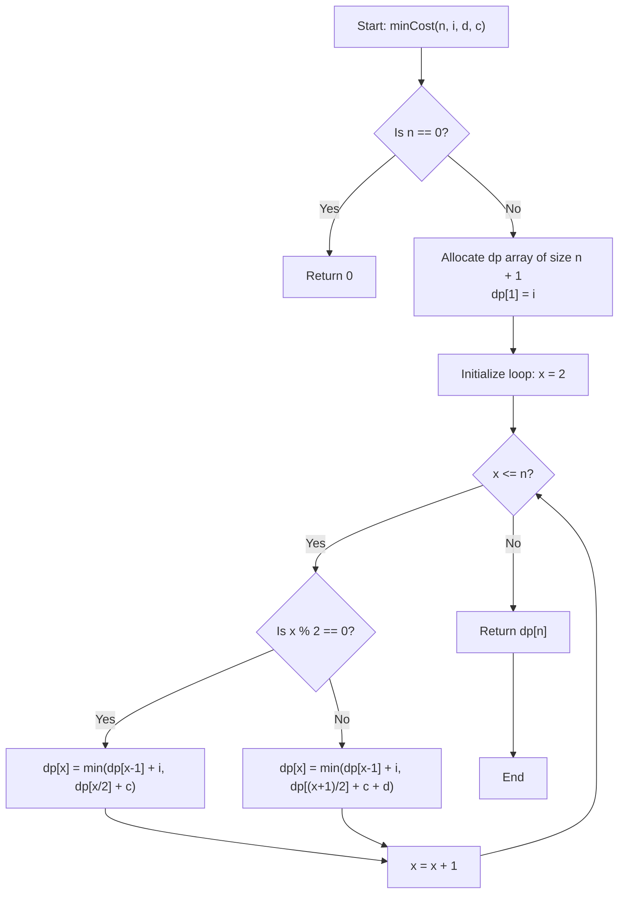

# 💡 Approach — Minimum Cost for n Characters

  | 📄 [Problem](./Problem.md) | 💡 [Approach](./Approach.md) | 🧩 [Solution](./Solution.cpp) | 🚀 [Main](./Main.cpp) |
  |:--------------------------:|:-----------------------------:|:------------------------------:|:---------------------:|

## 📊 Metadata

---

> [!TIP]
> **Core Algorithmic Insight — Dynamic Programming:**
> - To form $x$ characters, there are fundamentally three operations:
>   1. **Insert 1 character**: Reach length $x$ from $x - 1$ at cost $i$.
>   2. **Copy & Paste (Doubling)**: Reach length $x$ from $x / 2$ at cost $c$ (applicable when $x$ is even).
>   3. **Copy & Paste then Delete**: Reach length $x$ from an odd number by doubling $(x + 1) / 2$ and immediately deleting 1 character at cost $c + d$.
> - Notice that for any odd $x \ge 3$, $(x + 1) / 2 < x$. Thus, the state $dp[(x + 1) / 2]$ is **already computed** before we evaluate $dp[x]$!
> - Therefore, a single linear pass $\mathcal{O}(n)$ using bottom-up tabulation is sufficient to determine the optimal cost for all lengths from $1$ to $n$.

---

## 🧭 Intuition & Mathematical Formulation

Let $dp[x]$ denote the minimum cost to form exactly $x$ characters on the screen starting from an empty screen ($dp[0] = 0$).

### 1. Base Cases
- $dp[0] = 0$ (0 characters require 0 operations).
- $dp[1] = i$ (The only way to write the very first character on an empty screen is via insertion).

### 2. Transition for Even $x$ ($x \% 2 == 0$)
When $x$ is even:
- We can insert a character after $x - 1$ characters: $\text{cost} = dp[x - 1] + i$.
- We can double $x / 2$ characters using copy-paste: $\text{cost} = dp[x / 2] + c$.

Hence:
$$dp[x] = \min(dp[x - 1] + i, \; dp[x / 2] + c)$$

### 3. Transition for Odd $x$ ($x \% 2 == 1$)
When $x$ is odd:
- We can insert a character after $x - 1$ characters: $\text{cost} = dp[x - 1] + i$.
- Alternatively, we cannot directly double to an odd length $x$, but we could double to the next even length $x + 1$ (by starting from $(x + 1) / 2$ characters and copy-pasting), followed by deleting 1 character:
  $$\text{cost} = dp[(x + 1) / 2] + c + d$$

Why can we use $dp[(x + 1) / 2]$?
For any odd integer $x \ge 3$:
$$\frac{x + 1}{2} < x$$
For example:
- For $x = 3$: $(3 + 1) / 2 = 2 < 3$.
- For $x = 5$: $(5 + 1) / 2 = 3 < 5$.
- For $x = 9$: $(9 + 1) / 2 = 5 < 9$.

Because $(x + 1) / 2$ is strictly less than $x$, its optimal subproblem value $dp[(x + 1) / 2]$ is already finalized in our forward loop!

Hence:
$$dp[x] = \min(dp[x - 1] + i, \; dp[(x + 1) / 2] + c + d)$$

---

## 🔩 Step-by-Step Breakdown

1. **Allocate DP Table**:
   - Initialize an array `dp` of size $n + 1$ with $0$.
   - Set $dp[1] = i$.

2. **Iterate from $x = 2$ to $n$**:
   - If $x$ is even:
     $$dp[x] = \min(dp[x - 1] + i, \; dp[x / 2] + c)$$
   - If $x$ is odd:
     $$dp[x] = \min(dp[x - 1] + i, \; dp[(x + 1) / 2] + c + d)$$

3. **Return Result**:
   - Return $dp[n]$.

---

## 🔄 Mermaid Flowchart

---

## 🏃‍♂️ Dry Run

### Example 1: $n = 9, \; i = 1, \; d = 2, \; c = 1$

| $x$ | Parity | Option 1: Insert ($dp[x-1] + i$) | Option 2: Copy-Paste (± Delete) | $dp[x]$ | Chosen Operation |
|:---:|:---:|:---:|:---:|:---:|:---|
| **1** | Odd | — | — | **1** | Insert 1st char |
| **2** | Even | $dp[1] + 1 = 2$ | $dp[1] + 1 = 2$ | **2** | Either |
| **3** | Odd | $dp[2] + 1 = 3$ | $dp[2] + 1 + 2 = 5$ | **3** | Insert from 2 |
| **4** | Even | $dp[3] + 1 = 4$ | $dp[2] + 1 = 3$ | **3** | Copy from 2 |
| **5** | Odd | $dp[4] + 1 = 4$ | $dp[3] + 1 + 2 = 6$ | **4** | Insert from 4 |
| **6** | Even | $dp[5] + 1 = 5$ | $dp[3] + 1 = 4$ | **4** | Copy from 3 |
| **7** | Odd | $dp[6] + 1 = 5$ | $dp[4] + 1 + 2 = 6$ | **5** | Insert from 6 |
| **8** | Even | $dp[7] + 1 = 6$ | $dp[4] + 1 = 4$ | **4** | Copy from 4 |
| **9** | Odd | $dp[8] + 1 = 5$ | $dp[5] + 1 + 2 = 7$ | **5** | Insert from 8 |

Output: $dp[9] = \mathbf{5}$ ✅

---

### Example 2: $n = 9, \; i = 10, \; d = 1, \; c = 1$

| $x$ | Parity | Option 1: Insert ($dp[x-1] + 10$) | Option 2: Copy-Paste (± Delete) | $dp[x]$ | Chosen Operation |
|:---:|:---:|:---:|:---:|:---:|:---|
| **1** | Odd | — | — | **10** | Insert 1st char |
| **2** | Even | $dp[1] + 10 = 20$ | $dp[1] + 1 = 11$ | **11** | Copy from 1 |
| **3** | Odd | $dp[2] + 10 = 21$ | $dp[2] + 1 + 1 = 13$ | **13** | Copy from 2 to 4, delete to 3 |
| **4** | Even | $dp[3] + 10 = 23$ | $dp[2] + 1 = 12$ | **12** | Copy from 2 |
| **5** | Odd | $dp[4] + 10 = 22$ | $dp[3] + 1 + 1 = 15$ | **15** | Copy from 3 to 6, delete to 5 |
| **6** | Even | $dp[5] + 10 = 25$ | $dp[3] + 1 = 14$ | **14** | Copy from 3 |
| **7** | Odd | $dp[6] + 10 = 24$ | $dp[4] + 1 + 1 = 14$ | **14** | Copy from 4 to 8, delete to 7 |
| **8** | Even | $dp[7] + 10 = 24$ | $dp[4] + 1 = 13$ | **13** | Copy from 4 |
| **9** | Odd | $dp[8] + 10 = 23$ | $dp[5] + 1 + 1 = 17$ | **17** | Copy from 5 to 10, delete to 9 |

Output: $dp[9] = \mathbf{17}$ ✅

---

## 📊 Complexity Analysis

| Complexity Metric | Estimation | Rationale |
| :--- | :---: | :--- |
| **Time Complexity** | $\mathcal{O}(n)$ | We compute each state $dp[x]$ from $x = 2$ up to $n$ in constant $\mathcal{O}(1)$ time. Overall time is linear $\mathcal{O}(n)$. |
| **Auxiliary Space** | $\mathcal{O}(n)$ | We allocate a dynamic programming array of size $n + 1$ to store minimum costs. |

---

<h3>Happy Coding! 🚀</h3>

