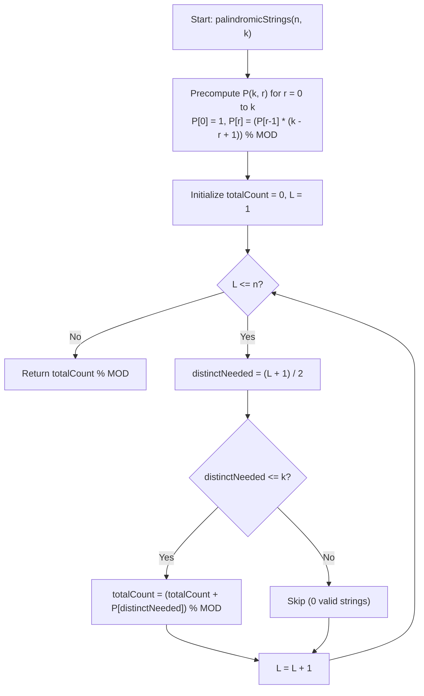

# 💡 Approach — Count Palindromic Strings with Constraints

  | 📄 [Problem](./Problem.md) | 💡 [Approach](./Approach.md) | 🧩 [Solution](./Solution.cpp) | 🚀 [Main](./Main.cpp) |
  |:--------------------------:|:-----------------------------:|:------------------------------:|:---------------------:|

## 📊 Metadata

---

> [!TIP]
> **Core Combinatorial Insight — Symmetrical Structure of Palindromes:**
> - In any palindrome of length $L$:
>   - Characters at symmetric pairs $(i, L - 1 - i)$ must be identical.
>   - Since no character can appear more than **twice** in the entire string, each chosen character can be used in at most **one** symmetric pair, and all characters in the first half must be **pairwise distinct**.
>   - For **odd** length strings, the middle character at index $\lfloor L / 2 \rfloor$ appears once. If it matched any character from the symmetric pairs, that character would appear $2 + 1 = 3$ times (which is strictly forbidden!). Thus, the center character must also be completely distinct from all pair characters.
> - Therefore, for any length $L$, the number of distinct characters required from the alphabet of size $k$ is exactly $r = \lceil L / 2 \rceil = \lfloor (L + 1) / 2 \rfloor$.
> - The number of valid palindromes of length $L$ is simply the permutation $P(k, r) = \frac{k!}{(k - r)!}$.

---

## 🧭 Mathematical Formulation & Derivation

Let $L$ be the length of a candidate palindrome, where $1 \le L \le n$.

### 1. Case 1: Even Length $L = 2m$
- A palindrome of length $2m$ has $m$ symmetric pairs:
  $$(0, 2m-1), (1, 2m-2), \dots, (m-1, m)$$
- The first half $S[0 \dots m-1]$ completely determines the second half $S[m \dots 2m-1]$.
- Each character chosen in $S[0 \dots m-1]$ appears **twice** in $S$.
- To ensure no character appears $> 2$ times, all $m$ characters in $S[0 \dots m-1]$ must be **distinct**.
- Number of ways to choose and arrange $m$ distinct characters out of $k$ available letters:
  $$\text{Ways}(L = 2m) = P(k, m) = k \times (k - 1) \times \dots \times (k - m + 1)$$
  *(If $m > k$, this evaluates to 0).*

### 2. Case 2: Odd Length $L = 2m + 1$
- A palindrome of length $2m + 1$ has $m$ symmetric pairs and $1$ middle character at index $m$.
- The $m$ characters in $S[0 \dots m-1]$ appear twice.
- The center character $S[m]$ appears once.
- If $S[m]$ were equal to any character in $S[0 \dots m-1]$, that character would appear $2 + 1 = 3$ times, violating the condition.
- Hence, all $m$ pair characters **and** the center character must be pairwise distinct — totaling $(m + 1)$ distinct characters.
- Number of ways:
  - First choose and arrange $m$ distinct characters for the first half: $P(k, m)$ ways.
  - Then choose the center character from the remaining $(k - m)$ characters: $(k - m)$ choices.
  $$\text{Ways}(L = 2m + 1) = P(k, m) \times (k - m) = P(k, m + 1)$$
  *(If $m + 1 > k$, this evaluates to 0).*

### 3. Unified Formula
For any length $L \ge 1$:
$$r = \left\lceil \frac{L}{2} \right\rceil = \left\lfloor \frac{L + 1}{2} \right\rfloor$$
$$\text{Ways}(L) = \begin{cases} P(k, r) \pmod{10^9 + 7} & \text{if } r \le k \\ 0 & \text{if } r > k \end{cases}$$

The total answer is the sum over all lengths from $1$ to $n$:
$$\text{Total} = \sum_{L=1}^{n} \text{Ways}(L) \pmod{10^9 + 7}$$

---

## 🔩 Step-by-Step Breakdown

1. **Precompute Permutations $P(k, r)$**:
   - Compute $P(k, r) = \prod_{j=0}^{r-1} (k - j) \pmod{10^9+7}$ for $r = 0, 1, \dots, k$.
2. **Iterate through Lengths $L = 1 \dots n$**:
   - Compute $r = (L + 1) / 2$.
   - If $r \le k$, add $P(k, r)$ to the running sum modulo $10^9 + 7$.
3. **Return Sum**:
   - Return the accumulated total.

---

## 🔄 Mermaid Flowchart

---

## 🏃‍♂️ Dry Run

### Example: $n = 4, \; k = 3$

Precomputed $P(3, r)$:
- $P(3, 0) = 1$
- $P(3, 1) = 3$
- $P(3, 2) = 3 \times 2 = 6$
- $P(3, 3) = 3 \times 2 \times 1 = 6$

| $L$ | Parity | Formula for $r$ | $r$ | $P(k, r)$ | Valid Palindromes | Total Count |
|:---:|:---:|:---:|:---:|:---:|:---|:---:|
| **1** | Odd | $(1 + 1)/2$ | **1** | $P(3, 1) = 3$ | `"a", "b", "c"` | $3$ |
| **2** | Even | $(2 + 1)/2$ | **1** | $P(3, 1) = 3$ | `"aa", "bb", "cc"` | $3 + 3 = 6$ |
| **3** | Odd | $(3 + 1)/2$ | **2** | $P(3, 2) = 6$ | `"aba", "aca", "bab", "bcb", "cac", "cbc"` | $6 + 6 = 12$ |
| **4** | Even | $(4 + 1)/2$ | **2** | $P(3, 2) = 6$ | `"abba", "acca", "baab", "bccb", "caac", "cbbc"` | $12 + 6 = \mathbf{18}$ |

Output: $\mathbf{18}$ ✅

---

## 📊 Complexity Analysis

| Complexity Metric | Estimation | Rationale |
| :--- | :---: | :--- |
| **Time Complexity** | $\mathcal{O}(n + k)$ | Precomputing permutations up to $k$ takes $\mathcal{O}(k)$, and summing over lengths $1 \dots n$ takes $\mathcal{O}(n)$. Since $k \le 26$ and $n \le 52$, runtime is virtually instantaneous ($< 1$ ms). |
| **Auxiliary Space** | $\mathcal{O}(k)$ | An array of size $k + 1 \le 27$ stores the precomputed permutation values. |

---

<h3>Happy Coding! 🚀</h3>

