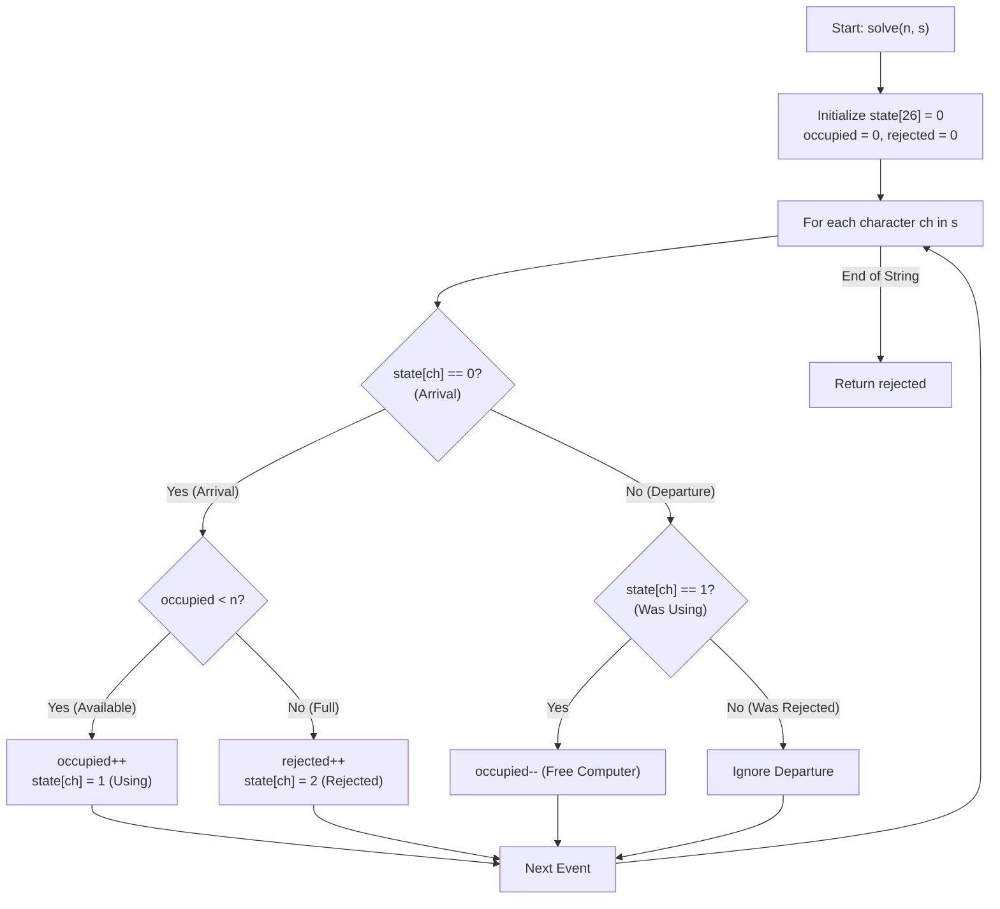

# 💡 Approach — Unoccupied Computers

  | 📄 [Problem](./Problem.md) | 💡 [Approach](./Approach.md) | 🧩 [Solution](./Solution.cpp) | 🚀 [Main](./Main.cpp) |
  |:--------------------------:|:-----------------------------:|:------------------------------:|:---------------------:|

## 📊 Metadata

---

> [!TIP]
> **Core Simulation Insight — State Machine per Customer:**
> - Every customer appears exactly **twice** in string $s$:
>   - First occurrence = **Arrival**
>   - Second occurrence = **Departure**
> - We track the status of each of the 26 uppercase English letters using a state array `state[26]`:
>   - `0`: Customer has **not arrived yet**.
>   - `1`: Customer is **present and currently occupying a computer**.
>   - `2`: Customer **arrived but was rejected** due to lack of available computers.
> - When a customer arrives (`state == 0`):
>   - If `occupied < n`: Computer assigned $\to$ increment `occupied`, set `state = 1`.
>   - If `occupied == n`: No computer available $\to$ increment `unattended/rejected`, set `state = 2`.
> - When a customer departs:
>   - If `state == 1`: Computer is freed $\to$ decrement `occupied`.
>   - If `state == 2`: Customer had no computer $\to$ do nothing.

---

## 🔩 Step-by-Step Breakdown

1. **State Initialization**:
   - Maintain a `state` array of size $26$ initialized to $0$.
   - Maintain counters `occupied = 0` (number of computers currently in use) and `rejected = 0` (customers who left without getting a computer).

2. **Iterate Through Event Stream**:
   - For each character $ch$ in string $s$, determine its 0-indexed letter position `idx = ch - 'A'`.
   - **First Occurrence (Arrival, `state[idx] == 0`)**:
     - Check if `occupied < n`:
       - Increment `occupied` by $1$.
       - Set `state[idx] = 1`.
     - Otherwise (`occupied >= n`):
       - Increment `rejected` by $1$.
       - Set `state[idx] = 2`.
   - **Second Occurrence (Departure)**:
     - If `state[idx] == 1`: The customer was using a computer; decrement `occupied` by $1$.
     - If `state[idx] == 2`: The customer was previously rejected; ignore.

3. **Return Result**:
   - Return `rejected` as the total number of unassigned customers.

---

## 🔄 Mermaid Flowchart

---

## 🏃‍♂️ Dry Run

### Example: $n = 3, \; s = \text{"GACCBDDBAGEE"}$

| Step | Char | Action / Event | `state[ch]` Before | `occupied` Before | Condition | `occupied` After | `rejected` | `state[ch]` After |
|:---:|:---:|:---|:---:|:---:|:---|:---:|:---:|:---:|
| 1 | `'G'` | Arrival | 0 | 0 | $0 < 3$ (Assigned) | 1 | 0 | 1 |
| 2 | `'A'` | Arrival | 0 | 1 | $1 < 3$ (Assigned) | 2 | 0 | 1 |
| 3 | `'C'` | Arrival | 0 | 2 | $2 < 3$ (Assigned) | 3 | 0 | 1 |
| 4 | `'C'` | Departure | 1 | 3 | Was Using (Freed) | 2 | 0 | 1 |
| 5 | `'B'` | Arrival | 0 | 2 | $2 < 3$ (Assigned) | 3 | 0 | 1 |
| 6 | `'D'` | Arrival | 0 | 3 | $3 = 3$ (Rejected) | 3 | **1** | 2 |
| 7 | `'D'` | Departure | 2 | 3 | Was Rejected (Ignore) | 3 | 1 | 2 |
| 8 | `'B'` | Departure | 1 | 3 | Was Using (Freed) | 2 | 1 | 1 |
| 9 | `'A'` | Departure | 1 | 2 | Was Using (Freed) | 1 | 1 | 1 |
| 10 | `'G'` | Departure | 1 | 1 | Was Using (Freed) | 0 | 1 | 1 |
| 11 | `'E'` | Arrival | 0 | 0 | $0 < 3$ (Assigned) | 1 | 1 | 1 |
| 12 | `'E'` | Departure | 1 | 1 | Was Using (Freed) | 0 | 1 | 1 |

**Total Rejected Customers = 1** ✅

---

## 📊 Complexity Analysis

| Complexity Metric | Estimation | Rationale |
| :--- | :---: | :--- |
| **Time Complexity** | $\mathcal{O}(|s|)$ | Single linear scan through the string of length $|s| \le 52$ with $\mathcal{O}(1)$ array lookups and updates per character. |
| **Auxiliary Space** | $\mathcal{O}(1)$ | Fixed-size array of size $26$ used to store state flags for uppercase English characters. |

---

> *"Simplicity is prerequisite for reliability."* — **Edsger W. Dijkstra**

---

<h3>Happy Coding! 🚀</h3>

