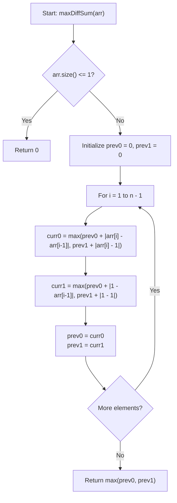

# 💡 Approach — Max Adjacent Diffs Sum with 1 Replacements

  | 📄 [Problem](./Problem.md) | 💡 [Approach](./Approach.md) | 🧩 [Solution](./Solution.cpp) | 🚀 [Main](./Main.cpp) |
  |:--------------------------:|:-----------------------------:|:------------------------------:|:---------------------:|

## 📊 Metadata

---

> [!TIP]
> **Core Dynamic Programming Insight — 2-State Transition:**
> - For every index $i$ ($0 \le i < n$), we make a binary choice:
>   - **State 0:** Keep $arr[i]$ as its original value $arr[i]$.
>   - **State 1:** Replace $arr[i]$ with $1$.
> - The absolute difference between consecutive elements $arr[i]$ and $arr[i-1]$ depends only on the state chosen for $arr[i-1]$ and $arr[i]$.
> - Let:
>   - `dp[i][0]` = Maximum sum of adjacent differences for prefix $arr[0 \dots i]$ where $arr[i]$ is **kept original**.
>   - `dp[i][1]` = Maximum sum of adjacent differences for prefix $arr[0 \dots i]$ where $arr[i]$ is **replaced with 1**.
> - **State Transitions ($1 \le i < n$):**
>   $$\begin{aligned}
>     \text{dp}[i][0] &= \max\Big(\text{dp}[i-1][0] + |arr[i] - arr[i-1]|, \; \text{dp}[i-1][1] + |arr[i] - 1|\Big) \\
>     \text{dp}[i][1] &= \max\Big(\text{dp}[i-1][0] + |1 - arr[i-1]|, \; \text{dp}[i-1][1] + |1 - 1|\Big)
>   \end{aligned}$$
> - **Space Optimization:**
>   Because the current step $i$ depends strictly on step $i-1$, we only need two variables (`prev0` and `prev1`) achieving $\mathcal{O}(1)$ auxiliary space.

---

## 🔩 Step-by-Step Breakdown

1. **Base Case Initialization**:
   - If array size $n \le 1$, adjacent differences cannot exist; return $0$.
   - For index $i = 0$:
     - `prev0 = 0` (arr[0] remains original)
     - `prev1 = 0` (arr[0] becomes 1)

2. **Dynamic Programming Iteration**:
   - For $i = 1$ to $n - 1$:
     - Compute `curr0 = max(prev0 + abs(arr[i] - arr[i-1]), prev1 + abs(arr[i] - 1))`
     - Compute `curr1 = max(prev0 + abs(1 - arr[i-1]), prev1 + 0)`
     - Update `prev0 = curr0`, `prev1 = curr1`.

3. **Final Result**:
   - The maximum total adjacent absolute difference is $\max(\text{prev0}, \text{prev1})$.

---

## 🔄 Mermaid Flowchart

---

## 🏃‍♂️ Dry Run

### Example: $arr = [3, 2, 1, 4, 5]$

| Index $i$ | $arr[i]$ | $arr[i-1]$ | `curr0` Calculation | `curr1` Calculation | `prev0` | `prev1` |
|:---:|:---:|:---:|:---|:---|:---:|:---:|
| **0** | $3$ | — | Base Case | Base Case | $0$ | $0$ |
| **1** | $2$ | $3$ | $\max(0 + |2-3|, 0 + |2-1|) = \max(1, 1) = 1$ | $\max(0 + |1-3|, 0 + 0) = \max(2, 0) = 2$ | $1$ | $2$ |
| **2** | $1$ | $2$ | $\max(1 + |1-2|, 2 + |1-1|) = \max(2, 2) = 2$ | $\max(1 + |1-2|, 2 + 0) = \max(2, 2) = 2$ | $2$ | $2$ |
| **3** | $4$ | $1$ | $\max(2 + |4-1|, 2 + |4-1|) = \max(5, 5) = 5$ | $\max(2 + |1-1|, 2 + 0) = \max(2, 2) = 2$ | $5$ | $2$ |
| **4** | $5$ | $4$ | $\max(5 + |5-4|, 2 + |5-1|) = \max(6, 6) = 6$ | $\max(5 + |1-4|, 2 + 0) = \max(8, 2) = 8$ | $6$ | **8** |

**Final Answer:** $\max(6, 8) = \mathbf{8}$ ✅ (Corresponding to modified array $[3, 1, 1, 4, 1]$).

---

## 📊 Complexity Analysis

| Complexity Metric | Estimation | Rationale |
| :--- | :---: | :--- |
| **Time Complexity** | $\mathcal{O}(n)$ | Single pass from $i = 1$ to $n-1$ performing constant number of $\mathcal{O}(1)$ arithmetic operations per step. |
| **Auxiliary Space** | $\mathcal{O}(1)$ | Only two rolling variables (`prev0` and `prev1`) are stored across iterations. |

---

> *"Dynamic programming is not about filling in tables; it's about smart recursion with memory."*

---

<h3>Happy Coding! 🚀</h3>

