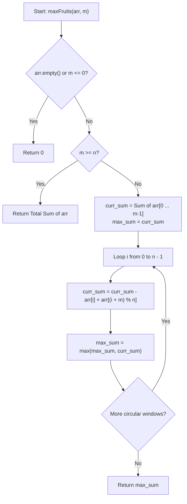

# 💡 Approach — Bird and Maximum Fruit Gathering

  | 📄 [Problem](./Problem.md) | 💡 [Approach](./Approach.md) | 🧩 [Solution](./Solution.cpp) | 🚀 [Main](./Main.cpp) |
  |:--------------------------:|:-----------------------------:|:------------------------------:|:---------------------:|

## 📊 Metadata

---

> [!TIP]
> **Core Intuition — Fixed-Size Sliding Window on a Circular Array:**
> - Because all fruit values $arr[i] \ge 0$, visiting as many trees as permitted (up to $\min(n, m)$) will always maximize or keep equal the total fruit count.
> - The trees form a cycle of size $n$. Any path visiting at most $m$ consecutive neighboring trees corresponds to a contiguous subsegment (window) of length $k = \min(n, m)$ in the circular array.
> - **Case 1: $m \ge n$**:
>   - The bird can traverse all $n$ trees in the circle. The answer is simply the sum of all elements in `arr`.
> - **Case 2: $m < n$**:
>   - We maintain a circular sliding window of size $m$.
>   - First, calculate the sum of the first $m$ elements ($arr[0 \dots m-1]$).
>   - Then slide the window around the circle of $n$ elements:
>     - When the window start shifts from index $i$ to $i+1$, subtract $arr[i]$ and add the new element $arr[(i + m) \bmod n]$.
>     - Maintain the maximum sum encountered over all $n$ circular windows.

---

## 🔩 Step-by-Step Breakdown

1. **Edge Case & Full Cycle Check**:
   - Let $n = arr.size()$.
   - If $n == 0$ or $m \le 0$, return $0$.
   - If $m \ge n$, compute and return $\sum_{i=0}^{n-1} arr[i]$.

2. **Initialize First Window**:
   - Compute `curr_sum` for the first $m$ trees:
     $$\text{curr\_sum} = \sum_{i=0}^{m-1} arr[i]$$
   - Initialize `max_sum = curr_sum`.

3. **Slide the Circular Window**:
   - For $i = 0$ to $n - 1$:
     - Subtract outgoing tree: $arr[i]$
     - Add incoming tree: $arr[(i + m) \bmod n]$
     - Update: $\text{curr\_sum} = \text{curr\_sum} - arr[i] + arr[(i + m) \bmod n]$
     - Update: $\text{max\_sum} = \max(\text{max\_sum}, \text{curr\_sum})$

4. **Return Result**:
   - Return `max_sum`.

---

## 🔄 Mermaid Flowchart

---

## 🏃‍♂️ Dry Run

### Example 1: $arr = [2, 1, 3, 5, 0, 1, 4]$, $m = 3$ ($n = 7$)

- Initial window $[2, 1, 3]$: $\text{curr\_sum} = 2 + 1 + 3 = 6$, $\text{max\_sum} = 6$.

| Step ($i$) | Outgoing $arr[i]$ | Incoming $arr[(i+3)\%7]$ | New Window | `curr_sum` | `max_sum` |
|:---:|:---:|:---:|:---:|:---:|:---:|
| **Init** | — | — | $[2, 1, 3]$ | $6$ | $6$ |
| **0** | $arr[0] = 2$ | $arr[3] = 5$ | $[1, 3, 5]$ | $6 - 2 + 5 = 9$ | **9** |
| **1** | $arr[1] = 1$ | $arr[4] = 0$ | $[3, 5, 0]$ | $9 - 1 + 0 = 8$ | **9** |
| **2** | $arr[2] = 3$ | $arr[5] = 1$ | $[5, 0, 1]$ | $8 - 3 + 1 = 6$ | **9** |
| **3** | $arr[3] = 5$ | $arr[6] = 4$ | $[0, 1, 4]$ | $6 - 5 + 4 = 5$ | **9** |
| **4** | $arr[4] = 0$ | $arr[0] = 2$ | $[1, 4, 2]$ | $5 - 0 + 2 = 7$ | **9** |
| **5** | $arr[5] = 1$ | $arr[1] = 1$ | $[4, 2, 1]$ | $7 - 1 + 1 = 7$ | **9** |
| **6** | $arr[6] = 4$ | $arr[2] = 3$ | $[2, 1, 3]$ | $7 - 4 + 3 = 6$ | **9** |

**Final Result:** $\mathbf{9}$ ✅

---

## 📊 Complexity Analysis

| Complexity Metric | Estimation | Rationale |
| :--- | :---: | :--- |
| **Time Complexity** | $\mathcal{O}(n)$ | Initializing the window takes $\mathcal{O}(m)$ and sliding around the circle takes $\mathcal{O}(n)$ steps, each performing $\mathcal{O}(1)$ arithmetic operations. Total time is $\mathcal{O}(n)$. |
| **Auxiliary Space** | $\mathcal{O}(1)$ | Only a few scalar variables (`curr_sum`, `max_sum`, `n`, `i`) are used. |

---

> *"The circularity of an array is easily mastered by modular arithmetic and sliding windows."*

---

<h3>Happy Coding! 🚀</h3>

