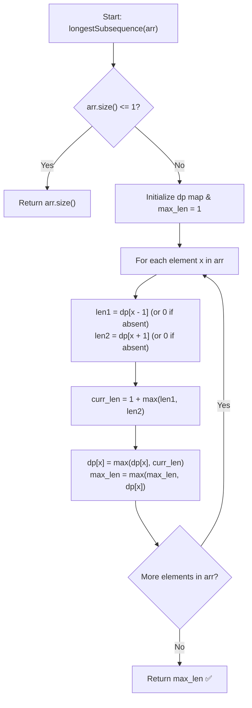

# 💡 Approach — Longest Subsequence with Adjacent Diff as 1

  | 📄 [Problem](./Problem.md) | 💡 [Approach](./Approach.md) | 🧩 [Solution](./Solution.cpp) | 🚀 [Main](./Main.cpp) |
  |:--------------------------:|:-----------------------------:|:------------------------------:|:---------------------:|

## 📊 Metadata

---

> [!TIP]
> **Core Intuition — Dynamic Programming on Element Values:**
> - In a standard Longest Increasing Subsequence (LIS) style approach, we might check all previous elements $\mathcal{O}(n^2)$.
> - However, the valid transition here is strictly $|arr[j] - arr[i]| = 1$, which means an element $x = arr[i]$ can only be appended to a valid subsequence ending in either:
>   1. $x - 1$
>   2. $x + 1$
> - Let $\text{dp}[v]$ represent the maximum length of a valid subsequence ending with the value $v$.
> - When encountering element $x$, the longest subsequence ending at $x$ is:
>   $$\text{dp}[x] = 1 + \max(\text{dp}[x - 1], \text{dp}[x + 1])$$
> - By storing the DP state in a hash table (`unordered_map`) or direct lookup table, we can process each element in $\mathcal{O}(1)$ average time, resulting in an optimal overall $\mathcal{O}(n)$ time complexity.

---

## 🔩 Step-by-Step Breakdown

1. **Initialize State**:
   - Check if the array is empty or has a single element ($n \le 1$). In that case, return $n$.
   - Maintain a hash map `dp` where key = number, value = longest valid subsequence ending with that number.
   - Maintain `max_len = 1` to record the global maximum length.

2. **Iterate Through Elements**:
   - For each element $x \in \text{arr}$:
     - Check if $x - 1$ exists in `dp`; if so, `len1 = dp[x - 1]`, else $0$.
     - Check if $x + 1$ exists in `dp`; if so, `len2 = dp[x + 1]`, else $0$.
     - Calculate $\text{curr\_len} = 1 + \max(\text{len1}, \text{len2})$.
     - Update $\text{dp}[x] = \max(\text{dp}[x], \text{curr\_len})$.
     - Update $\text{max\_len} = \max(\text{max\_len}, \text{dp}[x])$.

3. **Return Result**:
   - After scanning the entire array, return `max_len`.

---

## 🔄 Mermaid Flowchart

---

## 🏃‍♂️ Dry Run

### Example 1: $\text{arr} = [10, 9, 4, 5, 4, 8, 6]$

| Step | Element $x$ | `dp[x - 1]` | `dp[x + 1]` | Calculated `dp[x]` | Map State | `max_len` |
|:---:|:---:|:---:|:---:|:---:|:---|:---:|
| **1** | $10$ | `dp[9]` = $0$ | `dp[11]` = $0$ | $1 + 0 = 1$ | `{10: 1}` | **1** |
| **2** | $9$ | `dp[8]` = $0$ | `dp[10]` = $1$ | $1 + 1 = 2$ | `{10: 1, 9: 2}` | **2** |
| **3** | $4$ | `dp[3]` = $0$ | `dp[5]` = $0$ | $1 + 0 = 1$ | `{10: 1, 9: 2, 4: 1}` | **2** |
| **4** | $5$ | `dp[4]` = $1$ | `dp[6]` = $0$ | $1 + 1 = 2$ | `{10: 1, 9: 2, 4: 1, 5: 2}` | **2** |
| **5** | $4$ | `dp[3]` = $0$ | `dp[5]` = $2$ | $1 + 2 = 3$ | `{10: 1, 9: 2, 4: 3, 5: 2}` | **3** |
| **6** | $8$ | `dp[7]` = $0$ | `dp[9]` = $2$ | $1 + 2 = 3$ | `{10: 1, 9: 2, 4: 3, 5: 2, 8: 3}` | **3** |
| **7** | $6$ | `dp[5]` = $2$ | `dp[7]` = $0$ | $1 + 2 = 3$ | `{..., 6: 3}` | **3** |

**Final Result:** $\mathbf{3}$ ✅

---

## 📊 Complexity Analysis

| Complexity Metric | Estimation | Rationale |
| :--- | :---: | :--- |
| **Time Complexity** | $\mathcal{O}(n)$ | Single pass over array with $\mathcal{O}(1)$ average map lookups and insertions. |
| **Auxiliary Space** | $\mathcal{O}(n)$ | Hash map stores at most $n$ distinct value states. |

---

> *"By indexing DP states by value rather than position, we collapse an $\mathcal{O}(n^2)$ search into an $\mathcal{O}(1)$ lookup."*

---

<h3>Happy Coding! 🚀</h3>

