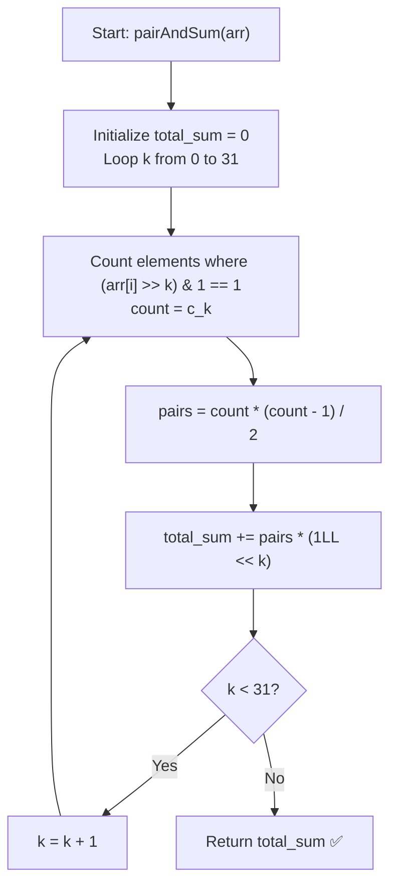

# 💡 Approach — Sum of Pairwise ANDs

<div align="center">

  | 📄 [Problem](./Problem.md) | 💡 [Approach](./Approach.md) | 🧩 [Solution](./Solution.cpp) | 🚀 [Main](./Main.cpp) |
  |:--------------------------:|:-----------------------------:|:------------------------------:|:---------------------:|
</div>

## 📊 Metadata


---

> [!TIP]
> **Core Intuition — Bit Contribution Principle:**
> - A brute-force pairwise calculation checks $\mathcal{O}(n^2)$ pairs. For $n = 10^5$, $\approx 5 \times 10^9$ operations, which causes **Time Limit Exceeded (TLE)**.
> - Notice that the bitwise AND operation evaluates each bit position independently.
> - For any bit position $k$ ($0 \le k \le 31$), the $k$-th bit of $(\text{arr}[i] \ \& \ \text{arr}[j])$ is $1$ if and only if **both** $\text{arr}[i]$ and $\text{arr}[j]$ have their $k$-th bit set to $1$.
> - If exactly $c_k$ numbers in the array have their $k$-th bit set, then the number of pairs $(i, j)$ with $i < j$ having the $k$-th bit set is:
>   $$\text{Pairs}(k) = \binom{c_k}{2} = \frac{c_k \cdot (c_k - 1)}{2}$$
> - Each such pair contributes $2^k$ to the total sum.
> - Therefore, the total sum is:
>   $$\text{Total Sum} = \sum_{k=0}^{31} \left( \frac{c_k \cdot (c_k - 1)}{2} \times 2^k \right)$$
> - This reduces the complexity from $\mathcal{O}(n^2)$ to $\mathcal{O}(32 \cdot n) = \mathcal{O}(n)$ time and $\mathcal{O}(1)$ space!

---

## 🔩 Step-by-Step Breakdown

1. **Initialize Accumulator**:
   - Initialize `total_sum = 0LL` (64-bit integer) to prevent intermediate overflow.

2. **Iterate Through Bit Positions**:
   - Loop through each bit index $k$ from $0$ to $31$ (or up to $\log_2(\max(\text{arr}))$, where $10^8 < 2^{27}$, but looping to $31$ covers all 32-bit integers).

3. **Count Set Bits**:
   - For bit $k$, count how many elements in `arr` have the $k$-th bit set:
     ```cpp
     long long count = 0;
     for (int num : arr) {
         if ((num >> k) & 1) {
             count++;
         }
     }
     ```

4. **Calculate Contribution**:
   - Compute number of matching pairs: $\text{pairs} = \frac{\text{count} \times (\text{count} - 1)}{2}$.
   - Add $\text{pairs} \times (1\text{LL} \ll k)$ to `total_sum`.

5. **Return Result**:
   - After processing all $32$ bit positions, return `total_sum`.

---

## 🔄 Mermaid Flowchart



---

## 🏃‍♂️ Dry Run

### Example 1: $\text{arr} = [5, 10, 15]$

Binary representations:
- $5 = (0101)_2$
- $10 = (1010)_2$
- $15 = (1111)_2$

| Bit Position $k$ | Value $2^k$ | Elements with Bit $k$ Set | Count $c_k$ | Pairs $\binom{c_k}{2}$ | Contribution $\binom{c_k}{2} \times 2^k$ | Running Total |
|:---:|:---:|:---:|:---:|:---:|:---:|:---:|
| **0** | $1$ | $5, 15$ | $2$ | $\frac{2 \times 1}{2} = 1$ | $1 \times 1 = 1$ | $1$ |
| **1** | $2$ | $10, 15$ | $2$ | $\frac{2 \times 1}{2} = 1$ | $1 \times 2 = 2$ | $1 + 2 = 3$ |
| **2** | $4$ | $5, 15$ | $2$ | $\frac{2 \times 1}{2} = 1$ | $1 \times 4 = 4$ | $3 + 4 = 7$ |
| **3** | $8$ | $10, 15$ | $2$ | $\frac{2 \times 1}{2} = 1$ | $1 \times 8 = 8$ | $7 + 8 = 15$ |
| **4..31** | $\ge 16$ | None | $0$ | $0$ | $0$ | $15$ |

**Final Output:** $\mathbf{15}$ ✅

---

## 📊 Complexity Analysis

| Complexity Metric | Estimation | Rationale |
| :--- | :---: | :--- |
| **Time Complexity** | $\mathcal{O}(n)$ | We iterate through $32$ bit positions. For each bit position, we iterate over $n$ elements. Total operations: $32 \times n = \mathcal{O}(n)$. |
| **Auxiliary Space** | $\mathcal{O}(1)$ | Only a few primitive integer accumulator variables are used. |

---

> *"By decomposing the problem from pair-wise comparison to bit-wise contribution, we transform quadratic time $\mathcal{O}(n^2)$ into linear time $\mathcal{O}(32 \cdot n)$."*

---

<div align="center">
<h3>Happy Coding! 🚀</h3>
<a href="../221_Day/Approach.md">
  
</a>
<a href="https://x.com/PankajB42550" target="_blank">
  
</a>
<a href="../223_Day/Approach.md">
  
</a>
</div>
