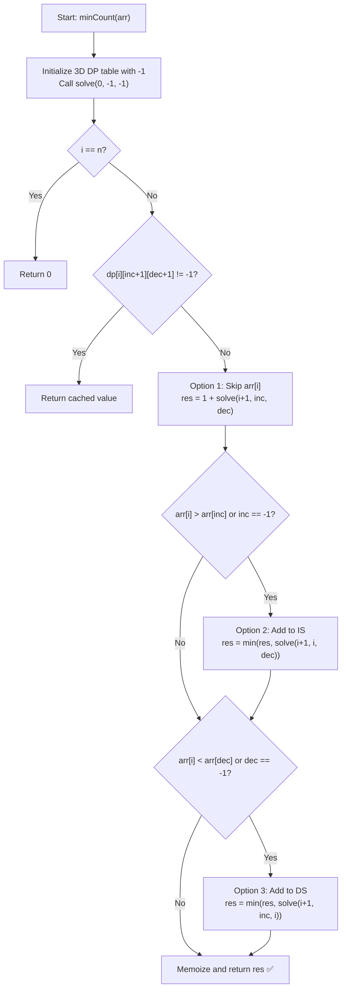

# 💡 Approach — Minimum Elements Outside Subsequences

  | 📄 [Problem](./Problem.md) | 💡 [Approach](./Approach.md) | 🧩 [Solution](./Solution.cpp) | 🚀 [Main](./Main.cpp) |
  |:--------------------------:|:-----------------------------:|:------------------------------:|:---------------------:|

## 📊 Metadata

---

> [!TIP]
> **Core Intuition — 3D Dynamic Programming with Memoization:**
> - We need to partition the elements of `arr` into two disjoint subsequences: one strictly increasing (IS) and one strictly decreasing (DS), while minimizing the number of unused elements.
> - Minimizing unused elements is equivalent to maximizing the total number of elements placed into either subsequence.
> - As we traverse `arr` index by index from $i = 0$ to $n-1$, each element `arr[i]` presents three mutually exclusive decisions:
>   1. **Append to Increasing Subsequence (IS):** Valid if `arr[i] > arr[last_inc]` (or if IS is currently empty).
>   2. **Append to Decreasing Subsequence (DS):** Valid if `arr[i] < arr[last_dec]` (or if DS is currently empty).
>   3. **Skip `arr[i]` (Leave unselected):** Costs $1$ unselected element and moves to $i + 1$ without altering the tails of either subsequence.
> - Because $n \le 100$, the state space `(i, last_inc + 1, last_dec + 1)` has size $(n+1) \times (n+1) \times (n+1) \approx 10^6$, which easily fits in memory and computes within a few milliseconds.

---

## 🔩 Step-by-Step Breakdown

1. **State Definition**:
   - Let `dp[i][last_inc + 1][last_dec + 1]` denote the minimum number of unselected elements in suffix `arr[i...n-1]`.
   - `last_inc`: index of the last element included in the increasing subsequence ($-1$ means empty).
   - `last_dec`: index of the last element included in the decreasing subsequence ($-1$ means empty).

2. **Base Case**:
   - When $i == n$, all elements have been processed, so remaining unselected elements $= 0$.

3. **Transitions**:
   - **Option 1 (Skip):**
     $$\text{res} = 1 + \text{solve}(i + 1, \text{last\_inc}, \text{last\_dec})$$
   - **Option 2 (Include in IS):**
     If $\text{last\_inc} == -1$ or $\text{arr}[i] > \text{arr}[\text{last\_inc}]$:
     $$\text{res} = \min(\text{res}, \text{solve}(i + 1, i, \text{last\_dec}))$$
   - **Option 3 (Include in DS):**
     If $\text{last\_dec} == -1$ or $\text{arr}[i] < \text{arr}[\text{last\_dec}]$:
     $$\text{res} = \min(\text{res}, \text{solve}(i + 1, \text{last\_inc}, i))$$

4. **Memoization & Return**:
   - Store and return `dp[i][last_inc + 1][last_dec + 1]`.

---

## 🔄 Mermaid Flowchart

---

## 🏃‍♂️ Dry Run

### Example: $\text{arr} = [1, 4, 2, 3, 3, 2, 4]$ ($n = 7$)

| Step $i$ | $\text{arr}[i]$ | Valid Moves | Optimal Decision | Subsequence State | Unselected Count |
|:---:|:---:|:---|:---|:---|:---:|
| **0** | $1$ | Put in IS or DS or Skip | Put in IS | $\text{IS}: [1], \text{DS}: []$ | $0$ |
| **1** | $4$ | Put in IS ($4>1$) or DS | Put in DS | $\text{IS}: [1], \text{DS}: [4]$ | $0$ |
| **2** | $2$ | Put in IS ($2>1$) or DS ($2<4$) | Put in IS | $\text{IS}: [1, 2], \text{DS}: [4]$ | $0$ |
| **3** | $3$ | Put in IS ($3>2$) or DS ($3<4$) | Put in DS | $\text{IS}: [1, 2], \text{DS}: [4, 3]$ | $0$ |
| **4** | $3$ | Put in IS ($3>2$) | Put in IS | $\text{IS}: [1, 2, 3], \text{DS}: [4, 3]$ | $0$ |
| **5** | $2$ | Put in DS ($2<3$) | Put in DS | $\text{IS}: [1, 2, 3], \text{DS}: [4, 3, 2]$ | $0$ |
| **6** | $4$ | Put in IS ($4>3$) | Put in IS | $\text{IS}: [1, 2, 3, 4], \text{DS}: [4, 3, 2]$ | $0$ |

**Final Output:** Minimum Unselected Elements $= \mathbf{0}$ ✅

---

## 📊 Complexity Analysis

| Complexity Metric | Estimation | Rationale |
| :--- | :---: | :--- |
| **Time Complexity** | $\mathcal{O}(n^3)$ | Total states $= (n+1) \times (n+1) \times (n+1)$. Each state takes $\mathcal{O}(1)$ transitions. |
| **Auxiliary Space** | $\mathcal{O}(n^3)$ | Memoization table of size $(n+1) \times (n+1) \times (n+1)$ ints plus recursion stack of depth $\mathcal{O}(n)$. |

---

> *"By simultaneously tracking the tail pointers of both increasing and decreasing sequences, we decouple the joint optimization problem into clean $\mathcal{O}(1)$ dynamic programming decisions."*

---

<h3>Happy Coding! 🚀</h3>

