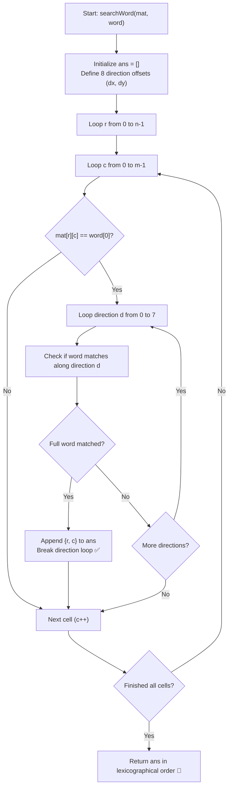

# 💡 Approach — Word in Grid - All Occurrences

  | 📄 [Problem](./Problem.md) | 💡 [Approach](./Approach.md) | 🧩 [Solution](./Solution.cpp) | 🚀 [Main](./Main.cpp) |
  |:--------------------------:|:-----------------------------:|:------------------------------:|:---------------------:|

## 📊 Metadata

---

> [!TIP]
> **Core Intuition — 8-Directional Straight-Line Ray Casting:**
> - The problem differs from standard Boggle / Word Search backtrackers because the word must be formed in a **fixed, unbroken straight-line direction** (no turns).
> - There are exactly **8 possible directions**:
>   - **Horizontal:** Right $(0, +1)$, Left $(0, -1)$
>   - **Vertical:** Down $(+1, 0)$, Up $(-1, 0)$
>   - **Diagonals:** Down-Right $(+1, +1)$, Down-Left $(+1, -1)$, Up-Right $(-1, +1)$, Up-Left $(-1, -1)$
> - For every cell $(r, c)$ in the $n \times m$ grid:
>   1. Check if $\text{mat}[r][c] == \text{word}[0]$. If not, skip immediately.
>   2. If it matches, test all $8$ directions. For each direction $(dr, dc)$, march $k = 0 \dots |word|-1$ steps along $(r + k \cdot dr, c + k \cdot dc)$.
>   3. If all $|word|$ characters match within valid grid boundaries, record coordinate $(r, c)$ and stop checking other directions for this starting cell (to avoid duplicate entries).
> - Traversing rows from top-to-bottom ($0 \to n-1$) and columns left-to-right ($0 \to m-1$) naturally yields coordinates in **lexicographically smallest order**.

---

  

---

## 🔩 Step-by-Step Breakdown

1. **Direction Vectors Definition**:
   - Define delta arrays for the 8 directions:
     $$\text{dx} = \{-1, -1, -1, 0, 0, 1, 1, 1\}$$
     $$\text{dy} = \{-1, 0, 1, -1, 1, -1, 0, 1\}$$

2. **Iterate Across All Grid Coordinates**:
   - Loop $r$ from $0$ to $n - 1$:
     - Loop $c$ from $0$ to $m - 1$:
       - If $\text{mat}[r][c] \neq \text{word}[0]$, continue.

3. **Directional Match Check**:
   - For each direction $d \in [0, 7]$:
     - Set `match = true`.
     - For step $k = 1$ to $|word| - 1$:
       - Calculate new coordinates:
         $$nr = r + k \cdot \text{dx}[d], \quad nc = c + k \cdot \text{dy}[d]$$
       - If $nr < 0$ or $nr \ge n$ or $nc < 0$ or $nc \ge m$ or $\text{mat}[nr][nc] \neq \text{word}[k]$:
         - `match = false; break;`
     - If `match == true`:
       - Append $\{r, c\}$ to results `ans`.
       - **Break** early from direction loop to avoid duplicate reporting of $(r, c)$.

4. **Return Formatted Coordinates**:
   - Return `ans`. If no matches exist, an empty list is returned.

---

## 🔄 Mermaid Flowchart

---

## 🏃‍♂️ Dry Run

### Example: $\text{mat} = \begin{bmatrix} \text{a} & \text{b} & \text{a} & \text{b} \\ \text{a} & \text{b} & \text{e} & \text{b} \\ \text{e} & \text{b} & \text{e} & \text{b} \end{bmatrix}, \quad \text{word} = \text{"abe"}$

  

| Starting $(r, c)$ | $\text{mat}[r][c]$ | Tested Direction $(dr, dc)$ | Path Cells & Characters | Result |
|:---:|:---:|:---:|:---|:---:|
| **(0, 0)** | `'a'` | Down-Right $(+1, +1)$ | $(0,0)\text{ 'a'} \to (1,1)\text{ 'b'} \to (2,2)\text{ 'e'}$ | **Matched! Added $\{0, 0\}$** |
| **(0, 2)** | `'a'` | Down-Left $(+1, -1)$ | $(0,2)\text{ 'a'} \to (1,1)\text{ 'b'} \to (2,0)\text{ 'e'}$ | **Matched! Added $\{0, 2\}$** |
| **(1, 0)** | `'a'` | Right $(0, +1)$ | $(1,0)\text{ 'a'} \to (1,1)\text{ 'b'} \to (1,2)\text{ 'e'}$ | **Matched! Added $\{1, 0\}$** |

**Final Lexicographical Output:** `[[0, 0], [0, 2], [1, 0]]` ✅

---

## 📊 Complexity Analysis

| Complexity Metric | Estimation | Rationale |
| :--- | :---: | :--- |
| **Time Complexity** | $\mathcal{O}(n \times m \times 8 \times |word|)$ | We visit every cell $(r, c)$ and check up to 8 straight lines of length $|word|$. For max bounds $50 \times 50 \times 8 \times 20 \approx 4 \times 10^5$ operations ($< 1\text{ ms}$). |
| **Auxiliary Space** | $\mathcal{O}(1)$ | Constant extra space for direction arrays and boundary trackers (excluding output storage). |

---

> *"Fixing directional vectors turns multi-dimensional matrix search into deterministic, ray-cast verification."*

---

<h3>Happy Coding! 🚀</h3>

