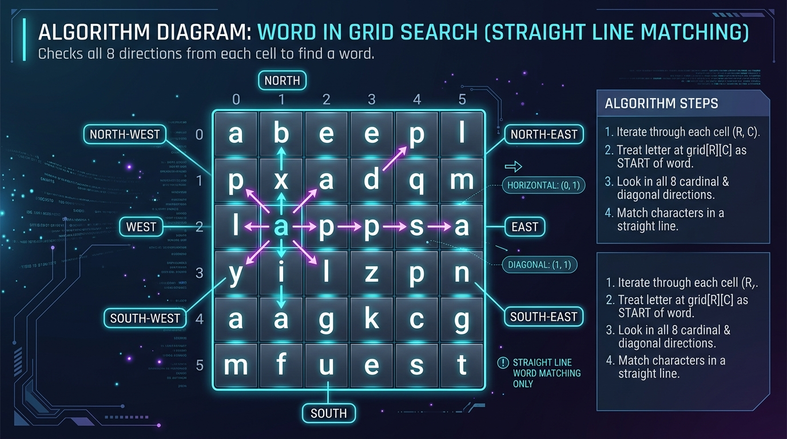
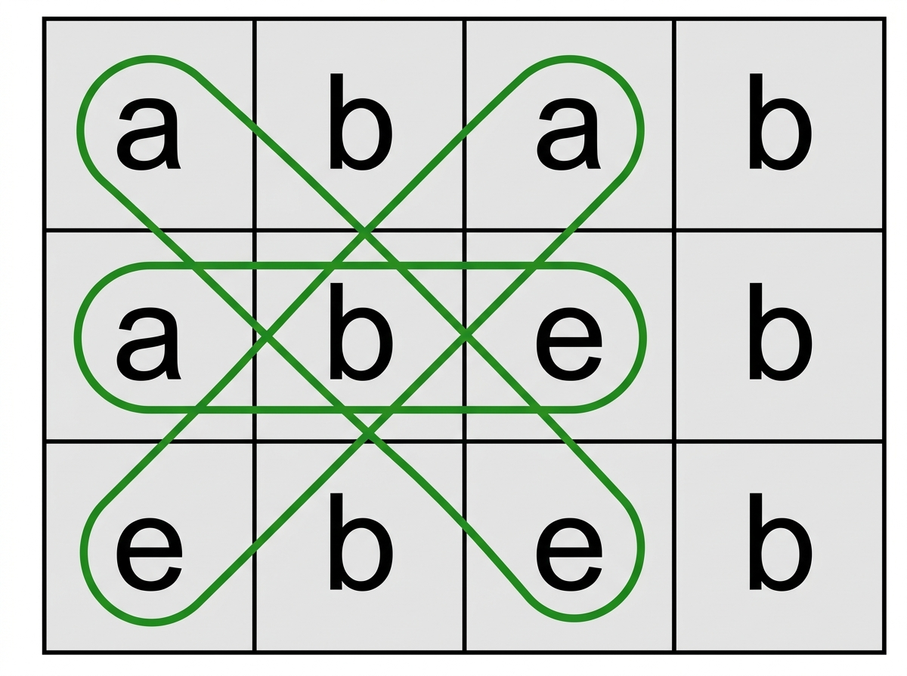
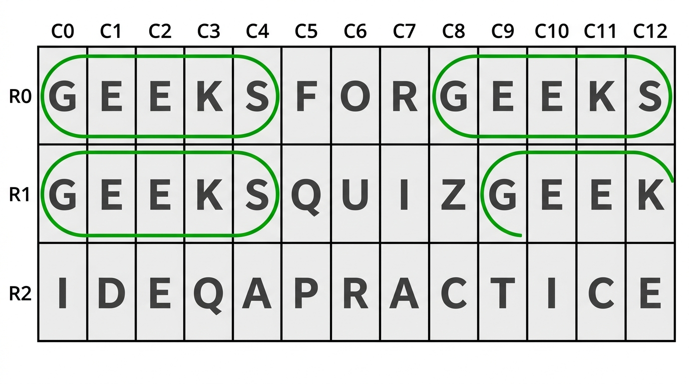

# 224. [Word in Grid - All Occurrences](https://www.geeksforgeeks.org/problems/find-the-string-in-grid0111/1)

<div align="center">

  | 📄 [Problem](./Problem.md) | 💡 [Approach](./Approach.md) | 🧩 [Solution](./Solution.cpp) | 🚀 [Main](./Main.cpp) |
  |:--------------------------:|:-----------------------------:|:------------------------------:|:---------------------:|
</div>

## 📊 Metadata


---

## 🧩 Problem Description

<div align="center">
  
</div>

Given a 2D grid `mat[][]` of size $n \times m$ consisting of characters and a string `word`, find all starting positions where the word occurs in the grid.

The word can be formed from any cell by moving in any of the **8 directions** (2 horizontal, 2 vertical, and 4 diagonal) in a **straight line without changing direction**.

Each cell can be used at most once per occurrence.

Return all unique starting coordinates in **lexicographically smallest order** (i.e. sorted by row index, then column index).

---

## 📌 Examples

**Example 1:**

<div align="center">
  
</div>

```text
Input: 
mat = [
  ['a', 'b', 'a', 'b'],
  ['a', 'b', 'e', 'b'],
  ['e', 'b', 'e', 'b']
]
word = "abe"

Output: [[0, 0], [0, 2], [1, 0]]

Explanation: 
- From (0, 0), we find "abe" in the right-down diagonal direction (0,0) -> (1,1) -> (2,2).
- From (0, 2), we find "abe" in the left-down diagonal direction (0,2) -> (1,1) -> (2,0).
- From (1, 0), we find "abe" in the horizontally right direction (1,0) -> (1,1) -> (1,2).
```

**Example 2:**

<div align="center">
  
</div>

```text
Input: 
mat = [
  ['G', 'E', 'E', 'K', 'S', 'F', 'O', 'R', 'G', 'E', 'E', 'K', 'S'],
  ['G', 'E', 'E', 'K', 'S', 'Q', 'U', 'I', 'Z', 'G', 'E', 'E', 'K'],
  ['I', 'D', 'E', 'Q', 'A', 'P', 'R', 'A', 'C', 'T', 'I', 'C', 'E']
]
word = "GEEKS"

Output: [[0, 0], [0, 8], [1, 0]]

Explanation: 
- From (0, 0), we find "GEEKS" horizontally right.
- From (0, 8), we find "GEEKS" horizontally right.
- From (1, 0), we find "GEEKS" horizontally right.
```

---

## 📐 Constraints

- $1 \le n, m \le 50$
- $1 \le |word| \le 20$
- `mat[i][j]` and `word` consist of English alphabets.

---

## ⏱️ Expected Complexities

| Parameter | Complexity |
| :---: | :---: |
| **Time Complexity** | $\mathcal{O}(n \times m \times 8 \times |word|)$ |
| **Auxiliary Space** | $\mathcal{O}(1)$ |

---

<div align="center">
<h3>Happy Coding! 🚀</h3>
<a href="../223_Day/Problem.md">
  
</a>
<a href="https://x.com/PankajB42550" target="_blank">
  
</a>
<a href="../225_Day/Problem.md">
  
</a>
</div>
