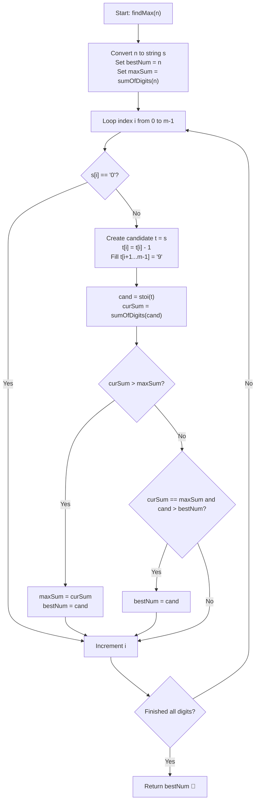

# 💡 Approach — Max Digit Sum Number in 1 to n

  | 📄 [Problem](./Problem.md) | 💡 [Approach](./Approach.md) | 🧩 [Solution](./Solution.cpp) | 🚀 [Main](./Main.cpp) |
  |:--------------------------:|:-----------------------------:|:------------------------------:|:---------------------:|

## 📊 Metadata

---

> [!TIP]
> **Core Intuition — Greedy Digit Modification with Trailing 9s:**
> - To maximize the sum of digits of a number $\le n$, we want as many suffix digits as possible to be **9** (the maximal decimal digit).
> - Let $n$ be represented as a decimal string $s = d_0 d_1 \dots d_{m-1}$.
> - Any number $x \le n$ that could achieve the maximal digit sum falls into one of two categories:
>   1. **$n$ itself**: The upper boundary number without any changes.
>   2. **Suffix-Maximized Candidates**: For each index $i \in [0, m-1]$ where digit $s[i] > '0'$:
>      - Keep prefix $s[0 \dots i-1]$ intact.
>      - Decrement digit at index $i$: $s[i] - 1$.
>      - Fill all remaining positions from $i+1$ to $m-1$ with `'9'`.
> - Why does this cover all optimal candidates?
>   - If $x < n$, there exists a first index $i$ from left where $x[i] < s[i]$.
>   - To maximize digit sum with this prefix, we greedily pick $x[i] = s[i] - 1$ and all subsequent digits $x[j] = 9$ for $j > i$.
> - Since $n \le 10^9$, $n$ has at most 10 digits ($m \le 10$). We generate at most $m + 1 \le 11$ candidate numbers, compute their digit sums in $\mathcal{O}(m)$, and pick the one with maximum digit sum (breaking ties with larger integer value).

---

## 🔩 Step-by-Step Breakdown

1. **Calculate Baseline ($n$)**:
   - Compute the digit sum of $n$, say `maxSum = sumOfDigits(n)`.
   - Set `bestNum = n`.

2. **Generate and Evaluate Candidates**:
   - Convert $n$ to string $s = \text{to\_string}(n)$ with length $m$.
   - Iterate $i$ from $0$ to $m - 1$:
     - If $s[i] == '0'$, skip (decrementing would result in a negative digit without borrowing).
     - Construct candidate string $t = s$:
       - Set $t[i] = t[i] - 1$.
       - Set $t[j] = '9'$ for all $j \in [i + 1, m - 1]$.
     - Convert candidate string $t$ to integer: $\text{cand} = \text{stoi}(t)$.
     - Compute its digit sum: $\text{curSum} = \text{sumOfDigits}(\text{cand})$.
     - Update the best result:
       - If $\text{curSum} > \text{maxSum}$, update $\text{maxSum} = \text{curSum}$ and $\text{bestNum} = \text{cand}$.
       - If $\text{curSum} == \text{maxSum}$, update $\text{bestNum} = \max(\text{bestNum}, \text{cand})$.

3. **Return Result**:
   - Return `bestNum`.

---

## 🔄 Mermaid Flowchart

---

## 🏃‍♂️ Dry Run

### Example 1: $n = 48$

| Index $i$ | Candidate String $t$ | Candidate Value | Digit Sum | Comparison vs Best | Best (`bestNum`, `maxSum`) |
|:---:|:---:|:---:|:---:|:---|:---:|
| Baseline | `"48"` | $48$ | $4 + 8 = 12$ | Initial baseline | $(48, 12)$ |
| $i = 0$ | `"39"` | $39$ | $3 + 9 = 12$ | $12 == 12$, but $39 < 48$ | $(48, 12)$ |
| $i = 1$ | `"47"` | $47$ | $4 + 7 = 11$ | $11 < 12$ | $(48, 12)$ |

**Output:** `48` ✅

---

### Example 2: $n = 90$

| Index $i$ | Candidate String $t$ | Candidate Value | Digit Sum | Comparison vs Best | Best (`bestNum`, `maxSum`) |
|:---:|:---:|:---:|:---:|:---|:---:|
| Baseline | `"90"` | $90$ | $9 + 0 = 9$ | Initial baseline | $(90, 9)$ |
| $i = 0$ | `"89"` | $89$ | $8 + 9 = 17$ | $17 > 9$ → Update! | $(89, 17)$ |
| $i = 1$ | Skip ($'0'$) | — | — | — | $(89, 17)$ |

**Output:** `89` ✅

---

### Example 3: $n = 100$

| Index $i$ | Candidate String $t$ | Candidate Value | Digit Sum | Comparison vs Best | Best (`bestNum`, `maxSum`) |
|:---:|:---:|:---:|:---:|:---|:---:|
| Baseline | `"100"` | $100$ | $1 + 0 + 0 = 1$ | Initial baseline | $(100, 1)$ |
| $i = 0$ | `"099"` | $99$ | $9 + 9 = 18$ | $18 > 1$ → Update! | $(99, 18)$ |
| $i = 1$ | Skip ($'0'$) | — | — | — | $(99, 18)$ |
| $i = 2$ | Skip ($'0'$) | — | — | — | $(99, 18)$ |

**Output:** `99` ✅

---

## 📊 Complexity Analysis

| Complexity Metric | Estimation | Rationale |
| :--- | :---: | :--- |
| **Time Complexity** | $\mathcal{O}(m^2) \approx \mathcal{O}(m)$ | $m$ is the number of digits in $n$ ($m \le 10$). We check at most $m$ candidate strings of length $m$. For $n \le 10^9$, takes $< 100$ operations ($< 1\ \mu\text{s}$). |
| **Auxiliary Space** | $\mathcal{O}(m)$ | String storage for candidate numbers. |

---

> *"Greedily locking prefixes and saturating the remaining suffix with nines guarantees finding the maximum digit sum in logarithmic steps."*

---

<h3>Happy Coding! 🚀</h3>

