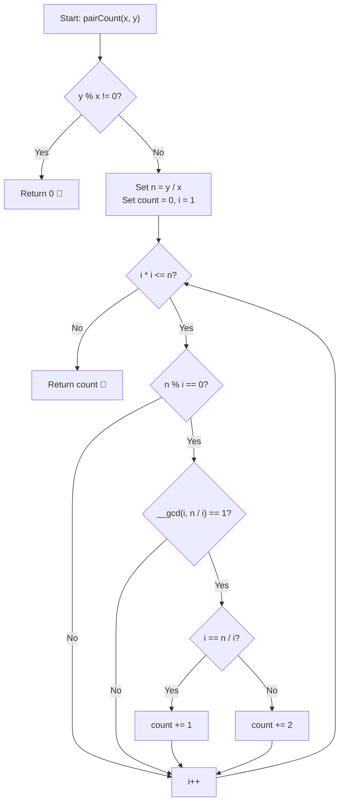

# 💡 Approach — Pairs with Given GCD and LCM

  | 📄 [Problem](./Problem.md) | 💡 [Approach](./Approach.md) | 🧩 [Solution](./Solution.cpp) | 🚀 [Main](./Main.cpp) |
  |:--------------------------:|:-----------------------------:|:------------------------------:|:---------------------:|

## 📊 Metadata

---

> [!TIP]
> **Core Intuition — Coprime Factor Pairs of Quotient $\frac{y}{x}$:**
> - We are given $\gcd(a, b) = x$ and $\text{lcm}(a, b) = y$.
> - **Fundamental Condition 1**: Since the GCD of two numbers must divide their LCM, if $y \pmod x \neq 0$, no such pair $(a, b)$ can exist. In this case, return `0`.
> - **Substitution**: Express $a$ and $b$ as multiples of their GCD:
>   $$a = u \cdot x, \quad b = v \cdot x \quad \text{where } \gcd(u, v) = 1$$
> - **Relating to LCM**:
>   $$\text{lcm}(a, b) = \frac{a \cdot b}{\gcd(a, b)} = \frac{(u \cdot x)(v \cdot x)}{x} = u \cdot v \cdot x = y$$
>   $$\implies u \cdot v = \frac{y}{x}$$
> - Let $n = \frac{y}{x}$. The problem transforms into: **How many ordered pairs of positive integers $(u, v)$ satisfy $u \cdot v = n$ and $\gcd(u, v) = 1$?**
> - We iterate over all divisors $u$ of $n$ up to $\sqrt{n}$. For each factor $u$:
>   - Let $v = \frac{n}{u}$.
>   - If $\gcd(u, v) == 1$:
>     - If $u == v$ (which only occurs when $n = 1$), it yields $1$ symmetric pair $(u, u)$.
>     - If $u \neq v$, it yields $2$ distinct ordered pairs: $(u, v)$ and $(v, u)$.

---

## 🔩 Step-by-Step Breakdown

1. **Divisibility Sanity Check**:
   - Check if $y \% x \neq 0$. If so, return `0` immediately.

2. **Compute Quotient $n = \frac{y}{x}$**:
   - Set `n = y / x` and initialize `pairCount = 0`.

3. **Iterate Over Factors up to $\sqrt{n}$**:
   - For every integer $i$ from $1$ up to $\lfloor\sqrt{n}\rfloor$:
     - If $n \% i == 0$:
       - Calculate the complementary factor $j = n / i$.
       - Check if $i$ and $j$ are coprime: `__gcd(i, j) == 1`.
       - If coprime:
         - If $i == j$, increment `pairCount += 1`.
         - If $i \neq j$, increment `pairCount += 2` (accounting for both $(i \cdot x, j \cdot x)$ and $(j \cdot x, i \cdot x)$).

4. **Return Result**:
   - Return `pairCount`.

---

## 🔄 Mermaid Flowchart

---

## 🏃‍♂️ Dry Run

### Example 1: $x = 2, y = 12$

1. $y \% x = 12 \% 2 = 0$ (Valid).
2. $n = 12 / 2 = 6$.
3. Loop for $i \le \sqrt{6} \approx 2.45 \implies i \in \{1, 2\}$:

| $i$ | Divisor check ($6 \% i == 0$) | $j = 6 / i$ | $\gcd(i, j)$ | Coprime? | $i == j$? | Distinct Pairs $(a, b) = (i \cdot x, j \cdot x)$ | Added Count | Cumulative `count` |
|:---:|:---:|:---:|:---:|:---:|:---:|:---:|:---:|:---:|
| **1** | $6 \% 1 == 0$ (True) | $6$ | $\gcd(1, 6) = 1$ | ✅ Yes | No ($1 \neq 6$) | $(2, 12), (12, 2)$ | $+2$ | **2** |
| **2** | $6 \% 2 == 0$ (True) | $3$ | $\gcd(2, 3) = 1$ | ✅ Yes | No ($2 \neq 3$) | $(4, 6), (6, 4)$ | $+2$ | **4** |

**Total Count:** `4` ✅

---

### Example 2: $x = 6, y = 4$

1. $y \% x = 4 \% 6 = 4 \neq 0$.
2. Condition fails immediately.

**Total Count:** `0` ✅

---

## 📊 Complexity Analysis

| Complexity Metric | Estimation | Rationale |
| :--- | :---: | :--- |
| **Time Complexity** | $\mathcal{O}(\sqrt{n} \log n)$ where $n = \frac{y}{x}$ | Iterating up to $\sqrt{n}$ and computing Euclidean GCD taking $\mathcal{O}(\log n)$ time at each step. |
| **Auxiliary Space** | $\mathcal{O}(1)$ | Only scalar integer variables are used throughout. |

---

> *"Transforming GCD-LCM relationships into coprime factor pairs on quotient $y/x$ compresses exponential combinations into a sleek square-root traversal."*

---

<h3>Happy Coding! 🚀</h3>

