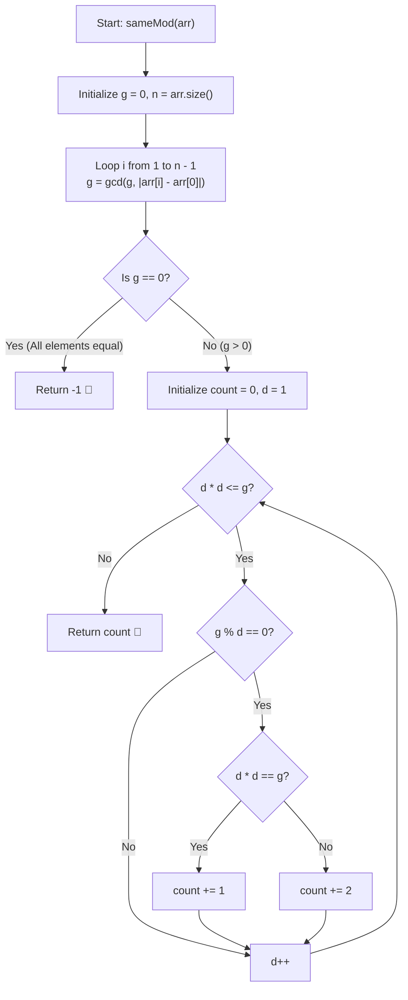

# 💡 Approach — Values with Equal Array Remainders

  | 📄 [Problem](./Problem.md) | 💡 [Approach](./Approach.md) | 🧩 [Solution](./Solution.cpp) | 🚀 [Main](./Main.cpp) |
  |:--------------------------:|:-----------------------------:|:------------------------------:|:---------------------:|

## 📊 Metadata

---

> [!TIP]
> **Core Intuition — Modular Congruence and GCD of Differences:**
> - The condition is that for all elements $arr[i]$ in the array, they must leave the exact same remainder when divided by a positive integer $k$:
>   $$arr[i] \equiv arr[0] \pmod k \quad \forall i \in [1, n-1]$$
> - By definition of modular congruence:
>   $$k \mid (arr[i] - arr[0]) \quad \forall i \in [1, n-1]$$
> - Therefore, $k$ must be a positive common divisor of all absolute differences $|arr[i] - arr[0]|$.
> - Any common divisor of a set of numbers must divide their **Greatest Common Divisor (GCD)**:
>   $$g = \gcd(|arr[1] - arr[0]|, |arr[2] - arr[0]|, \dots, |arr[n-1] - arr[0]|)$$
> - **Case 1 ($g = 0$):** All elements in the array are identical ($|arr[i] - arr[0]| = 0$ for all $i$). Any positive integer $k \ge 1$ divides $0$, which means infinitely many values of $k$ exist. Hence, return `-1`.
> - **Case 2 ($g > 0$):** The valid values of $k$ are precisely all positive divisors of $g$. The total number of valid $k$'s is simply the count of divisors of $g$, which can be computed in $\mathcal{O}(\sqrt{g})$ time.

---

## 🔩 Step-by-Step Breakdown

1. **Calculate Differences Relative to $arr[0]$**:
   - Initialize $g = 0$.
   - Iterate through every element $arr[i]$ from $i = 1$ to $n-1$:
     - Compute the absolute difference $d = |arr[i] - arr[0]|$.
     - Update $g = \gcd(g, d)$.

2. **Handle Infinite Case ($g = 0$)**:
   - If $g == 0$ (all elements are equal, or the array has size 1), return `-1`.

3. **Count All Positive Divisors of $g$**:
   - Initialize `count = 0`.
   - Iterate from $d = 1$ up to $\lfloor\sqrt{g}\rfloor$:
     - If $g \pmod d == 0$:
       - If $d \times d == g$, increment `count += 1` (perfect square root divisor).
       - Else, increment `count += 2` (counting both paired divisors $d$ and $g / d$).

4. **Return Result**:
   - Return `count`.

---

## 🔄 Mermaid Flowchart

---

## 🏃‍♂️ Dry Run

### Example 1: $arr = [38, 6, 34]$

1. Differences from $arr[0] = 38$:
   - $|arr[1] - arr[0]| = |6 - 38| = 32 \implies g = \gcd(0, 32) = 32$
   - $|arr[2] - arr[0]| = |34 - 38| = 4 \implies g = \gcd(32, 4) = 4$
2. $g = 4 \neq 0$.
3. Count divisors of $4$ for $d \le \sqrt{4} = 2$:

| $d$ | Divisor Check ($4 \% d == 0$) | Paired Divisor ($4 / d$) | $d == 4/d$? | Divisors Found | Count Added | Cumulative `count` |
|:---:|:---:|:---:|:---:|:---:|:---:|:---:|
| **1** | $4 \% 1 == 0$ (True) | $4$ | No ($1 \neq 4$) | $1, 4$ | $+2$ | **2** |
| **2** | $4 \% 2 == 0$ (True) | $2$ | Yes ($2 == 2$) | $2$ | $+1$ | **3** |

- **Total Divisors of $4$:** $\{1, 2, 4\} \implies$ Output: **`3`** ✅

---

### Example 2: $arr = [3, 2]$

1. Difference: $|2 - 3| = 1 \implies g = 1$.
2. $g = 1 \neq 0$.
3. Divisors of $1$: $\{1\} \implies$ Output: **`1`** ✅

---

### Example 3: $arr = [5, 5, 5]$

1. Differences: $|5 - 5| = 0, |5 - 5| = 0 \implies g = 0$.
2. $g == 0 \implies$ Infinitely many $k$ exist $\implies$ Output: **`-1`** ✅

---

## 📊 Complexity Analysis

| Complexity Metric | Estimation | Rationale |
| :--- | :---: | :--- |
| **Time Complexity** | $\mathcal{O}(n + \sqrt{g})$ | Finding the GCD across $n$ elements takes $\mathcal{O}(n \log(\max arr))$, and counting divisors of $g$ takes $\mathcal{O}(\sqrt{g})$ time. |
| **Auxiliary Space** | $\mathcal{O}(1)$ | Only scalar variables (`g`, `count`, `d`) are used, requiring strictly constant extra space. |

---

> *"Modular equivalence across an array is purely the divisibility of differences — finding the GCD transforms global congruence into simple divisor counting."*

---

<h3>Happy Coding! 🚀</h3>

