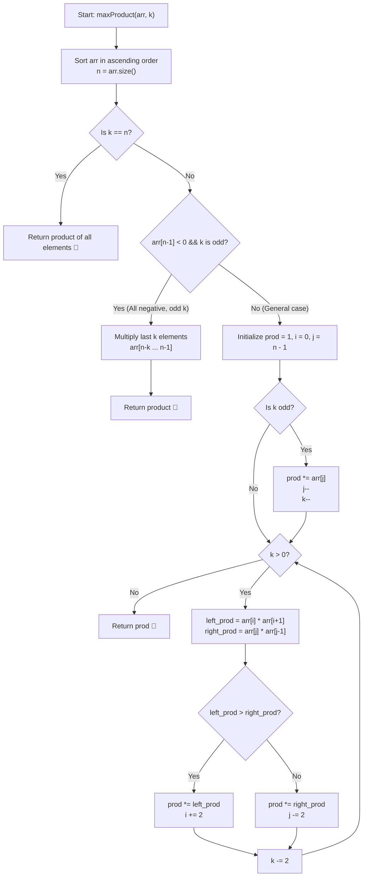

# 💡 Approach — Max Product Subsequence of Size K

  | 📄 [Problem](./Problem.md) | 💡 [Approach](./Approach.md) | 🧩 [Solution](./Solution.cpp) | 🚀 [Main](./Main.cpp) |
  |:--------------------------:|:-----------------------------:|:------------------------------:|:---------------------:|

## 📊 Metadata

---

> [!TIP]
> **Core Intuition — Sorting & Two-Pointer Greedy Matching:**
> - When we sort the array in ascending order $arr[0] \le arr[1] \le \dots \le arr[n-1]$:
>   - Large negative numbers appear at the front ($i=0, 1, \dots$).
>   - Large positive numbers appear at the back ($j=n-1, n-2, \dots$).
> - Multiplying two negative numbers produces a positive product ($(-a) \times (-b) = a \cdot b$). Thus, pairs of large-magnitude negative numbers can contribute positively to the overall product.
> - **Special Case 1 ($k = n$):** All elements must be included in the product.
> - **Special Case 2 (All negative numbers and $k$ is odd):** Any product of an odd number of negatives will always be negative. To maximize a negative product, we must minimize its absolute value. Thus, we greedily choose the $k$ least negative numbers (the largest $k$ numbers from the right: $arr[n-k \dots n-1]$).
> - **General Case ($arr[n-1] \ge 0$ or $k$ is even):**
>   1. If $k$ is odd, we take the largest element $arr[j]$ from the right ($j = n-1$). This guarantees that the remaining number of elements to pick is **even** ($k-1$).
>   2. While $k > 0$, we compare the product of the two leftmost numbers ($arr[i] \times arr[i+1]$) against the product of the two rightmost available numbers ($arr[j] \times arr[j-1]$).
>   3. Greedily multiply the pair with the larger product, advance the respective pointers by 2, and decrement $k$ by 2.

---

## 🔩 Step-by-Step Breakdown

1. **Sort the Input Array**:
   - Sort `arr` in ascending order.
   - Let $n = \text{arr.size()}$.

2. **Handle Special Cases**:
   - **Case $k == n$**: Compute the product of all elements and return.
   - **Case $arr[n-1] < 0$ and $k \% 2 == 1$**: All numbers are strictly negative and we need an odd count. Multiply the last $k$ numbers ($arr[n-1] \times arr[n-2] \times \dots \times arr[n-k]$) and return.

3. **Initialize Two Pointers**:
   - Set left pointer $i = 0$ and right pointer $j = n - 1$.
   - Set accumulator `prod = 1`.

4. **Pick Largest Single Element If $k$ Is Odd**:
   - If $k \% 2 == 1$:
     - `prod *= arr[j]`
     - `j--`
     - `k--`

5. **Greedily Match Pairs for Even $k$**:
   - While $k > 0$:
     - Compute `left_prod = arr[i] * arr[i+1]`.
     - Compute `right_prod = arr[j] * arr[j-1]`.
     - If `left_prod > right_prod`:
       - `prod *= left_prod`
       - `i += 2`
     - Else:
       - `prod *= right_prod`
       - `j -= 2`
     - `k -= 2`

6. **Return Result**:
   - Return `prod`.

---

## 🔄 Mermaid Flowchart

---

## 🏃‍♂️ Dry Run

### Example 2: $arr = [1, 2, -1, -3, -6, 4], \quad k = 4$

1. **Sorted Array**: `arr = [-6, -3, -1, 1, 2, 4]`, $n = 6, k = 4$.
2. Not all negative ($arr[5] = 4 \ge 0$), $k=4$ is even.
3. $i = 0, j = 5, \text{prod} = 1$.

| Step | Current $k$ | Left Pair ($arr[i], arr[i+1]$) | Left Product | Right Pair ($arr[j], arr[j-1]$) | Right Product | Chosen Pair | Updated `prod` | Next Pointers |
|:---:|:---:|:---:|:---:|:---:|:---:|:---:|:---:|:---:|
| **1** | $4$ | $(-6, -3)$ | $(-6) \times (-3) = \mathbf{18}$ | $(4, 2)$ | $4 \times 2 = \mathbf{8}$ | Left ($18 > 8$) | $1 \times 18 = \mathbf{18}$ | $i = 2, j = 5, k = 2$ |
| **2** | $2$ | $(-1, 1)$ | $(-1) \times 1 = \mathbf{-1}$ | $(4, 2)$ | $4 \times 2 = \mathbf{8}$ | Right ($8 > -1$) | $18 \times 8 = \mathbf{144}$ | $i = 2, j = 3, k = 0$ |

- **Final Output:** **`144`** ✅

---

### Example 3: $arr = [-5, -4, -3, -2, -1], \quad k = 3$

1. **Sorted Array**: `arr = [-5, -4, -3, -2, -1]`, $n = 5, k = 3$.
2. All elements are negative ($arr[4] = -1 < 0$) and $k=3$ is odd.
3. Multiply the $3$ largest negative numbers:
   $$\text{prod} = arr[4] \times arr[3] \times arr[2] = (-1) \times (-2) \times (-3) = \mathbf{-6}$$
- **Final Output:** **`-6`** ✅

---

## 📊 Complexity Analysis

| Complexity Metric | Estimation | Rationale |
| :--- | :---: | :--- |
| **Time Complexity** | $\mathcal{O}(n \log n)$ | Sorting the array of size $n \le 30$ takes $\mathcal{O}(n \log n)$ time. The two-pointer greedy traversal runs in $\mathcal{O}(k) \le \mathcal{O}(n)$ time. |
| **Auxiliary Space** | $\mathcal{O}(1)$ | We only use scalar variables (`prod`, `i`, `j`, `left_prod`, `right_prod`), requiring strictly $\mathcal{O}(1)$ extra space. |

---

> *"Greedy pair selection unlocks optimal products: two negatives make a positive, while single odd terms are tamed by the largest element."*

---

<h3>Happy Coding! 🚀</h3>

