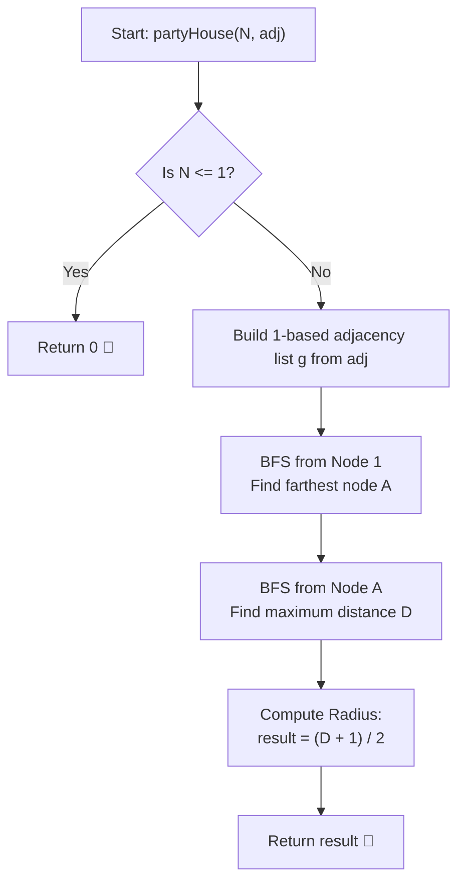

# 💡 Approach — Party in Town

  | 📄 [Problem](./Problem.md) | 💡 [Approach](./Approach.md) | 🧩 [Solution](./Solution.cpp) | 🚀 [Main](./Main.cpp) |
  |:--------------------------:|:-----------------------------:|:------------------------------:|:---------------------:|

## 📊 Metadata

---

> [!TIP]
> **Core Intuition — Tree Radius & Diameter:**
> - In graph theory, the maximum distance from any vertex $u$ to all other vertices in a tree is called its **eccentricity** $\epsilon(u)$.
> - We want to choose a house $u$ that minimizes $\epsilon(u)$, which is defined as the **radius** $R$ of the tree:
>   $$R = \min_{u \in V} \max_{v \in V} \text{dist}(u, v)$$
> - The **diameter** $D$ of a tree is the maximum distance between any two nodes in the tree.
> - For any unweighted tree, the radius $R$ is directly related to its diameter $D$ by:
>   $$R = \left\lceil \frac{D}{2} \right\rceil = \left\lfloor \frac{D + 1}{2} \right\rfloor$$
> - The tree diameter $D$ can be found in linear $\mathcal{O}(n)$ time using the classic **Two-BFS / Two-DFS Algorithm**:
>   1. Run BFS/DFS from an arbitrary node (e.g. node $1$) to find the farthest node $A$. Node $A$ is guaranteed to be an endpoint of a diameter path.
>   2. Run BFS/DFS from node $A$ to find the farthest node $B$ and record the distance $D = \text{dist}(A, B)$.
>   3. The answer is simply $(D + 1) / 2$.

---

## 🔩 Step-by-Step Breakdown

1. **Graph Construction**:
   - The input `adj` is 0-indexed where `adj[i]` contains neighbors of node $i + 1$.
   - Reconstruct an adjacency list `g` of size $n + 1$ mapping 1-based node indices to their adjacent neighbors.

2. **Handle Edge Cases**:
   - If $n \le 1$, maximum distance is $0$.

3. **First Traversal (Find Diameter Endpoint $A$)**:
   - Run BFS starting from node $1$.
   - Keep track of distances from node $1$ to all other nodes.
   - Let $A$ be the node with the maximum distance from node $1$.

4. **Second Traversal (Find Diameter $D$)**:
   - Run BFS starting from node $A$.
   - Find the maximum distance from $A$ to any node in the tree.
   - Let this maximum distance be $D$.

5. **Compute Tree Radius**:
   - Return $\lfloor (D + 1) / 2 \rfloor$.

---

## 🔄 Mermaid Flowchart

---

## 🏃‍♂️ Dry Run

### Example 1: `adj = [[2], [1, 4, 3], [2], [2]]`, $n = 4$

- **Graph:**
  - $1 - 2$
  - $2 - 4$
  - $2 - 3$
  - (Star tree centered at node 2)

| Step | Operation | Source Node | Max Dist | Farthest Node |
|:---:|:---|:---:|:---:|:---:|
| **1** | First BFS | Node $1$ | $2$ | Node $3$ (or $4$) |
| **2** | Second BFS | Node $3$ | $2$ | Node $4$ (or $1$) |
| **3** | Diameter $D$ | — | $D = 2$ | — |
| **4** | Radius | — | $\lfloor (2 + 1) / 2 \rfloor = \mathbf{1}$ | Party at house 2 |

- **Final Output:** **`1`** ✅

---

### Example 2: `adj = [[2], [1, 3], [4, 2], [3]]`, $n = 4$

- **Graph:** $1 - 2 - 3 - 4$ (Line graph of length 3)

| Step | Operation | Source Node | Max Dist | Farthest Node |
|:---:|:---|:---:|:---:|:---:|
| **1** | First BFS | Node $1$ | $3$ | Node $4$ |
| **2** | Second BFS | Node $4$ | $3$ | Node $1$ |
| **3** | Diameter $D$ | — | $D = 3$ | — |
| **4** | Radius | — | $\lfloor (3 + 1) / 2 \rfloor = \mathbf{2}$ | Party at house 2 or 3 |

- **Final Output:** **`2`** ✅

---

## 📊 Complexity Analysis

| Complexity Metric | Estimation | Rationale |
| :--- | :---: | :--- |
| **Time Complexity** | $\mathcal{O}(n)$ | Building the graph takes $\mathcal{O}(n)$ time. Performing two BFS traversals visits each vertex and edge at most twice, running in $\mathcal{O}(V + E) = \mathcal{O}(n)$ time. |
| **Auxiliary Space** | $\mathcal{O}(n)$ | Storing the graph adjacency list, BFS queue, and distance arrays takes $\mathcal{O}(n)$ extra space. |

---

> *"The center of a tree minimises the worst-case travel; find the diameter, and its midpoint halves the journey."*

---

<h3>Happy Coding! 🚀</h3>

