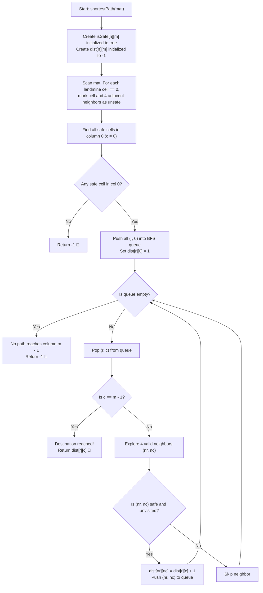

# 💡 Approach — Find Shortest Safe Route in a Matrix

  | 📄 [Problem](./Problem.md) | 💡 [Approach](./Approach.md) | 🧩 [Solution](./Solution.cpp) | 🚀 [Main](./Main.cpp) |
  |:--------------------------:|:-----------------------------:|:------------------------------:|:---------------------:|

## 📊 Metadata

---

> [!TIP]
> **Core Intuition — Hazard Preprocessing & Multi-Source BFS:**
> - A cell is hazardous if it contains `0` (landmine) **or** is directly adjacent (up/down/left/right) to a `0`.
> - **Step 1 (Hazard Mapping)**: We first identify all landmine positions from the original matrix and mark them as well as their 4-directional neighbors as unsafe in a separate safety grid `isSafe`.
> - **Step 2 (Multi-Source BFS)**: Because we want the shortest path from **any** safe cell in column $0$ to **any** safe cell in column $m - 1$, we initialize a single BFS queue with all safe cells in column $0$ with path length $1$.
> - BFS explores equidistant levels outward simultaneously in unweighted graphs. The **first time** any cell in the destination column $m - 1$ is popped or reached, its distance is guaranteed to be the minimum steps required.

---

## 🔩 Step-by-Step Breakdown

1. **Pre-processing Hazard Cells**:
   - Initialize a boolean 2D grid `isSafe[n][m]` to `true`.
   - Traverse the original matrix `mat`. Whenever `mat[i][j] == 0`:
     - Set `isSafe[i][j] = false`.
     - For each of the 4 cardinal directions $(dr, dc) \in \{(-1, 0), (1, 0), (0, -1), (0, 1)\}$:
       - If the neighbor $(i + dr, j + dc)$ lies within grid bounds, set `isSafe[i + dr][j + dc] = false`.

2. **Multi-Source Queue Initialization**:
   - Initialize a 2D distance array `dist[n][m]` filled with `-1`.
   - Create a queue `q` of coordinate pairs `(r, c)`.
   - Loop through all rows $r \in [0, n - 1]$ in column $0$:
     - If `isSafe[r][0]` is `true`:
       - `dist[r][0] = 1`
       - Push `(r, 0)` into `q`.
   - **Corner Case**: If $m = 1$ and at least one cell in column $0$ is safe, the answer is immediately `1`.

3. **Breadth-First Search (BFS) Traversal**:
   - While `q` is not empty:
     - Dequeue `(r, c)`.
     - If $c == m - 1$, return `dist[r][c]`.
     - For each 4-directional neighbor $(nr, nc) = (r + dr, c + dc)$:
       - If $0 \le nr < n$, $0 \le nc < m$, `isSafe[nr][nc] == true`, and `dist[nr][nc] == -1`:
         - Set `dist[nr][nc] = dist[r][c] + 1`.
         - Push `(nr, nc)` into `q`.

4. **Return Default Failure**:
   - If the queue is exhausted without ever reaching column $m - 1$, return `-1`.

---

## 🔄 Mermaid Flowchart

---

## 🏃‍♂️ Dry Run

### Example 1: $n = 5, m = 5$

$$\text{mat} = \begin{bmatrix} 1 & 0 & 1 & 1 & 1 \\ 1 & 1 & 1 & 1 & 1 \\ 1 & 1 & 1 & 1 & 1 \\ 1 & 1 & 1 & 0 & 1 \\ 1 & 1 & 1 & 1 & 0 \end{bmatrix}$$

1. **Hazard Map Calculation**:
   - Landmines at $(0,1)$, $(3,3)$, $(4,4)$.
   - Unsafe cells marked `X`:
     - $(0,1) \implies (0,1), (0,0), (0,2), (1,1)$
     - $(3,3) \implies (3,3), (2,3), (4,3), (3,2), (3,4)$
     - $(4,4) \implies (4,4), (3,4), (4,3)$

$$\text{isSafe} = \begin{bmatrix} X & X & X & 1 & 1 \\ 1 & X & 1 & 1 & 1 \\ 1 & 1 & 1 & X & 1 \\ 1 & 1 & X & X & X \\ 1 & 1 & 1 & X & X \end{bmatrix}$$

2. **Column 0 Safe Start Cells**: $(1,0), (2,0), (3,0), (4,0)$ initialized with `dist = 1`.
3. **BFS Level Steps**:
   - `dist = 1`: $(1,0), (2,0), (3,0), (4,0)$
   - `dist = 2`: $(2,1), (3,1), (4,1)$
   - `dist = 3`: $(2,2), (4,2)$
   - `dist = 4`: $(1,2)$
   - `dist = 5`: $(1,3), (0,3)$
   - `dist = 6`: $(0,4), (1,4)$ $\implies$ column $4$ reached!

- **Final Output:** **`6`** ✅

---

## 📊 Complexity Analysis

| Complexity Metric | Estimation | Rationale |
| :--- | :---: | :--- |
| **Time Complexity** | $\mathcal{O}(n \times m)$ | Identifying hazards visits each cell and its constant $4$ neighbors once ($\mathcal{O}(n \times m)$). Multi-source BFS visits each grid cell and traverses its $4$ outgoing edges at most once ($\mathcal{O}(V + E) = \mathcal{O}(n \times m)$). |
| **Auxiliary Space** | $\mathcal{O}(n \times m)$ | Storing the `isSafe` grid, `dist` matrix, and BFS queue takes $\mathcal{O}(n \times m)$ memory. |

---

> *"Navigating a minefield requires marking danger zones before the first step is taken; shortest paths then reveal themselves level by level."*

---

<h3>Happy Coding! 🚀</h3>

