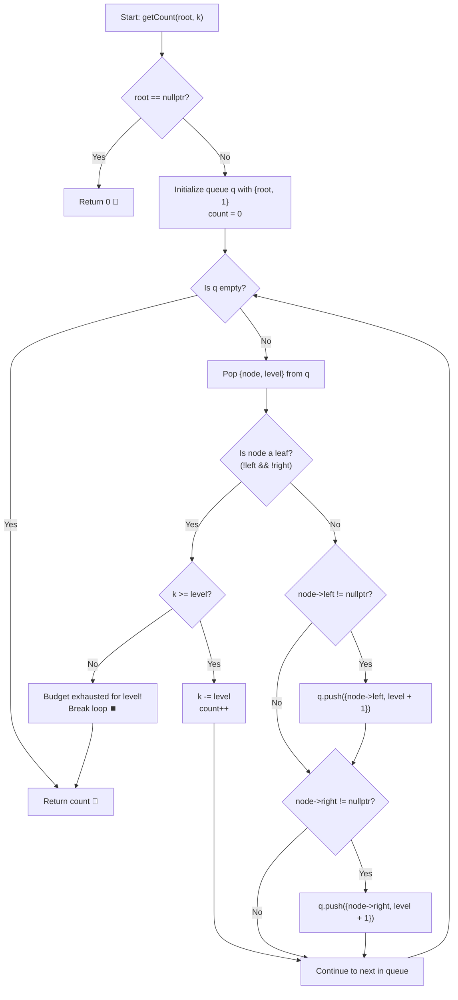

# 💡 Approach — Visit Leaves with Budget

<div align="center">

  | 📄 [Problem](./Problem.md) | 💡 [Approach](./Approach.md) | 🧩 [Solution](./Solution.cpp) | 🚀 [Main](./Main.cpp) |
  |:--------------------------:|:-----------------------------:|:------------------------------:|:---------------------:|
</div>

## 📊 Metadata


---

> [!TIP]
> **Core Intuition — Level-Order (BFS) Greedy Strategy:**
> - The cost of visiting any leaf node is directly equal to its level (depth) in the tree.
> - To **maximize the total number of leaves** visited within a fixed budget $k$, we must greedily choose leaves that have the **minimum levels** first (i.e. cheapest leaves first).
> - **Breadth-First Search (BFS)** naturally traverses tree nodes level by level in non-decreasing order of their depths ($1, 2, 3, \dots$).
> - As a result, leaves encountered during BFS are automatically discovered in non-decreasing order of cost.
> - Whenever a leaf node at `level` is encountered:
>   - If the remaining budget $k \ge \text{level}$, we deduct `level` from $k$ and increment our count.
>   - If $k < \text{level}$, no further leaves can be afforded (since all subsequent leaves in BFS will have cost $\ge \text{level}$), so we can immediately terminate the search and return the count.

---

## 🔩 Step-by-Step Breakdown

1. **Base Case Check**:
   - If the tree is empty (`root == nullptr`), return `0`.

2. **Initialize BFS Queue**:
   - Create a queue of pairs: `queue<pair<Node*, int>> q`, where each element stores a pointer to a tree node and its 1-based level.
   - Push `{root, 1}` into the queue.
   - Initialize `count = 0`.

3. **Level-Order Traversal**:
   - While `q` is not empty:
     - Pop the front pair `(node, level)`.
     - **Leaf Detection**: If `node->left == nullptr` and `node->right == nullptr`:
       - If $k \ge \text{level}$:
         - Subtract `level` from $k$: `k -= level`.
         - Increment `count++`.
       - Else:
         - Budget is insufficient to visit this leaf. Since any subsequent leaf in BFS will have a depth $\ge \text{level}$, we can terminate immediately (`break`).
     - **Queue Children**:
       - If `node->left` exists, push `{node->left, level + 1}`.
       - If `node->right` exists, push `{node->right, level + 1}`.

4. **Return Result**:
   - Return `count`.

---

## 🔄 Mermaid Flowchart



---

## 🏃‍♂️ Dry Run

### Example 1: `root = [10, 8, 2, 3, N, 3, 6, N, N, N, 4]`, $k = 8$

```
Level 1:           10
                 /    \
Level 2:        8      2
               /      / \
Level 3:      3      3   6
                      \
Level 4:               4
```

| Step | Node | Level | Is Leaf? | Action | Remaining Budget $k$ | Count |
|:---:|:---:|:---:|:---:|:---|:---:|:---:|
| 1 | `10` | 1 | No | Push `8` (L2), `2` (L2) | 8 | 0 |
| 2 | `8` | 2 | No | Push `3` (L3) | 8 | 0 |
| 3 | `2` | 2 | No | Push `3` (L3), `6` (L3) | 8 | 0 |
| 4 | `3` (left) | 3 | **Yes** | $8 \ge 3 \implies 8 - 3 = 5$ | 5 | **1** |
| 5 | `3` (right) | 3 | No | Push `4` (L4) | 5 | 1 |
| 6 | `6` | 3 | **Yes** | $5 \ge 3 \implies 5 - 3 = 2$ | 2 | **2** |
| 7 | `4` | 4 | **Yes** | $2 < 4 \implies$ Cannot afford! Break. | 2 | **2** |

- **Final Answer:** `2` ✅

---

## 📊 Complexity Analysis

| Complexity Metric | Estimation | Rationale |
| :--- | :---: | :--- |
| **Time Complexity** | $\mathcal{O}(n)$ | In the worst case, each node is pushed and popped from the BFS queue at most once. |
| **Auxiliary Space** | $\mathcal{O}(n)$ | The BFS queue holds at most $\mathcal{O}(w) = \mathcal{O}(n)$ nodes simultaneously, where $w$ is the maximum width of the binary tree. |

---

> *"Greedily choosing leaves in ascending order of depth guarantees maximum count under a bounded budget; BFS provides that exact ordering for free."*

---

<div align="center">
<h3>Happy Coding! 🚀</h3>
<a href="../230_Day/Approach.md">
  
</a>
<a href="https://x.com/PankajB42550" target="_blank">
  
</a>
<a href="../232_Day/Approach.md">
  
</a>
</div>
